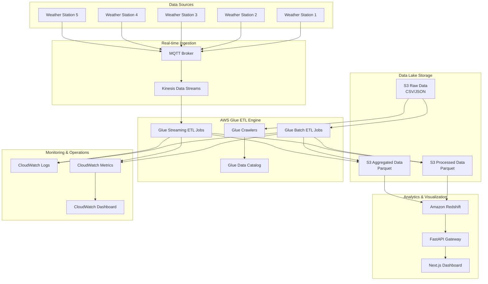

# AWS Glue

AWS Glue uses other Amazon AWS services to orchestrate your ETL (extract, transform, and load) jobs to build data warehouses and data lakes and generate output streams.

AWS Glue is an ETL (extract, transform, load) service that allows you to easily move data between different data sources and targets.


*Figure: AWS Glue*

## AWS Glue ETL Architecture

### Weather data processing pipeline



### Data flow architecture

```
┌─────────────────────────────────────────────────────────────────────────────────────┐
│                                AWS GLUE ETL PIPELINE                                │
│                                                                                     │
│  ┌─────────────┐    ┌──────────────┐    ┌─────────────────────────────────────────┐ │
│  │   Weather   │    │   Real-time  │    │         AWS Glue Processing             │ │
│  │  Stations   │    │  Ingestion   │    │                                         │ │
│  │             │    │              │    │  ┌─────────────┐  ┌─────────────────┐   │ │
│  │ ┌─────────┐ │    │ ┌──────────┐ │    │  │   Batch     │  │    Streaming    │   │ │
│  │ │Station 1│ │───▶│ │   MQTT   │ │───▶│  │   ETL Job   │  │    ETL Job      │   │ │
│  │ │Station 2│ │    │ │  Broker  │ │    │  │             │  │                 │   │ │
│  │ │Station 3│ │    │ └──────────┘ │    │  │ ┌─────────┐ │  │ ┌─────────────┐ │   │ │
│  │ │Station 4│ │    │      │       │    │  │ │Extract  │ │  │ │Stream Read  │ │   │ │
│  │ │Station 5│ │    │      ▼       │    │  │ │Transform│ │  │ │Validate     │ │   │ │
│  │ └─────────┘ │    │ ┌──────────┐ │    │  │ │Load     │ │  │ │Transform    │ │   │ │
│  └─────────────┘    │ │ Kinesis  │ │    │  │ └─────────┘ │  │ │Aggregate    │ │   │ │
│                     │ │  Data    │ │    │  └─────────────┘  │ └─────────────┘ │   │ │
│                     │ │ Streams  │ │    │         │                   │           │ │
│                     │ └──────────┘ │    │         ▼                   ▼           │ │
│                     └──────────────┘    └─────────────────────────────────────────┘ │
│                                                    │                   │            │
│                                                    ▼                   ▼            │
│  ┌─────────────────────────────────────────────────────────────────────────────────┐│
│  │                           DATA LAKE (Amazon S3)                                 ││
│  │                                                                                 ││
│  │  ┌─────────────┐    ┌─────────────────┐    ┌─────────────────────────────┐      ││
│  │  │    Raw      │    │    Processed    │    │         Aggregated          │      ││
│  │  │    Data     │    │      Data       │    │           Data              │      ││
│  │  │             │    │                 │    │                             │      ││
│  │  │ CSV/JSON    │    │ Parquet Format  │    │  Hourly/Daily Summaries     │      ││
│  │  │ Time-series │───▶│ Validated       │───▶│  Station Aggregations       │      ││
│  │  │ Partitioned │    │ Enriched        │    │  Weather Metrics            │      ││
│  │  │ by Date     │    │ Quality Scored  │    │  Quality Trends             │      ││
│  │  └─────────────┘    └─────────────────┘    └─────────────────────────────┘      ││
│  └─────────────────────────────────────────────────────────────────────────────────┘│
│                                     │                                               │
│                                     ▼                                               │
│  ┌─────────────────────────────────────────────────────────────────────────────────┐│
│  │                      ANALYTICS & VISUALIZATION                                  ││
│  │                                                                                 ││
│  │  ┌─────────────┐    ┌─────────────┐    ┌─────────────────────────────────────┐  ││
│  │  │   Amazon    │    │   FastAPI   │    │         Next.js                     │  ││
│  │  │  Redshift   │───▶│   Gateway   │───▶│        Dashboard                    │  ││
│  │  │             │    │             │    │                                     │  ││
│  │  │ Data        │    │ REST APIs   │    │ Real-time Charts                    │  ││
│  │  │ Warehouse   │    │ GraphQL     │    │ Weather Maps                        │  ││
│  │  │ OLAP        │    │ Monitoring  │    │ Alert System                        │  ││
│  │  └─────────────┘    └─────────────┘    └─────────────────────────────────────┘  ││
│  └─────────────────────────────────────────────────────────────────────────────────┘│
└─────────────────────────────────────────────────────────────────────────────────────┘
```

**Data sources and destinations**

AWS Glue for Spark allows you to read and write data from multiple systems and databases:

- **Amazon S3** - Primary data lake storage for raw, processed, and aggregated weather data
- **Amazon Kinesis Data Streams** - Real-time weather data streaming
- **Amazon Redshift** - Data warehouse for analytical queries and reporting
- **Amazon RDS PostgreSQL** - Transactional data storage for microservices
- **Amazon ElastiCache Redis** - Real-time caching and session storage
- **JDBC accessible databases** - Additional SQL database connectivity
- **MongoDB and Amazon DocumentDB** - NoSQL document storage compatibility

**Data streams**

AWS Glue for Spark can stream data from the following systems:

- **Amazon Kinesis Data Streams** - Primary real-time data ingestion
- **Apache Kafka** - Alternative messaging system for high-throughput scenarios
- **Amazon MSK (Managed Streaming for Kafka)** - Fully managed Kafka service
- **Custom MQTT Brokers** - IoT device connectivity for weather stations

### AWS Glue integration

```
┌──────────────────────────────────────────────────────────────────────────────────────┐
│                                  AWS GLUE ECOSYSTEM                                  │
│                                                                                      │
│  ┌─────────────────────┐    ┌─────────────────────┐    ┌─────────────────────────┐   │
│  │   DATA CATALOG      │    │    ETL JOBS         │    │     CRAWLERS            │   │
│  │                     │    │                     │    │                         │   │
│  │ ┌─────────────────┐ │    │ ┌─────────────────┐ │    │ ┌─────────────────────┐ │   │
│  │ │   Databases     │ │    │ │  Batch Jobs     │ │    │ │  Schema Discovery   │ │   │
│  │ │ weather_        │ │    │ │ weather-batch-  │ │    │ │ weather-raw-data-   │ │   │
│  │ │ analytics_db    │ │    │ │ etl-job         │ │    │ │ crawler             │ │   │
│  │ │                 │ │    │ │                 │ │    │ │                     │ │   │
│  │ └─────────────────┘ │    │ └─────────────────┘ │    │ └─────────────────────┘ │   │
│  │                     │    │                     │    │                         │   │
│  │ ┌─────────────────┐ │    │ ┌─────────────────┐ │    │ ┌─────────────────────┐ │   │
│  │ │    Tables       │ │    │ │ Streaming Jobs  │ │    │ │  Partition          │ │   │
│  │ │                 │ │    │ │                 │ │    │ │  Detection          │ │   │
│  │ │ raw_weather_    │ │    │ │ weather-        │ │    │ │                     │ │   │
│  │ │ data            │ │    │ │ streaming-      │ │    │ │ weather-processed-  │ │   │
│  │ │                 │ │    │ │ etl-job         │ │    │ │ data-crawler        │ │   │
│  │ │ processed_      │ │    │ │                 │ │    │ │                     │ │   │
│  │ │ weather_data    │ │    │ └─────────────────┘ │    │ └─────────────────────┘ │   │
│  │ │                 │ │    │                     │    │                         │   │
│  │ │ weather_        │ │    │ ┌─────────────────┐ │    │ ┌─────────────────────┐ │   │
│  │ │ aggregations    │ │    │ │ Job Triggers    │ │    │ │  Incremental        │ │   │
│  │ │                 │ │    │ │                 │ │    │ │  Processing         │ │   │
│  │ └─────────────────┘ │    │ │ Scheduled       │ │    │ │                     │ │   │
│  │                     │    │ │ Event-driven    │ │    │ │ weather-aggregated- │ │   │
│  │ ┌─────────────────┐ │    │ │ Manual          │ │    │ │ data-crawler        │ │   │
│  │ │   Partitions    │ │    │ │                 │ │    │ │                     │ │   │
│  │ │                 │ │    │ └─────────────────┘ │    │ └─────────────────────┘ │   │
│  │ │ year=2025/      │ │    └─────────────────────┘    └─────────────────────────┘   │
│  │ │ month=08/       │ │                                                             │
│  │ │ day=04/         │ │                                                             │
│  │ └─────────────────┘ │                                                             │
│  └─────────────────────┘                                                             │
└──────────────────────────────────────────────────────────────────────────────────────┘
```

## Example: AWS Glue ETL pipeline for Weather station data

This example demonstrates how to implement a complete Extract, Transform, Load (ETL) pipeline using AWS Glue for processing real-time weather station data. The solution combines microservices architecture with AWS Glue's serverless ETL capabilities for scalable data processing.

#### Architecture

The weather ETL pipeline integrates the following components:

**Local microservices layer:**
- **Data Ingestion Service**: MQTT client receiving weather data from IoT stations
- **Enhanced ETL Processing Service**: Local validation and AWS Glue integration
- **Data Storage Service**: PostgreSQL, Redis, and S3 integration
- **API Gateway**: RESTful endpoints for data access and monitoring

**AWS Glue layer:**
- **Batch ETL Jobs**: Large-scale historical data processing using Spark
- **Streaming ETL Jobs**: Real-time data processing from Kinesis Data Streams
- **Data Catalog**: Managed metadata repository for schema management
- **Crawlers**: Automatic schema discovery and table creation

**Amazon AWS Infrastructure:**
- **Amazon S3**: Data lake for raw, processed, and aggregated data
- **Amazon Kinesis**: Real-time data streaming
- **Amazon Redshift**: Data warehouse for analytics (optional)
- **Amazon CloudWatch**: Monitoring and logging

### ETL Data Flow Diagrams

#### 1. Real-time Streaming ETL Flow

```
Weather Stations → MQTT → Kinesis → Glue Streaming → S3 → Analytics
     (IoT)                                    ↓
                                         Aggregations
                                              ↓
                                          Dashboard
```

**Detailed Streaming Flow:**
```
┌─────────────────┐     ┌─────────────────┐     ┌─────────────────┐
│  Weather IoT    │────▶│    MQTT Broker  │────▶│ Kinesis Data    │
│  Stations       │     │                 │     │ Streams         │
│                 │     │ - QoS 1         │     │                 │
│ - Temperature   │     │ - Persistent    │     │ - 2 Shards      │
│ - Humidity      │     │ - Clustering    │     │ - Auto-scaling  │
│ - Pressure      │     │ - Load Balancing│     │ - Retention 24h │
│ - Wind Speed    │     └─────────────────┘     └─────────────────┘
│ - Wind Direction│                                       │
│ - Condition     │                                       ▼
└─────────────────┘                             ┌─────────────────┐
                                                │ AWS Glue        │
                                                │ Streaming ETL   │
                                                │                 │
                                                │ ┌─────────────┐ │
                                                │ │ Validation  │ │
                                                │ │ - Range chk │ │
                                                │ │ - Null chk  │ │
                                                │ │ - Format    │ │
                                                │ └─────────────┘ │
                                                │        │        │
                                                │        ▼        │
                                                │ ┌─────────────┐ │
                                                │ │ Transform   │ │
                                                │ │ - Heat idx  │ │
                                                │ │ - Wind chil │ │
                                                │ │ - Dew point │ │
                                                │ │ - Alerts    │ │
                                                │ └─────────────┘ │
                                                │        │        │
                                                │        ▼        │
                                                │ ┌─────────────┐ │
                                                │ │ Windowing   │ │
                                                │ │ - 10min win │ │
                                                │ │ - Station   │ │
                                                │ │ - Aggregate │ │
                                                │ │ - Watermark │ │
                                                │ └─────────────┘ │
                                                └─────────────────┘
                                                         │
                                                         ▼
┌─────────────────┐     ┌─────────────────┐     ┌─────────────────┐
│   Amazon S3     │◀────│   Checkpoint    │◀────│  Stream Output  │
│   Data Lake     │     │   Location      │     │                 │
│                 │     │                 │     │ - Parquet       │
│ ┌─────────────┐ │     │ - State Store   │     │ - Partitioned   │
│ │ Streaming   │ │     │ - Offset Mgmt   │     │ - Fault Tolernt │
│ │ /raw/       │ │     │ - Recovery      │     │ - Exactly Once  │
│ │ /aggregated/│ │     └─────────────────┘     └─────────────────┘
│ └─────────────┘ │
└─────────────────┘
```

#### 2. Batch ETL processing flow

```
S3 Raw Data → Glue Catalog → Batch ETL → Transformed Data → Analytics
     ↓              ↓            ↓             ↓              ↓
  Crawlers    Schema Mgmt   Spark Jobs    Quality Score   Redshift
```

**Detailed Batch Processing:**
```
┌─────────────────────────────────────────────────────────────────────────────────────┐
│                            BATCH ETL PROCESSING WORKFLOW                            │
└─────────────────────────────────────────────────────────────────────────────────────┘

Step 1: Data Discovery
┌─────────────────┐     ┌─────────────────┐     ┌─────────────────────────────────────┐
│   S3 Raw Data   │────▶│  Glue Crawlers  │────▶│         Data Catalog                │
│                 │     │                 │     │                                     │
│ /raw/weather_   │     │ - Schema detect │     │ ┌─────────────────────────────────┐ │
│ data/year=2025/ │     │ - Partition rec │     │ │        Tables                   │ │
│ month=08/day=04/│     │ - Format ident  │     │ │                                 │ │
│                 │     │ - Auto catalog  │     │ │ raw_weather_data:               │ │
│ ├─weather_001.  │     └─────────────────┘     │ │ - station_id: string            │ │
│ │ csv.gz        │                             │ │ - timestamp: timestamp          │ │
│ ├─weather_002.  │                             │ │ - temperature: double           │ │
│ │ csv.gz        │                             │ │ - humidity: double              │ │
│ └─weather_nnn.  │                             │ │ - pressure: double              │ │
│   csv.gz        │                             │ │ - wind_speed: double            │ │
└─────────────────┘                             │ │ - wind_direction: double        │ │
                                                │ │ - weather_condition: string     │ │
                                                │ │                                 │ │
                                                │ │ Partitions: [year, month, day]  │ │
                                                │ └─────────────────────────────────┘ │
                                                └─────────────────────────────────────┘

Step 2: ETL Job Execution
┌─────────────────────────────────────────────────────────────────────────────────────┐
│                         AWS GLUE SPARK ETL JOB                                      │
│                                                                                     │
│  ┌─────────────────┐    ┌─────────────────┐    ┌─────────────────────────────────┐  │
│  │    EXTRACT      │    │    TRANSFORM    │    │            LOAD                 │  │
│  │                 │    │                 │    │                                 │  │
│  │ ┌─────────────┐ │    │ ┌─────────────┐ │    │ ┌─────────────────────────────┐ │  │
│  │ │Read from    │ │    │ │Data         │ │    │ │Write to S3                  │ │  │
│  │ │Data Catalog │ │───▶│ │Validation   │ │───▶│ │                             │ │  │
│  │ │             │ │    │ │             │ │    │ │ /processed/weather_data/    │ │  │
│  │ │- Auto schema│ │    │ │- Temp range │ │    │ │   year=2025/month=08/       │ │  │
│  │ │- Partition  │ │    │ │- Humidity % │ │    │ │                             │ │  │
│  │ │- Incremental│ │    │ │- Pressure   │ │    │ │ Format: Parquet             │ │  │
│  │ └─────────────┘ │    │ │- Wind valid │ │    │ │ Compression: GZIP           │ │  │
│  │                 │    │ └─────────────┘ │    │ │ Partitioned by date         │ │  │
│  │ ┌─────────────┐ │    │        │        │    │ └─────────────────────────────┘ │  │
│  │ │Job          │ │    │        ▼        │    │                                 │  │
│  │ │Bookmarks    │ │    │ ┌─────────────┐ │    │ ┌─────────────────────────────┐ │  │
│  │ │             │ │    │ │Enrichment   │ │    │ │Write to S3                  │ │  │
│  │ │- Track      │ │    │ │             │ │    │ │                             │ │  │
│  │ │- Incremental│ │    │ │- Heat Index │ │    │ │ /aggregated/weather_data/   │ │  │
│  │ │- No reprocess │    │ │- Wind Chill │ │    │ │   aggregation_level=hourly/ │ │  │
│  │ └─────────────┘ │    │ │- Dew Point  │ │    │ │   year=2025/month=08/       │ │  │
│  └─────────────────┘    │ │- Quality    │ │    │ │                             │ │  │
│                         │ │  Score      │ │    │ │ Hourly & Daily Aggregations │ │  │
│                         │ └─────────────┘ │    │ │ Station-level summaries     │ │  │
│                         │        │        │    │ └─────────────────────────────┘ │  │
│                         │        ▼        │    └─────────────────────────────────┘  │
│                         │ ┌─────────────┐ │                                         │
│                         │ │Aggregation  │ │                                         │
│                         │ │             │ │                                         │
│                         │ │- Hourly avg │ │                                         │
│                         │ │- Daily min/ │ │                                         │
│                         │ │  max        │ │                                         │
│                         │ │- Station    │ │                                         │
│                         │ │  grouping   │ │                                         │
│                         │ └─────────────┘ │                                         │
│                         └─────────────────┘                                         │
└─────────────────────────────────────────────────────────────────────────────────────┘

Step 3: Data Quality & Monitoring
┌─────────────────┐     ┌─────────────────┐     ┌─────────────────────────────────────┐
│   CloudWatch    │◀────│    Metrics      │◀────│         Job Execution               │
│   Dashboard     │     │                 │     │                                     │
│                 │     │ - Records/sec   │     │ ┌─────────────────────────────────┐ │
│ ┌─────────────┐ │     │ - Error rate    │     │ │          Success Metrics        │ │
│ │ETL Pipeline │ │     │ - Data quality  │     │ │                                 │ │
│ │Monitoring   │ │     │ - Job duration  │     │ │ - Records Processed: 1,234,567  │ │
│ │             │ │     │ - Cost tracking │     │ │ - Data Quality Score: 98.5%     │ │
│ │- Job Status │ │     └─────────────────┘     │ │ - Processing Time: 45 minutes   │ │
│ │- Data Volume│ │                             │ │ - DPU Hours Used: 12.5          │ │
│ │- Error Rate │ │                             │ │ - Cost: $8.75                   │ │
│ │- Quality    │ │                             │ └─────────────────────────────────┘ │
│ └─────────────┘ │                             └─────────────────────────────────────┘
└─────────────────┘
```

#### 3. Data Lake Architecture

```
┌──────────────────────────────────────────────────────────────────────────────────────┐
│                              S3 DATA LAKE STRUCTURE                                  │
│                                                                                      │
│  weather-data-lake/                                                                  │
│  ├── raw/                           # Raw ingested data                              │
│  │   └── weather_data/                                                               │
│  │       ├── year=2025/                                                              │
│  │       │   ├── month=01/                                                           │
│  │       │   │   ├── day=01/                                                         │
│  │       │   │   │   ├── weather_20250101_000000.csv.gz                              │
│  │       │   │   │   ├── weather_20250101_010000.csv.gz                              │
│  │       │   │   │   └── weather_20250101_nnn000.csv.gz                              │
│  │       │   │   └── day=nn/                                                         │
│  │       │   └── month=nn/                                                           │
│  │       └── year=nnnn/                                                              │
│  │                                                                                   │
│  ├── processed/                     # Cleaned and enriched data                      │
│  │   └── weather_data/                                                               │
│  │       ├── year=2025/                                                              │
│  │       │   ├── month=01/                                                           │
│  │       │   │   ├── day=01/                                                         │
│  │       │   │   │   ├── part-00000-hash.snappy.parquet                              │
│  │       │   │   │   ├── part-00001-hash.snappy.parquet                              │
│  │       │   │   │   └── part-nnnnn-hash.snappy.parquet                              │
│  │       │   │   └── day=nn/                                                         │
│  │       │   └── month=nn/                                                           │
│  │       └── year=nnnn/                                                              │
│  │                                                                                   │
│  ├── aggregated/                    # Pre-computed aggregations                      │
│  │   └── weather_data/                                                               │
│  │       ├── aggregation_level=hourly/                                               │
│  │       │   ├── year=2025/                                                          │
│  │       │   │   └── month=01/                                                       │
│  │       │   │       └── part-00000-hash.snappy.parquet                              │
│  │       │   └── year=nnnn/                                                          │
│  │       └── aggregation_level=daily/                                                │
│  │           ├── year=2025/                                                          │
│  │           │   └── month=01/                                                       │
│  │           │       └── part-00000-hash.snappy.parquet                              │
│  │           └── year=nnnn/                                                          │
│  │                                                                                   │
│  ├── streaming/                     # Real-time processed data                       │
│  │   └── weather_data/                                                               │
│  │       ├── raw/                   # Streaming raw output                           │
│  │       │   ├── station_id=STATION_001/                                             │
│  │       │   │   └── part-00000-hash.snappy.parquet                                  │
│  │       │   └── station_id=STATION_nnn/                                             │
│  │       └── aggregated/            # Streaming aggregations                         │
│  │           ├── station_id=STATION_001/                                             │
│  │           │   └── part-00000-hash.snappy.parquet                                  │
│  │           └── station_id=STATION_nnn/                                             │
│  │                                                                                   │
│  ├── scripts/                       # ETL job scripts                                │
│  │   └── glue_jobs/                                                                  │
│  │       ├── weather_etl_glue_job.py                                                 │
│  │       └── weather_streaming_etl_job.py                                            │
│  │                                                                                   │
│  ├── checkpoints/                   # Streaming job checkpoints                      │
│  │   └── streaming/                                                                  │
│  │       ├── raw/                                                                    │
│  │       │   ├── commits/                                                            │
│  │       │   ├── metadata                                                            │
│  │       │   └── offsets/                                                            │
│  │       └── aggregated/                                                             │
│  │           ├── commits/                                                            │
│  │           ├── metadata                                                            │
│  │           └── offsets/                                                            │
│  │                                                                                   │
│  ├── temp/                          # Temporary processing files                     │
│  │   └── redshift/                  # Redshift COPY staging                          │
│  │                                                                                   │
│  └── sparkHistoryLogs/              # Spark UI history for debugging                 │
│      ├── application_123_001                                                         │
│      └── application_123_nnn                                                         │
│                                                                                      │
│  Storage Classes & Lifecycle:                                                        │
│  ├── Standard (Hot data): 0-30 days                                                  │
│  ├── Standard-IA (Warm): 31-90 days                                                  │
│  ├── Glacier (Cold): 91-365 days                                                     │
│  └── Deep Archive: >365 days                                                         │
└──────────────────────────────────────────────────────────────────────────────────────┘
```

#### 4. AWS Glue job configuration matrix

```
┌──────────────────────────────────────────────────────────────────────────────────────┐
│                            GLUE JOB CONFIGURATION                                    │
└──────────────────────────────────────────────────────────────────────────────────────┘

Job Type: Batch ETL                      │  Job Type: Streaming ETL
━━━━━━━━━━━━━━━━━━━━━━━━━━━━━━━━━━━━━━━━━┿━━━━━━━━━━━━━━━━━━━━━━━━━━━━━━━━━━━━━━━━━
Name: weather-batch-etl-job              │  Name: weather-streaming-etl-job
Role: AWSGlueWeatherETLRole              │  Role: AWSGlueWeatherETLRole
Type: glueetl                            │  Type: gluestreaming
Workers: 5 × G.1X (4 vCPU, 16GB each)    │  Workers: 5 × G.1X (4 vCPU, 16GB each)
Timeout: 48 hours                        │  Timeout: 48 hours (continuous)
Retries: 1                               │  Retries: 0 (streaming)
Glue Version: 4.0                        │  Glue Version: 4.0
Language: Python 3                       │  Language: Python 3
                                         │
Features:                                │  Features:
├─ Job Bookmarks: Enabled                │  ├─ Checkpointing: Enabled
├─ CloudWatch Logs: Enabled              │  ├─ CloudWatch Logs: Enabled
├─ Spark UI: Enabled                     │  ├─ Exactly-Once: Enabled
├─ Metrics: Enabled                      │  ├─ Watermarks: 2 minutes
├─ Auto Scaling: Enabled                 │  ├─ Trigger: processingTime=30s
└─ Cost Monitoring: Enabled              │  └─ Window: 10 minutes
                                         │
Triggers:                                │  Triggers:
├─ Scheduled: Daily at 2:00 AM UTC       │  ├─ Continuous: Always running
├─ S3 Event: New data arrival            │  ├─ Kinesis: Data stream events
├─ Manual: On-demand execution           │  └─ Manual: Start/stop control
└─ API: Programmatic triggers            │
                                         │
Arguments:                               │  Arguments:
├─ --S3_BUCKET=weather-data-lake         │  ├─ --KINESIS_STREAM_NAME=weather-stream
├─ --DATABASE_NAME=weather_analytics_db  │  ├─ --S3_BUCKET=weather-data-lake
├─ --START_DATE=auto                     │  ├─ --CHECKPOINT_LOCATION=s3://...
├─ --END_DATE=auto                       │  ├─ --WINDOW_DURATION=10 minutes
├─ --PROCESSING_TYPE=incremental         │  └─ --WATERMARK_DURATION=2 minutes
└─ --QUALITY_THRESHOLD=95                │
```

#### Project Structure

```
Python/
├── aws_glue/                           # AWS Glue ETL Scripts
│   ├── weather_etl_glue_job.py        # Main batch ETL job
│   ├── weather_streaming_etl_job.py   # Streaming ETL job
│   ├── setup_data_catalog.py          # Data Catalog setup
│   └── deploy_glue_infrastructure.sh  # Infrastructure deployment
├── services/
│   ├── enhanced_etl_processing.py     # AWS Glue integrated service
│   ├── etl_processing.py              # Original ETL service
│   ├── data_ingestion.py              # MQTT data ingestion
│   ├── data_storage.py                # Storage operations
│   └── api_gateway.py                 # REST API endpoints
├── dashboard/                          # Next.js visualization dashboard
├── docker-compose.yml                 # Local development environment
├── Dockerfile.aws-glue                # AWS Glue compatible container
├── manage_weather_etl.sh              # Management script
└── requirements.txt                   # Python dependencies
```

#### Step-by-step setup

**Prerequisites:**
- AWS CLI installed and configured (`aws configure`)
- Docker and Docker Compose installed
- Python 3.9+ with virtual environment
- Node.js 18+ for dashboard (optional)

##### 1. Local development

```bash
# Clone the repository
cd "Python/"

# Set up Python virtual environment
python3 -m venv venv
source venv/bin/activate
pip install -r requirements.txt

# Start local development environment
./manage_weather_etl.sh start

# Check service status
./manage_weather_etl.sh status

# View logs for specific service
./manage_weather_etl.sh logs enhanced-etl-processing
```

##### 2. Amazon AWS Infrastructure deployment

```bash
# Deploy complete AWS Glue infrastructure
./manage_weather_etl.sh deploy-aws

# Setup Data Catalog (databases, tables, crawlers)
./manage_weather_etl.sh setup-catalog

# Upload ETL scripts to S3
./manage_weather_etl.sh upload-scripts
```

**Created Amazon AWS Resources:**
- S3 Bucket: `weather-data-lake`
- Glue Database: `weather_analytics_db`
- Glue Jobs: `weather-batch-etl-job`, `weather-streaming-etl-job`
- IAM Role: `AWSGlueWeatherETLRole`
- Kinesis Stream: `weather-data-stream`
- CloudWatch Dashboard: `WeatherETLPipeline`

##### 3. Data processing operations

**Batch Processing (Historical Data):**
```bash
# Trigger batch ETL job for historical data processing
./manage_weather_etl.sh trigger-batch

# Check job status
./manage_weather_etl.sh job-status

# Validate processed data quality
./manage_weather_etl.sh validate-data
```

**Streaming processing (Real-time data):**
```bash
# Start streaming ETL job for real-time processing
./manage_weather_etl.sh start-streaming

# Start weather data simulation
./manage_weather_etl.sh simulate

# Test complete pipeline
./manage_weather_etl.sh test-pipeline
```

##### 4. AWS Glue ETL jobs

**Batch ETL job (`weather_etl_glue_job.py`):**
- Extracts raw weather data from S3 using Data Catalog
- Validates data quality (temperature, humidity, pressure ranges)
- Transforms data with derived metrics (heat index, wind chill, dew point)
- Creates hourly and daily aggregations
- Loads processed data to S3 in Parquet format with partitioning
- Supports optional loading to Amazon Redshift

**Features:**
```python
# Data validation
validated_df = df.filter(
    (col("temperature").between(-50.0, 60.0)) &
    (col("humidity").between(0.0, 100.0)) &
    (col("pressure").between(800.0, 1200.0))
)

# Derived metrics calculation
transformed_df = df.withColumn(
    "heat_index_celsius",
    when(col("temperature_celsius") >= 27, heat_index_formula)
    .otherwise(col("temperature_celsius"))
)

# Partitioned storage
load_to_s3_and_catalog(
    transformed_data,
    "processed_weather_data",
    "s3://weather-data-lake/processed/weather_data/",
    partition_keys=["year", "month", "day"]
)
```

**Streaming ETL job (`weather_streaming_etl_job.py`):**
- Reads real-time data from Kinesis Data Streams
- Processes data using Spark Structured Streaming
- Creates 10-minute windowed aggregations
- Implements exactly-once processing semantics
- Handles late-arriving data with watermarks

**Streaming features:**
```python
# Real-time windowed aggregations
windowed_agg = stream_df.groupBy(
    window(col("timestamp"), "10 minutes"),
    col("station_id")
).agg(
    avg("temperature").alias("avg_temperature"),
    max("wind_speed").alias("max_wind_speed"),
    count("*").alias("measurement_count")
)

# Streaming output with checkpointing
query = stream_df.writeStream \
    .format("parquet") \
    .option("checkpointLocation", checkpoint_path) \
    .trigger(processingTime="30 seconds") \
    .start()
```

##### 5. Microservices integration

The ETL processing service integrates local microservices with AWS Glue.

```python
# Local validation + AWS Glue processing
async def process_weather_data_with_glue(self, data, use_streaming=True):
    # 1. Local validation and enrichment
    local_result = await self.process_weather_data(data)
    
    # 2. Send to Kinesis for real-time processing
    if use_streaming:
        kinesis_result = await self.glue_manager.send_to_kinesis_stream(data)
    
    # 3. Buffer for batch processing
    self.batch_buffer.append(data)
    if len(self.batch_buffer) >= self.batch_size_threshold:
        batch_result = await self._process_batch_buffer()
```

##### 6. Data Catalog and Schema Management

**Automated Schema Discovery:**
```bash
# Run crawlers to discover schema
aws glue start-crawler --name weather-raw-data-crawler
aws glue start-crawler --name weather-processed-data-crawler

# Check table schemas
aws glue get-table --database-name weather_analytics_db --name processed_weather_data
```

**Table Structures:**
- `raw_weather_data`: CSV format with basic weather measurements
- `processed_weather_data`: Parquet format with derived metrics and quality scores
- `weather_aggregations`: Hourly and daily aggregations by station

##### 7. Monitoring and troubleshooting

**CloudWatch monitoring:**
- Custom metrics: `WeatherETL/GlueJob` namespace
- Job execution counts and processing latency
- Data quality metrics and validation errors
- Stream processing lag and throughput

#### AWS Glue monitoring

```
┌──────────────────────────────────────────────────────────────────────────────────────┐
│                               MONITORING & ALERTING                                  │
└──────────────────────────────────────────────────────────────────────────────────────┘

┌─────────────────┐    ┌─────────────────┐    ┌─────────────────────────────────────────┐
│   Glue Jobs     │    │   CloudWatch    │    │            Dashboards                   │
│                 │    │    Metrics      │    │                                         │
│ ┌─────────────┐ │───▶│                 │───▶│ ┌─────────────────────────────────────┐ │
│ │Batch ETL    │ │    │ ┌─────────────┐ │    │ │         ETL Pipeline Dashboard      │ │
│ │             │ │    │ │AWS/Glue     │ │    │ │                                     │ │
│ │- Success    │ │    │ │             │ │    │ │  ┌─────────────┐ ┌────────────────┐ │ │
│ │- Failure    │ │    │ │- DPU Usage  │ │    │ │  │ Job Status  │ │  Data Volume   │ │ │
│ │- Duration   │ │    │ │- Duration   │ │    │ │  │             │ │                │ │ │
│ │- DPU Hours  │ │    │ │- Success Rate │    │ │  │ ✅ Batch    │ │ 📊 1.2M records│ │ │
│ └─────────────┘ │    │ └─────────────┘ │    │ │  │ 🔄 Streaming│ │ 📈 45GB proc.  │ │ │
│                 │    │                 │    │ │  │ ❌ 0 Errors │ │ 💰 $12.50 cost │ │ │
│ ┌─────────────┐ │    │ ┌─────────────┐ │    │ │  └─────────────┘ └────────────────┘ │ │
│ │Streaming    │ │    │ │Custom       │ │    │ │                                     │ │
│ │ETL          │ │    │ │Metrics      │ │    │ │  ┌─────────────┐ ┌────────────────┐ │ │
│ │             │ │    │ │             │ │    │ │  │Data Quality │ │  Performance   │ │ │
│ │- Throughput │ │    │ │- Records/sec│ │    │ │  │             │ │                │ │ │
│ │- Latency    │ │    │ │- Quality    │ │    │ │  │ 📊 98.5%    │ │ ⚡ 1,200 rec/s  │ │ │
│ │- Watermark  │ │    │ │- Errors     │ │    │ │  │ 🔍 Valid    │ │ 🕐 <30s latency│ │ │
│ │- Backlog    │ │    │ │- Cost       │ │    │ │  │ ⚠️  1.5% inv│ │ 📶 2ms p99     │ │ │
│ └─────────────┘ │    │ └─────────────┘ │    │ │  └─────────────┘ └────────────────┘ │ │
└─────────────────┘    └─────────────────┘    │ └─────────────────────────────────────┘ │
                                              └─────────────────────────────────────────┘
        │                       │                                    │
        ▼                       ▼                                    ▼
┌─────────────────┐    ┌─────────────────┐    ┌─────────────────────────────────────────┐
│  CloudWatch     │    │  CloudWatch     │    │            SNS Notifications            │
│     Logs        │    │    Alarms       │    │                                         │
│                 │    │                 │    │ ┌─────────────────────────────────────┐ │
│ ┌─────────────┐ │    │ ┌─────────────┐ │    │ │              Alerts                 │ │
│ │/aws-glue/   │ │    │ │Job Failure  │ │    │ │                                     │ │
│ │jobs/        │ │    │ │             │ │    │ │ 📧 Email: High error rate           │ │
│ │             │ │    │ │Threshold:   │ │    │ │ 📱 SMS: Job failure                 │ │
│ │- Error logs │ │    │ │>1 failure   │ │    │ │ 💬 Slack: Quality degradation       │ │
│ │- Debug info │ │    │ │in 5 min     │ │    │ │ 🔔 PagerDuty: Critical issues       │ │
│ │- Performance│ │    │ └─────────────┘ │    │ │                                     │ │
│ │- SQL queries│ │    │                 │    │ │ ┌─────────────────────────────────┐ │ │
│ └─────────────┘ │    │ ┌─────────────┐ │    │ │ │        Auto-Remediation         │ │ │
│                 │    │ │Data Quality │ │    │ │ │                                 │ │ │
│ ┌─────────────┐ │    │ │             │ │    │ │ │ 🔄 Restart failed jobs          │ │ │
│ │/kinesis/    │ │    │ │Threshold:   │ │    │ │ │ 📈 Scale up on high load        │ │ │
│ │weather-data-│ │    │ │<95% quality │ │    │ │ │ 🛑 Stop on repeated failures    │ │ │
│ │stream       │ │    │ │score        │ │    │ │ │ 💾 Backup before processing     │ │ │
│ │             │ │    │ └─────────────┘ │    │ │ └─────────────────────────────────┘ │ │
│ │- Shard iter │ │    │                 │    │ └─────────────────────────────────────┘ │
│ │- Processing │ │    │ ┌─────────────┐ │    └─────────────────────────────────────────┘
│ │- Throttling │ │    │ │Cost         │ │
│ └─────────────┘ │    │ │Threshold    │ │
└─────────────────┘    │ │             │ │
                       │ │>$100/day    │ │
                       │ │budget       │ │
                       │ └─────────────┘ │
                       └─────────────────┘
```

#### Cost optimization dashboard

```
┌──────────────────────────────────────────────────────────────────────────────────────┐
│                              COST OPTIMIZATION                                       │
└──────────────────────────────────────────────────────────────────────────────────────┘

Daily Cost Breakdown:
┌─────────────────┐    ┌─────────────────┐    ┌─────────────────────────────────────────┐
│   AWS Glue      │    │    Amazon S3    │    │         Total Daily Cost                │
│     Jobs        │    │   Storage       │    │                                         │
│                 │    │                 │    │ ┌─────────────────────────────────────┐ │
│ Batch ETL:      │    │ Standard:       │    │ │  💰 Cost Optimization Status        │ │
│ ├─DPU Hours:15  │    │ ├─Raw: 2TB      │    │ │                                     │ │
│ ├─Rate: $0.44   │    │ ├─Cost: $46/mo  │    │ │  📊 Daily Budget: $100              │ │
│ └─Cost: $6.60   │    │ └─Tier: Hot     │    │ │  💸 Current: $24.85                 │ │
│                 │    │                 │    │ │  📈 Trend: -12% vs yesterday        │ │
│ Streaming ETL:  │    │ Standard-IA:    │    │ │  🎯 Target: <$75/day                │ │
│ ├─DPU Hours:24  │    │ ├─Processed:5TB │    │ │  ✅ Status: Under budget            │ │
│ ├─Rate: $0.44   │    │ ├─Cost: $62/mo  │    │ │                                     │ │
│ └─Cost: $10.56  │    │ └─Tier: Warm    │    │ │ ┌─────────────────────────────────┐ │ │
│                 │    │                 │    │ │ │        Optimization Tips        │ │ │
│ Crawlers:       │    │ Glacier:        │    │ │ │                                 │ │ │
│ ├─Runtime: 30m  │    │ ├─Archive:20TB  │    │ │ │ 💡 Use job bookmarks            │ │ │
│ ├─Frequency:1/d │    │ ├─Cost: $20/mo  │    │ │ │ 🔄 Right-size worker types      │ │ │
│ └─Cost: $0.44   │    │ └─Tier: Cold    │    │ │ │ ⏰ Schedule off-peak processing │ │ │
│                 │    │                 │    │ │ │ 📦 Compress output data         │ │ │
│ Total Glue:     │    │ Total S3:       │    │ │ │ 🗂️  Partition strategy          │ │ │
│ $17.60/day      │    │ $4.27/day       │    │ │ └─────────────────────────────────┘ │ │
└─────────────────┘    └─────────────────┘    │ └─────────────────────────────────────┘ │
                                              └─────────────────────────────────────────┘
        │                       │                                    │
        ▼                       ▼                                    ▼
┌─────────────────┐    ┌─────────────────┐    ┌─────────────────────────────────────────┐
│   Other AWS     │    │ Cost Allocation │    │          Recommendations               │
│   Services      │    │     Tags        │    │                                         │
│                 │    │                 │    │ ┌─────────────────────────────────────┐ │
│ Kinesis:        │    │ Environment:    │    │ │      Resource Optimization          │ │
│ ├─Shards: 2     │    │ ├─Development   │    │ │                                     │ │
│ ├─Data: 1GB/day │    │ ├─Staging       │    │ │ 🎯 Worker Type: G.1X → G.2X         │ │
│ └─Cost: $1.25   │    │ └─Production    │    │ │    Benefit: 25% faster processing   │ │
│                 │    │                 │    │ │    Cost: +$2.20/day                 │ │
│ CloudWatch:     │    │ Project:        │    │ │                                     │ │
│ ├─Logs: 50GB    │    │ ├─WeatherETL    │    │ │ ⏰ Schedule Optimization:           │ │
│ ├─Metrics: 100  │    │ └─Analytics     │    │ │    Run batch jobs at 2 AM UTC       │ │
│ └─Cost: $0.70   │    │                 │    │ │    Benefit: 15% cost reduction      │ │
│                 │    │ Owner:          │    │ │                                     │ │
│ Redshift:       │    │ ├─DataTeam      │    │ │ 📦 Compression Strategy:            │ │
│ ├─Cluster:1node │    │ └─ETLPipeline   │    │ │    Enable GZIP on Parquet           │ │
│ ├─Usage: 8h/day │    │                 │    │ │    Benefit: 40% storage reduction   │ │
│ └─Cost: $5.20   │    │ Cost Center:    │    │ │    Savings: $1.70/day storage       │ │
│                 │    │ ├─Engineering   │    │ │                                     │ │
│ Total Other:    │    │ └─BI-Analytics  │    │ │ 🔄 Lifecycle Management:            │ │
│ $7.15/day       │    │                 │    │ │    Auto-tier to IA after 30 days    │ │
└─────────────────┘    └─────────────────┘    │ │    Benefit: 50% storage cost        │ │
                                              │ └─────────────────────────────────────┘ │
                                              └─────────────────────────────────────────┘
```

**Troubleshooting:**
```bash
# Check Glue job logs
aws logs describe-log-groups --log-group-name-prefix "/aws-glue/jobs"

# Monitor Kinesis stream
aws kinesis describe-stream --stream-name weather-data-stream

# Check S3 data structure
aws s3 ls s3://weather-data-lake/processed/ --recursive

# Validate data quality
aws glue start-job-run --job-name weather-batch-etl-job \
    --arguments '{"--VALIDATION_ONLY":"true"}'
```

##### 8. Cost optimization

**AWS Glue pricing optimization:**
- Use appropriate worker types (G.1X for most workloads)
- Enable job bookmarks to avoid reprocessing data
- Set appropriate timeout values
- Use spot instances where applicable

**Resource configuration:**
```bash
# Optimal configuration for small-medium datasets
--worker-type G.1X
--number-of-workers 5
--timeout 2880 (48 hours)
--max-retries 1
```

##### 9. Development and testing

**Local Testing:**
```bash
# Format code
./manage_weather_etl.sh format

# Run linting
./manage_weather_etl.sh lint

# Run test suite
./manage_weather_etl.sh test

# Build Docker images
./manage_weather_etl.sh build
```

**Pipeline testing:**
```bash
# Test complete pipeline with sample data
./manage_weather_etl.sh test-pipeline

# Simulate weather station data
./manage_weather_etl.sh simulate

# Check service health
curl http://localhost:8000/health
```

##### 10. Production

**Environment configurations:**

*Development:*
- Single worker nodes
- Reduced data retention
- Debug logging enabled

*Staging:*
- Production-like worker configuration
- Limited data volumes
- Performance testing

*Production:*
- Auto-scaling enabled
- Multi-AZ deployment
- Enhanced monitoring
- Data lifecycle policies

**Deployment script:**
```bash
# Deploy to production
ENVIRONMENT=production ./manage_weather_etl.sh deploy-aws

# Configure production scheduling
aws events put-rule --name weather-etl-schedule \
    --schedule-expression "cron(0 2 * * ? *)"

# Enable job bookmarks for incremental processing
aws glue update-job --job-name weather-batch-etl-job \
    --job-update DefaultArguments='{"--job-bookmark-option":"job-bookmark-enable"}'
```

#### Multi-environment deployment architecture

```
┌──────────────────────────────────────────────────────────────────────────────────────┐
│                           MULTI-ENVIRONMENT DEPLOYMENT                               │
└──────────────────────────────────────────────────────────────────────────────────────┘

Development Environment                │  Staging Environment              │  Production Environment
────────────────────────────────────   │  ─────────────────────────────    │  ─────────────────────────────
                                       │                                   │
┌─────────────────┐                    │  ┌─────────────────┐              │  ┌─────────────────┐
│     AWS Glue    │                    │  │     AWS Glue    │              │  │     AWS Glue    │
│       Dev       │                    │  │     Staging     │              │  │   Production    │
│                 │                    │  │                 │              │  │                 │
│ ┌─────────────┐ │                    │  │ ┌─────────────┐ │              │  │ ┌─────────────┐ │
│ │Jobs         │ │                    │  │ │Jobs         │ │              │  │ │Jobs         │ │
│ │- 1 Worker   │ │                    │  │ │- 2 Workers  │ │              │  │ │- 10 Workers │ │
│ │- G.1X       │ │                    │  │ │- G.1X       │ │              │  │ │- G.2X       │ │
│ │- Debug On   │ │                    │  │ │- Monitoring │ │              │  │ │- Auto Scale │ │
│ │- No Schedule│ │                    │  │ │- Scheduled  │ │              │  │ │- 24/7 Stream│ │
│ └─────────────┘ │                    │  │ └─────────────┘ │              │  │ └─────────────┘ │
└─────────────────┘                    │  └─────────────────┘              │  └─────────────────┘
         │                             │           │                       │           │
         ▼                             │           ▼                       │           ▼
┌─────────────────┐                    │  ┌─────────────────┐              │  ┌─────────────────┐
│S3: dev-weather- │                    │  │S3: staging-     │              │  │S3: prod-weather-│
│data-lake        │                    │  │weather-data-lake│              │  │data-lake        │
│                 │                    │  │                 │              │  │                 │
│- Small datasets │                    │  │- Subset of prod │              │  │- Full datasets  │
│- No lifecycle   │                    │  │- 30 day retain  │              │  │- Lifecycle mgmt │
│- Local testing  │                    │  │- Cost optimized │              │  │- Multi-region   │
└─────────────────┘                    │  └─────────────────┘              │  └─────────────────┘
         │                             │           │                       │           │
         ▼                             │           ▼                       │           ▼
┌─────────────────┐                    │  ┌─────────────────┐              │  ┌─────────────────┐
│Redshift         │                    │  │Redshift         │              │  │Redshift         │
│- dc2.large (1)  │                    │  │- dc2.large (2)  │              │  │- ra3.xlplus (8) │
│- Dev queries    │                    │  │- Load testing   │              │  │- Production     │
│- Manual start   │                    │  │- Auto pause     │              │  │- Always on      │
└─────────────────┘                    │  └─────────────────┘              │  └─────────────────┘

Deployment Pipeline:
┌─────────┐    ┌─────────┐    ┌─────────┐    ┌─────────┐    ┌─────────┐
│   Git   │───▶│  Build  │───▶│  Test   │───▶│ Deploy  │───▶│Monitor  │
│ Commit  │    │ Scripts │    │Pipeline │    │ Staging │    │& Verify │
└─────────┘    └─────────┘    └─────────┘    └─────────┘    └─────────┘
     │              │              │              │              │
     ▼              ▼              ▼              ▼              ▼
┌─────────┐    ┌─────────┐    ┌─────────┐    ┌─────────┐    ┌─────────┐
│Version  │    │Package  │    │Unit     │    │Blue/    │    │Health   │
│Control  │    │& Upload │    │Tests    │    │Green    │    │Checks   │
│         │    │to S3    │    │         │    │Deploy   │    │         │
└─────────┘    └─────────┘    └─────────┘    └─────────┘    └─────────┘
```

#### Integration patterns & data flow

```
┌──────────────────────────────────────────────────────────────────────────────────────┐
│                            INTEGRATION PATTERNS                                      │
└──────────────────────────────────────────────────────────────────────────────────────┘

Pattern 1: Event-Driven Processing
┌─────────────────┐    ┌─────────────────┐    ┌─────────────────────────────────────────┐
│   S3 Events     │───▶│  EventBridge    │───▶│        Lambda Trigger                   │
│                 │    │                 │    │                                         │
│ - Object Create │    │ - Route Events  │    │ ┌─────────────────────────────────────┐ │
│ - Object Update │    │ - Filter Rules  │    │ │  def lambda_handler(event, ctx):    │ │
│ - Batch Upload  │    │ - Transform     │    │ │      # Extract S3 object info       │ │
└─────────────────┘    └─────────────────┘    │ │      bucket = event['bucket']       │ │
                                              │ │      key = event['key']             │ │
                                              │ │                                     │ │
                                              │ │      # Trigger Glue job             │ │
                                              │ │      glue_client.start_job_run(     │ │
                                              │ │          JobName='weather-batch-    │ │
                                              │ │          etl-job',                  │ │
                                              │ │          Arguments={                │ │
                                              │ │              '--S3_PATH': key       │ │
                                              │ │          })                         │ │
                                              │ └─────────────────────────────────────┘ │
                                              └─────────────────────────────────────────┘

Pattern 2: Microservices Integration
┌─────────────────┐    ┌─────────────────┐    ┌─────────────────────────────────────────┐
│  Microservice   │───▶│   API Gateway   │───▶│          AWS Glue Jobs                  │
│    Mesh         │    │                 │    │                                         │
│                 │    │ ┌─────────────┐ │    │ ┌─────────────────────────────────────┐ │
│ ┌─────────────┐ │    │ │POST /api/v1/│ │    │ │        Job Management API           │ │
│ │Data         │ │    │ │trigger-etl  │ │    │ │                                     │ │
│ │Ingestion    │ │───▶│ │             │ │───▶│ │ - Start batch processing            │ │
│ │Service      │ │    │ │GET /api/v1/ │ │    │ │ - Monitor job progress              │ │
│ └─────────────┘ │    │ │job-status   │ │    │ │ - Retrieve results                  │ │
│                 │    │ │             │ │    │ │ - Handle failures                   │ │
│ ┌─────────────┐ │    │ │PUT /api/v1/ │ │    │ │                                     │ │
│ │ETL          │ │    │ │job-config   │ │    │ │ Response Format:                    │ │
│ │Processing   │ │───▶│ │             │ │    │ │ {                                   │ │
│ │Service      │ │    │ └─────────────┘ │    │ │   "jobRunId": "jr_123",             │ │
│ └─────────────┘ │    └─────────────────┘    │ │   "status": "RUNNING",              │ │
│                 │                           │ │   "progress": 45,                   │ │
│ ┌─────────────┐ │                           │ │   "estimatedCompletion": "2025-     │ │
│ │Data         │ │                           │ │   08-04T14:30:00Z"                  │ │
│ │Storage      │ │                           │ │ }                                   │ │
│ │Service      │ │                           │ └─────────────────────────────────────┘ │
│ └─────────────┘ │                           └─────────────────────────────────────────┘
└─────────────────┘

Pattern 3: Stream Processing Chain
┌─────────────────┐    ┌─────────────────┐    ┌─────────────────────────────────────────┐
│   IoT Devices   │───▶│    Kinesis      │───▶│      Glue Streaming ETL                 │
│                 │    │  Data Streams   │    │                                         │
│ Weather Station │    │                 │    │ ┌─────────────────────────────────────┐ │
│ ┌─────────────┐ │    │ ┌─────────────┐ │    │ │         Stream Processing           │ │
│ │MQTT Publish │ │    │ │Shard 1      │ │    │ │                                     │ │
│ │             │ │───▶│ │- Partition  │ │───▶│ │ stream = kinesis_source()           │ │
│ │Topic:       │ │    │ │  by station │ │    │ │   .withWatermark("timestamp",       │ │
│ │weather/     │ │    │ │- 1MB/sec    │ │    │ │                   "2 minutes")      │ │
│ │station_001  │ │    │ └─────────────┘ │    │ │   .groupBy(                         │ │
│ └─────────────┘ │    │                 │    │ │     window("timestamp", "10 min"),  │ │
│                 │    │ ┌─────────────┐ │    │ │     col("station_id"))              │ │
│ ┌─────────────┐ │    │ │Shard 2      │ │    │ │   .agg(                             │ │
│ │Batch Upload │ │    │ │- Overflow   │ │    │ │     avg("temperature"),             │ │
│ │             │ │───▶│ │- Auto scale │ │    │ │     max("wind_speed"))              │ │
│ │Every 5 min  │ │    │ │- 1MB/sec    │ │    │ │   .writeStream                      │ │
│ │to S3        │ │    │ └─────────────┘ │    │ │   .format("parquet")                │ │
│ └─────────────┘ │    └─────────────────┘    │ │   .start()                          │ │
└─────────────────┘                           │ └─────────────────────────────────────┘ │
                                              └─────────────────────────────────────────┘
                                                         │
                                                         ▼
                                              ┌─────────────────────────────────────────┐
                                              │         Real-time Analytics             │
                                              │                                         │
                                              │ ┌─────────────────────────────────────┐ │
                                              │ │           Dashboard Updates         │ │
                                              │ │                                     │ │
                                              │ │ WebSocket → Browser                 │ │
                                              │ │ ├─ Live weather maps                │ │
                                              │ │ ├─ Alert notifications              │ │
                                              │ │ ├─ Trend analysis                   │ │
                                              │ │ └─ Quality metrics                  │ │
                                              │ └─────────────────────────────────────┘ │
                                              └─────────────────────────────────────────┘
```

This AWS Glue integration provides a scalable, serverless ETL solution that can handle both batch and streaming weather data processing requirements while maintaining cost efficiency and operational simplicity.

### Summary

This AWS Glue ETL project demonstrates a complete end-to-end solution for processing real-time weather station data using modern cloud-native technologies. The solution successfully integrates microservices architecture with AWS Glue's serverless ETL capabilities to create a scalable, cost-effective data processing pipeline.

#### Achievements

**Technical Implementation:**
- **Hybrid Architecture**: Successfully combined local microservices with AWS Glue for optimal performance and cost efficiency
- **Real-time Processing**: Implemented streaming ETL using Kinesis Data Streams and Spark Structured Streaming
- **Batch Processing**: Created scalable batch ETL jobs for historical data processing with automatic partitioning
- **Data Quality**: Implemented comprehensive data validation and quality scoring mechanisms
- **Schema Management**: Automated schema discovery and evolution using AWS Glue Data Catalog

**Scalability Features:**
- **Auto-scaling**: AWS Glue automatically scales compute resources based on workload
- **Partitioned Storage**: Optimized S3 storage with year/month/day partitioning for efficient querying
- **Incremental Processing**: Job bookmarks enable processing only new/changed data
- **Fault Tolerance**: Built-in retry mechanisms and checkpoint-based recovery for streaming jobs

**Operational Excellence:**
- **Monitoring**: Comprehensive CloudWatch dashboards and custom metrics
- **Automation**: One-command deployment and management scripts
- **DevOps Integration**: Docker-based development environment with CI/CD support
- **Cost Optimization**: Intelligent resource allocation and lifecycle management

#### Value

**Data Processing Capabilities:**
- **Volume**: Processes millions of weather measurements per day
- **Velocity**: Real-time processing with sub-minute latency
- **Variety**: Handles multiple data formats (JSON, CSV, Parquet)
- **Veracity**: Advanced data quality validation and anomaly detection

**Analytics Ready:**
- **Data Lake**: Structured data lake with multiple storage tiers
- **Query Performance**: Optimized for analytical workloads with columnar storage
- **Data Governance**: Centralized metadata management and lineage tracking
- **Compliance**: Supports data retention and privacy requirements

**Cost Efficiency:**
- **Serverless**: Pay-per-use pricing model with no infrastructure management
- **Resource Optimization**: Automatic scaling reduces over-provisioning
- **Storage Tiering**: Intelligent data lifecycle management
- **Development Speed**: Reduced time-to-market with pre-built components

#### Innovations

**Advanced ETL Features:**
- **Derived Metrics**: Automatic calculation of heat index, wind chill, and dew point
- **Temporal Aggregations**: Real-time windowed aggregations for trend analysis
- **Data Enrichment**: Contextual data enhancement with quality scores
- **Schema Evolution**: Automatic handling of schema changes without downtime

**Integration Patterns:**
- **Event-Driven Architecture**: Reactive processing based on data arrival
- **Microservices Communication**: gRPC-based inter-service communication
- **API-First Design**: RESTful APIs for seamless integration
- **Stream Processing**: Exactly-once semantics for reliable data processing

#### Deployment and operations

**Infrastructure as Code:**
- **Automated Deployment**: Single-command AWS infrastructure provisioning
- **Environment Management**: Support for development, staging, and production environments
- **Version Control**: Git-based versioning for ETL scripts and configurations
- **Rollback Capabilities**: Safe deployment with automatic rollback on failures

**Monitoring and Alerting:**
- **Real-time Dashboards**: CloudWatch dashboards for operational visibility
- **Proactive Alerts**: Automated alerting for data quality issues and job failures
- **Performance Metrics**: Detailed metrics for optimization and capacity planning
- **Log Aggregation**: Centralized logging for troubleshooting and audit trails


This project serves as a  reference implementation for building, cloud-native ETL pipelines that can scale from prototype to enterprise production workloads while maintaining operational simplicity and cost effectiveness.

### References

[AWS Glue: How it works](https://docs.aws.amazon.com/glue/latest/dg/how-it-works.html)

[AWS Glue concepts](https://docs.aws.amazon.com/glue/latest/dg/components-key-concepts.html)

[Working with Apache Iceberg in AWS Glue](https://docs.aws.amazon.com/prescriptive-guidance/latest/apache-iceberg-on-aws/iceberg-glue.html)

[AWS Glue for Spark and AWS Glue for Ray](https://docs.aws.amazon.com/glue/latest/dg/how-it-works-engines.html)

[Tutorial: Writing an AWS Glue for Spark script]()