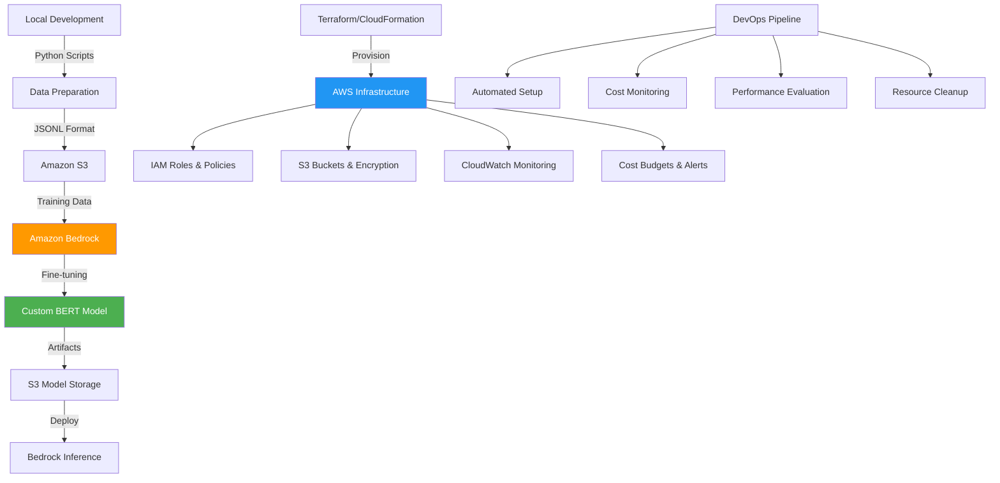

# Amazon Bedrock

## What is Amazon Bedrock?

You can choose from a range of foundation models to find the model that is best suited for your use case. Using Amazon Bedrock, you can experiment with and evaluate foundation models for your use cases, customize them with your data using techniques such as fine-tuning and Retrieval Augmented Generation (RAG), and build agents that execute tasks using your enterprise systems and data sources.

## Determine the best model for your use case

Evaluate outputs of different models with prompts to determine the model that is best suited for your application.

Model customization is the process of providing training data to a model in order to improve its performance for specific use-cases.

## Amazon Bedrock BERT fine-tuning solution

This repository now includes a **solution** for fine-tuning BERT models using Amazon Bedrock, combining local development with cloud-scale managed infrastructure.

### Architecture



### Documentation

This repository provides comprehensive documentation for both **local development** and **Amazon Bedrock cloud deployment**:

#### **Local Development & API Documentation**
- **[docs/DOCUMENTATION.md](./docs/DOCUMENTATION.md)**: Complete local API reference
  - FastAPI endpoint documentation
  - Local setup and troubleshooting
  - Development workflow
  - Docker deployment guides
  - Error handling and debugging

#### ☁️ **Amazon Bedrock Cloud Documentation**
- **[fine-tuning/README.md](./fine-tuning/README.md)**: Amazon Bedrock integration guide
- **[fine-tuning/RESOURCE_CALCULATOR.md](./fine-tuning/RESOURCE_CALCULATOR.md)**: AWS resource allocation
- This README: Architecture overview and cloud setup

> **For DevOps teams**: Use the local documentation for development/testing environments and the Bedrock documentation for production cloud deployments.

### Start

#### Option 1: Automated setup (Recommended)
```bash
# Navigate to the fine-tuning directory
cd "Amazon Bedrock/fine-tuning"

# Run the automated setup script
chmod +x setup_bedrock.sh
./setup_bedrock.sh

# Follow interactive prompts for:
# - AWS Region selection
# - Project configuration
# - Budget limits
# - Email notifications
```

#### Option 2: Manual Step-by-step setup

**Step 1: Prerequisites**
```bash
# Install AWS CLI v2
curl "https://awscli.amazonaws.com/awscli-exe-linux-x86_64.zip" -o "awscliv2.zip"
unzip awscliv2.zip && sudo ./aws/install

# Configure AWS credentials
aws configure
# Enter your Access Key, Secret Key, Region (us-east-1), and output format (json)

# Verify access to Bedrock
aws bedrock list-foundation-models --region us-east-1
```

**Step 2: Python Environment setup**
```bash
# Create dedicated environment for Bedrock
python3 -m venv bedrock_env
source bedrock_env/bin/activate

# Install all required dependencies
pip install -r requirements-bedrock.txt

# Verify installation
python -c "import boto3, torch, transformers; print('✅ All dependencies installed')"
```

**Step 3: Infrastructure deployment**

Choose your preferred Infrastructure as Code tool:

**Using Terraform (Recommended):**
```bash
cd infrastructure
terraform init
terraform plan -var="notification_email=your-email@example.com"
terraform apply -auto-approve
```

**Using CloudFormation:**
```bash
aws cloudformation deploy \
  --template-file infrastructure/bedrock-cloudformation.yaml \
  --stack-name bert-fine-tuning-stack \
  --parameter-overrides \
    ProjectName=bert-fine-tuning \
    Environment=dev \
    NotificationEmail=your-email@example.com \
    MaxBudgetAmount=100 \
  --capabilities CAPABILITY_IAM
```

**Step 4: Configure and run fine-tuning**
```bash
# Run the complete example workflow
python bedrock_example.py --mode all

# Or run individual steps:
python bedrock_example.py --mode prepare  # Prepare and upload data
python bedrock_example.py --mode train    # Start fine-tuning job
python bedrock_example.py --mode evaluate # Evaluate model performance
```

**Step 5: Monitor costs and usage**
```bash
# Check current costs
python cost_monitor.py --check-current

# Generate monthly report
python cost_monitor.py --report monthly --output monthly_report.json

# Set up cost alerts
python cost_monitor.py --set-alert 50.0 --email your-email@example.com
```

### What's included in this files?

#### **Fine-tuning components**
- **`src/bert_fine_tuning.py`**: Original local BERT fine-tuning script
- **`src/bedrock_bert_fine_tuning.py`**: Amazon Bedrock integration layer
- **`bedrock_example.py`**: Complete workflow demonstration
- **`cost_monitor.py`**: Cost tracking and optimization

#### **Infrastructure as Code**
- **`infrastructure/main.tf`**: Terraform configuration for AWS resources
- **`infrastructure/bedrock-cloudformation.yaml`**: CloudFormation alternative
- **`infrastructure/variables.tf`**: Configurable parameters
- **`setup_bedrock.sh`**: Automated deployment script

#### **Monitoring & cost control**
- **CloudWatch Integration**: Automatic logging and metrics
- **Budget Controls**: Automated cost alerts and limits
- **Performance Tracking**: Training metrics and evaluation
- **Resource Cleanup**: Automated cleanup to prevent cost overruns

#### 🔧 **Configuration Management**
- **`requirements-bedrock.txt`**: Amazon Bedrock specific dependencies
- **`config/`**: Configuration files for different environments
- **Environment Variables**: Secure credential management

### **Cost management**

#### Automated budget controls
- **Budget Limits**: Set maximum spending limits with automatic alerts
- **Cost Monitoring**: Real-time tracking of Bedrock usage costs
- **Threshold Alerts**: Email notifications at 50%, 80%, and 100% of budget
- **Resource Cleanup**: Automatic cleanup of unused resources

#### Cost optimization
- **Smart Batching**: Optimal batch sizes for cost-effective training
- **Model Selection**: Guidance on choosing cost-effective base models
- **Training Optimization**: Hyperparameter tuning for faster convergence
- **Usage Analytics**: Detailed cost breakdowns and recommendations

### 🔐 **Security & compliance**

#### Enterprise Security
- **IAM Roles**: Least-privilege access policies
- **Encryption**: S3 encryption at rest and in transit
- **VPC Integration**: Optional VPC deployment for network isolation
- **Audit Logging**: Complete audit trail in CloudWatch

#### Compliance Features
- **Data Privacy**: Secure handling of training data
- **Access Control**: Role-based access to resources
- **Retention Policies**: Configurable data retention periods
- **Compliance Reporting**: Automated compliance reports

### **DevOps**

The solution supports DevOps.

#### CI/CD
```yaml
# Example GitHub Actions workflow
name: Bedrock BERT Fine-tuning
on:
  push:
    branches: [main]
jobs:
  deploy:
    runs-on: ubuntu-latest
    steps:
      - uses: actions/checkout@v2
      - name: Setup AWS
        uses: aws-actions/configure-aws-credentials@v1
        with:
          aws-access-key-id: ${{ secrets.AWS_ACCESS_KEY_ID }}
          aws-secret-access-key: ${{ secrets.AWS_SECRET_ACCESS_KEY }}
          aws-region: us-east-1
      - name: Deploy Infrastructure
        run: |
          cd infrastructure
          terraform init
          terraform apply -auto-approve
      - name: Run Fine-tuning
        run: |
          source bedrock_env/bin/activate
          python bedrock_example.py --mode all
```

#### Monitoring
- **CloudWatch Dashboards**: Custom dashboards for training metrics
- **SNS Notifications**: Real-time alerts for job completion/failure
- **Cost Analytics**: Integration with AWS Cost Explorer
- **Performance Metrics**: Training accuracy and loss tracking

### **Performance optimization**

#### Training optimization
- **Automatic Mixed Precision**: Faster training with lower memory usage
- **Gradient Accumulation**: Handle larger effective batch sizes
- **Learning Rate Scheduling**: Optimal learning rate strategies
- **Early Stopping**: Prevent overfitting and reduce costs

#### Resource optimization
- **Instance Selection**: Automated selection of optimal instance types
- **Spot Instances**: Cost savings with spot instance integration
- **Auto-scaling**: Dynamic resource allocation based on workload
- **Resource Monitoring**: Real-time resource utilization tracking

### **Model lifecycle**

#### Version Control
- **Model Versioning**: Automatic versioning of fine-tuned models
- **Experiment Tracking**: Compare different training runs
- **Model Registry**: Centralized model artifact storage
- **Rollback Capability**: Easy rollback to previous model versions

#### Deployment Pipeline
- **A/B Testing**: Compare model performance in production
- **Blue/Green Deployment**: Zero-downtime model updates
- **Canary Releases**: Gradual rollout of new models
- **Performance Monitoring**: Production model performance tracking

### **Documentation**

#### Comprehensive Documentation
- **[docs/DOCUMENTATION.md](./docs/DOCUMENTATION.md)**: Local development API reference and troubleshooting
- **[fine-tuning/README.md](./fine-tuning/README.md)**: Amazon Bedrock cloud integration guide
- **[fine-tuning/RESOURCE_CALCULATOR.md](./fine-tuning/RESOURCE_CALCULATOR.md)**: AWS resource allocation calculator
- **Setup Guides**: Step-by-step setup instructions for both local and cloud
- **Best Practices**: Production deployment guidelines

#### Example Use Cases
- **Sentiment Analysis**: Customer feedback classification
- **Document Classification**: Automated document categorization
- **Content Moderation**: Automated content filtering
- **Custom Domain Tasks**: Industry-specific classification

This integration allows you to leverage Amazon Bedrock's managed infrastructure while maintaining your existing BERT fine-tuning code and extending it with cloud-native capabilities for production-scale deployments.

## Amazon AWS resource allocation & estimation for fine-tuning Pipeline

### Overview: Choosing the right Amazon AWS infrastructure

When fine-tuning BERT models at scale, selecting the appropriate AWS resources is critical for balancing performance, cost, and efficiency. AWS offers a comprehensive range of compute, storage, and networking solutions optimized for ML workloads.

### Amazon EC2 instance selection for ML training

#### **GPU-Based instances (Recommended for BERT fine-tuning)**

**Amazon EC2 P5 Instances** - *Latest Generation GPU Instances*
- **Use Case**: Large-scale BERT fine-tuning, complex transformer models
- **Specifications**: NVIDIA H100 Tensor Core GPUs
- **Performance**: Up to 4x faster training vs. previous generation
- **Cost Benefits**: Up to 40% reduction in training costs
- **Best For**: Production workloads, large datasets (>10GB), complex models

```bash
# P5 Instance Types for BERT Fine-tuning
Instance Type    | GPUs | GPU Memory | vCPUs | Memory  | Cost/Hour* | Best Use Case
p5.48xlarge     | 8    | 640 GB     | 192   | 2048 GB | $98.32     | Large models, batch training
p5.24xlarge     | 4    | 320 GB     | 96    | 1024 GB | $49.16     | Medium datasets
p5.12xlarge     | 2    | 160 GB     | 48    | 512 GB  | $24.58     | Small-medium models
p5.2xlarge      | 1    | 80 GB      | 12    | 128 GB  | $8.19      | Development, small datasets

*Prices shown are approximate for us-east-1 region
```

**Amazon EC2 P4d instances** - *High-Performance GPU Instances*
- **Use Case**: Cost-effective alternative for medium-scale fine-tuning
- **Specifications**: NVIDIA A100 40GB/80GB GPUs
- **Performance**: 2.5x faster than P3 instances
- **Best For**: Medium-scale BERT fine-tuning, cost-conscious workloads

```bash
# P4d Instance Recommendations
Instance Type    | GPUs | GPU Memory | vCPUs | Memory  | Cost/Hour* | Recommended For
p4d.24xlarge    | 8    | 320 GB     | 96    | 1152 GB | $32.77     | Multi-GPU training
p4de.24xlarge   | 8    | 640 GB     | 96    | 1152 GB | $40.96     | Large context models
```

**Amazon EC2 G5 instances** - *Cost-Effective GPU Instances*
- **Use Case**: Small to medium BERT fine-tuning, development
- **Specifications**: NVIDIA A10G GPUs
- **Best For**: Proof of concepts, smaller models, budget-conscious training

#### **ML Accelerators**

**Amazon EC2 Trn1/Trn1n Instances** - *AWS Trainium Accelerators*
- **Use Case**: Cost-optimized training for large models
- **Performance**: Up to 50% cost savings vs. comparable GPU instances
- **Network**: Up to 1600 Gbps EFA networking (Trn1n)
- **Best For**: Large-scale BERT training, cost optimization

```bash
# Trainium Instance Options
Instance Type    | Trainium | vCPUs | Memory  | Network  | Cost/Hour* | Use Case
trn1.32xlarge   | 16       | 128   | 512 GB  | 800 Gbps | $21.50     | Large model training
trn1n.32xlarge  | 16       | 128   | 512 GB  | 1600 Gbps| $24.78     | Network-intensive training
trn1.2xlarge    | 1        | 8     | 32 GB   | 12.5 Gbps| $1.34      | Development, small models
```

### Resource estimation calculator

#### **BERT fine-tuning resource requirements**

**Small Dataset (< 1GB, < 100K samples)**
```yaml
Recommended Setup:
  Instance: p5.2xlarge or g5.xlarge
  Training Time: 2-6 hours
  Estimated Cost: $16-50
  Storage: 100 GB EBS gp3
  Memory Requirements: 32-64 GB
```

**Medium Dataset (1-10GB, 100K-1M samples)**
```yaml
Recommended Setup:
  Instance: p5.12xlarge or p4d.24xlarge
  Training Time: 8-24 hours
  Estimated Cost: $200-800
  Storage: 500 GB EBS gp3 + S3
  Memory Requirements: 128-512 GB
```

**Large Dataset (>10GB, >1M samples)**
```yaml
Recommended Setup:
  Instance: p5.48xlarge or UltraCluster
  Training Time: 1-7 days
  Estimated Cost: $2,000-15,000
  Storage: 1-5 TB EBS gp3 + S3 + FSx Lustre
  Memory Requirements: 512-2048 GB
```

> **For detailed resource calculations and cost optimization, see the [AWS Resource Calculator Guide](./fine-tuning/RESOURCE_CALCULATOR.md)**

### Storage Architecture for ML training

#### **Amazon S3 - Training Data Storage**
```bash
# S3 Storage Classes for ML Training
Storage Class          | Use Case                    | Cost/GB/month* | Access Pattern
S3 Standard           | Active training data        | $0.023         | Frequent access
S3 Express One Zone   | High-performance training   | $0.16          | Ultra-fast access
S3 Intelligent-Tiering| Variable access patterns   | $0.0125        | Automatic optimization
```

#### **Amazon EBS - instance storage**
```bash
# EBS Volume Types for ML Training
Volume Type | IOPS      | Throughput    | Cost/GB/month* | Best For
gp3        | 3,000-16K | 125-1000 MB/s | $0.08          | General training
io2        | 100-64K   | 1000+ MB/s    | $0.125         | High IOPS training
st1        | 500       | 500 MB/s      | $0.045         | Bulk data processing
```

#### **Amazon FSx for Lustre - High-Performance File Storage**
```bash
# FSx Lustre for Large-Scale Training
Deployment Type    | Throughput/TiB | Cost/month/TiB* | Use Case
Scratch           | 200 MB/s       | $140            | Temporary training
Persistent SSD    | 250-1000 MB/s  | $240-600        | Long-term training
Persistent HDD    | 40 MB/s        | $140            | Archive/backup
```

### Networking configuration

#### **Amazon EC2 UltraClusters**
- **Scale**: Up to 20,000 GPUs in a single cluster
- **Network**: 3,200 Gbps Elastic Fabric Adapter (EFA)
- **Latency**: 16% lower latency vs. traditional clusters
- **Use Case**: Massive scale distributed training

#### **Placement Groups for Optimal Performance**
```python
# Terraform configuration for placement groups
resource "aws_placement_group" "bert_training_cluster" {
  name     = "bert-training-cluster"
  strategy = "cluster"
  
  tags = {
    Purpose = "BERT-Fine-tuning"
    Environment = "production"
  }
}
```

### Cost estimation & optimization

#### **Training cost calculator**

**Example: Medium BERT model fine-tuning**
```python
# Cost estimation example
def estimate_training_cost(
    instance_type="p5.12xlarge",
    hourly_rate=24.58,
    training_hours=12,
    storage_gb=500,
    data_transfer_gb=100
):
    compute_cost = hourly_rate * training_hours
    storage_cost = (storage_gb * 0.08) / 30 * (training_hours / 24)  # Pro-rated daily
    transfer_cost = data_transfer_gb * 0.09  # S3 transfer
    
    total_cost = compute_cost + storage_cost + transfer_cost
    
    return {
        "compute": compute_cost,
        "storage": storage_cost,
        "data_transfer": transfer_cost,
        "total": total_cost
    }

# Example output: ~$295-320 for 12-hour training
```

#### **Cost optimization**

**1. Spot instances for development**
```bash
# Up to 90% cost savings for interruptible workloads
aws ec2 request-spot-instances \
  --instance-count 1 \
  --type "one-time" \
  --launch-specification '
  {
    "ImageId": "ami-12345678",
    "InstanceType": "p5.2xlarge",
    "SecurityGroupIds": ["sg-12345678"]
  }'
```

**2. Reserved instances for production**
```bash
# 1-year commitment: 40% savings
# 3-year commitment: 60% savings
Instance Type: p5.12xlarge
On-Demand: $24.58/hour
1-Year Reserved: $14.75/hour (40% savings)
3-Year Reserved: $9.83/hour (60% savings)
```

**3. Capacity blocks for predictable workloads**
```bash
# Reserve GPU capacity for future training jobs
Duration: 1-500 instances for 1-14 days
Advance Booking: Up to 8 weeks ahead
Cost Model: Pay for reserved capacity regardless of usage
Best For: Critical training deadlines, guaranteed resources
```

### 🔧 Infrastructure as Code Templates

#### **Terraform configuration for optimal ML training**

```hcl
# Optimized EC2 instance for BERT fine-tuning
resource "aws_instance" "bert_training_instance" {
  ami                    = data.aws_ami.deep_learning.id
  instance_type         = var.instance_type  # p5.12xlarge
  subnet_id             = aws_subnet.training_subnet.id
  vpc_security_group_ids = [aws_security_group.ml_training.id]
  
  # Optimized EBS configuration
  root_block_device {
    volume_type = "gp3"
    volume_size = 500
    iops       = 3000
    throughput = 250
    encrypted  = true
  }
  
  # Placement group for optimal networking
  placement_group = aws_placement_group.bert_training_cluster.id
  
  # Enhanced networking
  ena_support    = true
  sriov_net_support = "simple"
  
  tags = {
    Name        = "BERT-Training-Instance"
    Environment = var.environment
    Project     = "BERT-Fine-tuning"
  }
}

# High-performance storage for training data
resource "aws_fsx_lustre_file_system" "training_storage" {
  storage_capacity      = 1200  # GB
  subnet_ids           = [aws_subnet.training_subnet.id]
  deployment_type      = "PERSISTENT_2"
  per_unit_storage_throughput = 250
  
  import_policy = "NEW_CHANGED"
  export_policy = "NEW_CHANGED"
  import_path   = "s3://${aws_s3_bucket.training_data.bucket}/input/"
  export_path   = "s3://${aws_s3_bucket.training_data.bucket}/output/"
}
```

### Performance monitoring & optimization

#### **CloudWatch Metrics for Training Optimization**

```python
# Custom metrics for training optimization
def publish_training_metrics(instance_id, gpu_utilization, memory_usage):
    cloudwatch = boto3.client('cloudwatch')
    
    cloudwatch.put_metric_data(
        Namespace='ML/Training',
        MetricData=[
            {
                'MetricName': 'GPUUtilization',
                'Dimensions': [
                    {
                        'Name': 'InstanceId',
                        'Value': instance_id
                    }
                ],
                'Value': gpu_utilization,
                'Unit': 'Percent'
            },
            {
                'MetricName': 'MemoryUsage',
                'Value': memory_usage,
                'Unit': 'Percent'
            }
        ]
    )
```

#### **Auto-Scaling for training workloads**

```yaml
# Auto Scaling Group for batch training jobs
AutoScalingGroup:
  Type: AWS::AutoScaling::AutoScalingGroup
  Properties:
    MinSize: 0
    MaxSize: 10
    DesiredCapacity: 2
    LaunchTemplate:
      LaunchTemplateId: !Ref MLTrainingLaunchTemplate
      Version: !GetAtt MLTrainingLaunchTemplate.LatestVersionNumber
    VPCZoneIdentifier:
      - !Ref PrivateSubnet1
      - !Ref PrivateSubnet2
    Tags:
      - Key: Name
        Value: ML-Training-ASG
        PropagateAtLaunch: true
```

### Best Practices for resource selection

#### **DevOps Checklist for Amazon AWS resource allocation**

**Pre-Training assessment**
- Estimate dataset size and complexity
- Determine training duration requirements
- Set budget constraints and cost alerts
- Choose appropriate AWS region for data locality

**Compute selection**
- P5 instances for production, latest models
- P4d instances for cost-effective alternative
- Trainium for cost optimization at scale
- Spot instances for development/testing

**Storage configuration**
- S3 Express One Zone for high-performance data access
- FSx Lustre for distributed training workloads
- EBS gp3 for local instance storage
- Enable S3 Transfer Acceleration for global datasets

**Network optimization**
- Use placement groups for multi-instance training
- Enable Enhanced Networking (ENA/SR-IOV)
- Configure EFA for distributed training
- Monitor network utilization and adjust

**Cost management**
- Set up billing alerts and budgets
- Use Reserved Instances for predictable workloads
- Implement auto-shutdown for idle instances
- Monitor and optimize resource utilization

### Start resource configurations

#### **Development environment (Budget: $50-100)**
```bash
Instance: g5.xlarge ($1.19/hour)
Storage: 100 GB EBS gp3
Training Time: 4-8 hours
Dataset: < 1 GB
Use Case: Proof of concept, algorithm development
```

#### **Production environment (Budget: $500-2000)**
```bash
Instance: p5.12xlarge ($24.58/hour)
Storage: 500 GB EBS gp3 + S3 Express One Zone
Training Time: 8-24 hours
Dataset: 1-10 GB
Use Case: Production fine-tuning, evaluation
```

#### **Enterprise environment (Budget: $2000+)**
```bash
Instance: UltraCluster with P5.48xlarge
Storage: Multi-TB FSx Lustre + S3
Training Time: Days to weeks
Dataset: > 10 GB
Use Case: Large-scale models, research, production at scale
```

This resource allocation guide helps DevOps teams make decisions about AWS infrastructure for BERT fine-tuning, balancing performance requirements with cost optimization.

### References

[Amazon Bedrock](https://aws.amazon.com/bedrock/)

[What is Amazon Bedrock?](https://docs.aws.amazon.com/bedrock/latest/userguide/what-is-bedrock.html)

[Evaluate the performance of Amazon Bedrock resources](https://docs.aws.amazon.com/bedrock/latest/userguide/evaluation.html)

[Creating production-quality generative AI applications](https://aws.amazon.com/blogs/apn/zero-to-generative-ai-with-databricks-and-aws/)

[Supported Regions and models for model evaluation](https://docs.aws.amazon.com/bedrock/latest/userguide/evaluation-support.html)

[Amazon Bedrock Workshop](https://catalog.us-east-1.prod.workshops.aws/workshops/a4bdb007-5600-4368-81c5-ff5b4154f518/en-US)

[Knowledge Bases and RAG](https://catalog.us-east-1.prod.workshops.aws/workshops/a4bdb007-5600-4368-81c5-ff5b4154f518/en-US/120-rag/)

[Customize your model to improve its performance for your use case](https://docs.aws.amazon.com/bedrock/latest/userguide/custom-models.html)

[Model Customization](https://catalog.us-east-1.prod.workshops.aws/workshops/a4bdb007-5600-4368-81c5-ff5b4154f518/en-US/130-model-customization/)

[Generative AI Infrastructure at AWS](https://aws.amazon.com/blogs/compute/generative-ai-infrastructure-at-aws/)

[AWS Machine Learning Infrastructure](https://aws.amazon.com/machine-learning/infrastructure/)

[Amazon EC2 Instance Types for Machine Learning](https://aws.amazon.com/ec2/instance-types/#Accelerated_Computing)

[Amazon EC2 P5 Instances](https://aws.amazon.com/blogs/aws/new-amazon-ec2-p5-instances-powered-by-nvidia-h100-tensor-core-gpus-for-accelerating-generative-ai-and-hpc-applications/)

[Amazon EC2 Capacity Blocks for ML](https://aws.amazon.com/blogs/aws/announcing-amazon-ec2-capacity-blocks-for-ml-to-reserve-gpu-capacity-for-your-machine-learning-workloads/)

[AWS Trainium and Inferentia](https://aws.amazon.com/machine-learning/trainium/)

[Amazon SageMaker HyperPod](https://aws.amazon.com/sagemaker/hyperpod/)

[Amazon FSx for Lustre](https://aws.amazon.com/fsx/lustre/)

[Amazon S3 Express One Zone](https://aws.amazon.com/s3/storage-classes/express-one-zone/)

[AWS Cost Management and Billing](https://aws.amazon.com/aws-cost-management/)
