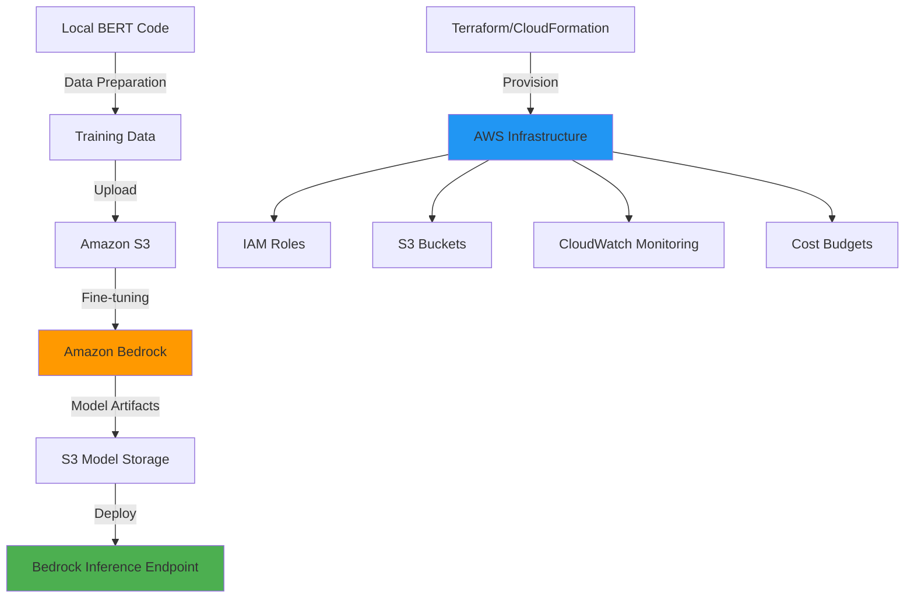

# Fine-tuning Transformer models in PyTorch with Amazon Bedrock Integration

This project demonstrates how to fine-tune pre-trained Transformer models like BERT for text classification using PyTorch, Hugging Face transformers library, and **Amazon Bedrock** for scalable cloud-based model customization.

## New: Amazon Bedrock integration

This project now supports **Amazon Bedrock** for managed, scalable fine-tuning of BERT models in the cloud. Amazon Bedrock provides:

- **Managed Infrastructure**: No need to provision or manage compute resources
- **Cost-effective**: Pay only for what you use with automatic scaling
- **Security**: Built-in security, compliance, and governance
- **Deployment**: Seamless integration with AWS services
- **Monitoring**: Built-in logging and metrics with CloudWatch

### Architecture



## What is BERT?

**BERT** (Bidirectional Encoder Representations from Transformers) is a natural language processing (NLP) model developed by Google. BERT uses a deep neural network architecture called a **Transformer** to interpret the context and meaning of words in text.

### BERT:
- **Bidirectional**: Unlike traditional models that read text from left to right, BERT reads text in both directions simultaneously
- **Pre-trained**: Trained on massive text datasets using self-supervised learning
- **Context-aware**: Understands word meaning based on surrounding context
- **Transfer Learning**: Can be fine-tuned for specific tasks with minimal additional training

## How does the BERT model work for text classification?

### 1. **Architecture**
BERT is built on the **Transformer architecture**, which relies on:
- **Multi-Head Self-Attention**: Allows the model to focus on different parts of the input sequence simultaneously
- **Feed-Forward Neural Networks**: Process the attention outputs
- **Layer Normalization**: Stabilizes training
- **Positional Encodings**: Help the model understand word order

### 2. **Attention mechanism in Transformers**
The **attention mechanism** is the core innovation of Transformers:
- **Self-Attention**: Each word in the sequence attends to every other word, creating rich contextual representations
- **Multi-Head Attention**: Multiple attention mechanisms run in parallel, capturing different types of relationships
- **Query-Key-Value**: Each word is transformed into query (Q), key (K), and value (V) vectors
- **Attention Weights**: Computed as: `Attention(Q,K,V) = softmax(QK^T/√d_k)V`

### 3. **Text Classification process**
1. **Input Tokenization**: Text is converted to token IDs using WordPiece tokenization
2. **Embedding**: Tokens are converted to dense vector representations
3. **Transformer Layers**: 12 layers (BERT-base) or 24 layers (BERT-large) process the embeddings
4. **[CLS] Token**: Special classification token whose final representation is used for classification
5. **Classification Head**: A simple linear layer maps BERT output to class probabilities

### 4. **Fine-tuning process**
Fine-tuning adapts the pre-trained BERT model to specific classification tasks:
- **Transfer Learning**: Start with pre-trained BERT weights
- **Task specific layer**: Add a classification head for your specific number of classes
- **End-to-end training**: Update all model parameters using labeled data from your domain
- **Lower Learning Rate**: Use smaller learning rates (2e-5) to preserve pre-trained knowledge

## How fine-tuning works?

### Supervised learning approach
Text classification uses **supervised learning**:
1. **Labeled dataset**: Collection of texts with their corresponding category labels
2. **Training**: Algorithm learns patterns from labeled examples
3. **Validation**: Model performance is evaluated on unseen data
4. **Inference**: Trained model predicts categories for new text

### Pre-trained model
- **Training time**: Start with language understanding already learned
- **Performance**: Leverages patterns from massive text corpora
- **Less data required**: Fine-tuning needs fewer labeled examples than training from scratch
- **Hugging Face Hub**: Easy access to pre-trained models

## Project Structure

```
PyTorch-Bedrock-Fine-tuning/
├── README.md                          # This documentation
├── RESOURCE_CALCULATOR.md             # AWS resource allocation guide
├── .gitignore                        # Git ignore file for Python projects
├── requirements.txt                  # Core dependencies
├── requirements-api.txt              # API-specific dependencies
├── requirements-bedrock.txt          # 🆕 Amazon Bedrock dependencies
├── bert_env/                         # Virtual environment (excluded from git)
├── bedrock_env/                      # 🆕 Bedrock-specific environment
├── src/
│   ├── bert_fine_tuning.py          # Main BERT fine-tuning script
│   ├── bedrock_bert_fine_tuning.py  # 🆕 Amazon Bedrock integration
│   ├── minimal_bert.py              # Simplified version
│   └── test_environment.py          # Environment verification script
├── infrastructure/                   # 🆕 Infrastructure as Code
│   ├── main.tf                      # Terraform configuration
│   ├── variables.tf                 # Terraform variables
│   ├── bedrock-cloudformation.yaml  # CloudFormation template
│   └── templates/
│       └── aws_config.tpl           # AWS configuration template
├── config/                          # 🆕 Configuration files
│   ├── bedrock_config.json         # Bedrock configuration
│   └── aws_config.json             # AWS settings
├── data/                            # 🆕 Training data directory
│   └── sample_training_data.json   # Sample training data
├── docs/                            # 📚 Documentation
│   └── DOCUMENTATION.md             # Local API reference and troubleshooting
├── api.py                           # FastAPI backend server
├── setup_bedrock.sh                # 🆕 Automated setup script
├── aws_resource_calculator.py       # 🆕 AWS resource allocation calculator
├── cost_monitor.py                  # 🆕 Cost monitoring and alerts
├── test_setup.py                   # Environment verification script
├── test_model.py                   # Model evaluation suite
├── test_api.sh                     # API testing script with curl commands
├── examples.py                     # Usage examples and guides
├── project_summary.py              # Project overview
├── Dockerfile                      # Docker container configuration
├── docker-compose.yml              # Docker Compose setup
├── nginx.conf                      # Nginx reverse proxy config
└── fine_tuned_bert/                # Saved model directory (created after training)
```

## Start with Amazon Bedrock

### Option 1: Automated setup (Recommended)
```bash
# Clone and navigate to the project
cd fine-tuning

# Run the automated setup script
chmod +x setup_bedrock.sh
./setup_bedrock.sh

# Follow the interactive prompts to configure:
# - AWS Region
# - Project name
# - Budget limits
# - Email notifications
```

### Option 2: Manual setup

#### Step 1: Prerequisites
```bash
# Install AWS CLI
curl "https://awscli.amazonaws.com/awscli-exe-linux-x86_64.zip" -o "awscliv2.zip"
unzip awscliv2.zip
sudo ./aws/install

# Configure AWS credentials
aws configure
```

#### Step 2: Python environment
```bash
# Create and activate virtual environment
python3 -m venv bedrock_env
source bedrock_env/bin/activate

# Install dependencies
pip install -r requirements-bedrock.txt
```

#### Step 3: Infrastructure deployment
Choose either Terraform or CloudFormation:

**Using Terraform:**
```bash
cd infrastructure
terraform init
terraform plan
terraform apply
```

**Using CloudFormation:**
```bash
aws cloudformation deploy \
  --template-file infrastructure/bedrock-cloudformation.yaml \
  --stack-name bert-fine-tuning-stack \
  --parameter-overrides \
    ProjectName=bert-fine-tuning \
    Environment=dev \
    NotificationEmail=your-email@example.com \
  --capabilities CAPABILITY_IAM
```

#### Step 4: Run fine-tuning
```bash
# Activate environment
source bedrock_env/bin/activate

# Run Bedrock fine-tuning
python src/bedrock_bert_fine_tuning.py
```

## Setup (Local development)

### 1. Create Python virtual environment
```bash
python3 -m venv bert_env
source bert_env/bin/activate  # On Linux/Mac
```

### 2. Install dependencies
```bash
pip install torch transformers scikit-learn numpy pandas
```

### 3. Verify setup
```bash
python test_setup.py
```

### 4. Run fine-tuning
```bash
python src/bert_fine_tuning.py
```

### 5. Start FastAPI server
```bash
# Install API dependencies
pip install -r requirements-api.txt

# Start the API server
python api.py
# or using uvicorn directly
uvicorn api:app --host 0.0.0.0 --port 8000 --reload
```

### 6. Test API Endpoints
```bash
# Run comprehensive API tests
./test_api.sh

# Or test manually with curl
curl -X POST "http://localhost:8000/classify" \
  -H "Content-Type: application/json" \
  -d '{"text": "I love this product!", "return_confidence": true}'
```

## FastAPI backend server

This project includes **FastAPI** backend that provides REST API endpoints for text classification using the fine-tuned BERT model.

> **For detailed local API documentation, complete endpoint reference, and troubleshooting, see [docs/DOCUMENTATION.md](../docs/DOCUMENTATION.md)**

### API
- **RESTful Endpoints**: Standard HTTP methods for text classification
- **Single & batch processing**: Classify one text or multiple texts at once
- **Confidence scores**: Optional confidence values for predictions
- **Health monitoring**: Health check and model status endpoints
- **Documentation**: Auto-generated API docs with Swagger UI
- **CORS**: Cross-Origin Resource Sharing enabled
- **Error handling**: Comprehensive error responses and logging
- **Performance metrics**: Processing time tracking

### API Endpoints

#### 1. **Root Endpoint**
```bash
GET /
# Returns basic API information
```

#### 2. **Health Check**
```bash
GET /health
# Returns API and model health status
curl http://localhost:8000/health
```

#### 3. **Model information**
```bash
GET /model/info
# Returns detailed model information
curl http://localhost:8000/model/info
```

#### 4. **Text Classification (Single)**
```bash
POST /classify
# Classify a single text
curl -X POST "http://localhost:8000/classify" \
  -H "Content-Type: application/json" \
  -d '{"text": "I absolutely love this product!", "return_confidence": true}'

# Response:
{
  "text": "I absolutely love this product!",
  "prediction": 1,
  "label": "positive",
  "confidence": 0.9876,
  "processing_time_ms": 45.23
}
```

#### 5. **Text Classification (Batch)**
```bash
POST /classify/batch
# Classify multiple texts at once
curl -X POST "http://localhost:8000/classify/batch" \
  -H "Content-Type: application/json" \
  -d '{
    "texts": ["Great product!", "Terrible service.", "It was okay."],
    "return_confidence": true
  }'

# Response:
{
  "results": [
    {
      "text": "Great product!",
      "prediction": 1,
      "label": "positive",
      "confidence": 0.9234,
      "processing_time_ms": 42.1
    },
    // ... more results
  ],
  "total_texts": 3,
  "total_processing_time_ms": 123.45
}
```

#### 6. **Classifications - Demo**
```bash
GET /classify/demo
# Returns sample classifications for testing
curl http://localhost:8000/classify/demo
```

### Documentation (API)

The FastAPI server automatically generates interactive documentation:

- **Swagger UI**: http://localhost:8000/docs
- **ReDoc**: http://localhost:8000/redoc

These interfaces allow you to:
- Browse all available endpoints
- Test API calls directly in the browser
- View request/response schemas
- Download OpenAPI specifications

### Starting the API server

#### Method 1: Python (Execution)
```bash
# Activate virtual environment
source bert_env/bin/activate

# Install API dependencies
pip install -r requirements-api.txt

# Start server
python api.py
```

#### Method 2: Using Uvicorn
```bash
# Development mode with auto-reload
uvicorn api:app --host 0.0.0.0 --port 8000 --reload

# Production mode
uvicorn api:app --host 0.0.0.0 --port 8000 --workers 4
```

### Testing the API

#### Automated testing
```bash
# Run comprehensive test suite
./test_api.sh
```

#### Manual testing
```bash
# Basic classification
curl -X POST "http://localhost:8000/classify" \
  -H "Content-Type: application/json" \
  -d '{"text": "This movie was fantastic!"}'

# With confidence scores
curl -X POST "http://localhost:8000/classify" \
  -H "Content-Type: application/json" \
  -d '{"text": "I hate this product.", "return_confidence": true}'

# Batch processing
curl -X POST "http://localhost:8000/classify/batch" \
  -H "Content-Type: application/json" \
  -d '{
    "texts": ["Amazing service!", "Poor quality.", "Average experience."],
    "return_confidence": true
  }'

# Health check
curl http://localhost:8000/health

# Model information
curl http://localhost:8000/model/info
```

## Docker deployment

The project includes complete **Docker** support for containerized deployment.

### Docker
- **Multi-stage Build**: Optimized container size
- **Security**: Non-root user execution
- **Health Checks**: Container health monitoring  
- **Resource Limits**: Memory and CPU constraints
- **Environment Configuration**: Flexible deployment options
- **Nginx Integration**: Optional reverse proxy setup

### Start with Docker

#### 1. **Build and run with Docker**
```bash
# Build the Docker image
docker build -t bert-classifier .

# Run the container
docker run -p 8000:8000 bert-classifier

# Run with custom configuration
docker run -p 8000:8000 \
  -e LOG_LEVEL=debug \
  -v $(pwd)/fine_tuned_bert:/app/fine_tuned_bert:ro \
  bert-classifier
```

#### 2. **Using Docker Compose (Recommended)**
```bash
# Start the service
docker-compose up -d

# View logs
docker-compose logs -f

# Stop the service
docker-compose down

# Start with nginx (production)
docker-compose --profile production up -d
```

#### 3. **Production deployment**
```bash
# Build and run with nginx reverse proxy
docker-compose --profile production up -d

# Scale the API service
docker-compose up -d --scale bert-api=3
```

### Docker configuration

#### **Dockerfile**
The Dockerfile includes:
- Python 3.11 slim base image
- System dependencies installation
- Python package installation with caching
- Non-root user for security
- Health check configuration
- Optimized layer caching

#### **Docker Compose**
The docker-compose.yml provides:
- API service configuration
- Port mapping (8000:8000)
- Volume mounting for models
- Health checks
- Resource limits
- Optional nginx reverse proxy

#### **Environment variables**
```bash
# Available environment variables
LOG_LEVEL=info          # Logging level
PYTHONPATH=/app         # Python path
MODEL_PATH=/app/fine_tuned_bert  # Custom model path
```

### Docker deployment options

#### **Development**
```bash
# Basic development setup
docker-compose up -d
# Access API at http://localhost:8000
```

#### **Production with Load Balancer**
```bash
# Production setup with nginx
docker-compose --profile production up -d
# Access API through nginx at http://localhost:80
```

#### **Kubernetes deployment**
```yaml
# kubernetes-deployment.yaml (example)
apiVersion: apps/v1
kind: Deployment
metadata:
  name: bert-classifier
spec:
  replicas: 3
  selector:
    matchLabels:
      app: bert-classifier
  template:
    metadata:
      labels:
        app: bert-classifier
    spec:
      containers:
      - name: bert-classifier
        image: bert-classifier:latest
        ports:
        - containerPort: 8000
        resources:
          requests:
            memory: "2Gi"
            cpu: "500m"
          limits:
            memory: "4Gi"
            cpu: "1000m"
---
apiVersion: v1
kind: Service
metadata:
  name: bert-classifier-service
spec:
  selector:
    app: bert-classifier
  ports:
  - port: 80
    targetPort: 8000
  type: LoadBalancer
```

### Container health monitoring

#### **Health Check Endpoint**
```bash
# Check container health
curl http://localhost:8000/health

# Docker health status
docker ps
# Look for "healthy" status
```

#### **Monitoring commands**
```bash
# View container logs
docker logs <container_id>

# Monitor resource usage
docker stats <container_id>

# Execute commands inside container
docker exec -it <container_id> /bin/bash
```

### Troubleshooting Docker

#### **Problems**
```bash
# Container not starting
docker logs <container_id>

# Port already in use
docker ps | grep 8000
sudo netstat -tulpn | grep 8000

# Model not loading
# Ensure fine_tuned_bert directory exists
ls -la fine_tuned_bert/

# Memory issues
# Increase Docker memory limits
# Or use smaller models like DistilBERT
```

#### **Performance optimization**
```bash
# Use multi-stage builds
# Enable Docker BuildKit
DOCKER_BUILDKIT=1 docker build -t bert-classifier .

# Use .dockerignore to exclude unnecessary files
# Optimize layer caching by copying requirements first
```

## Testing fine-tuning success

### 1. **Training metrics**
- **Loss Reduction**: Training loss should decrease over epochs
- **Convergence**: Loss should stabilize (not oscillate wildly)
- **No Overfitting**: Validation loss shouldn't increase while training loss decreases

### 2. **Evaluation metrics**
- **Accuracy**: Percentage of correctly classified samples
- **Precision**: True positives / (True positives + False positives)
- **Recall**: True positives / (True positives + False negatives)  
- **F1-Score**: Harmonic mean of precision and recall

### 3. **Test cases**
```python
# Example test cases
test_cases = [
    ("I love this product!", 1),      # Positive
    ("This is terrible quality", 0),   # Negative
    ("Average experience", ???),       # Neutral - check model confidence
]
```

## Model performance evaluation

### 1. **Validation split**
- Split data into training (80%), validation (10%), test (10%)
- Use validation set to tune hyperparameters
- Use test set for final performance evaluation

### 2. **Cross validation**
- K-fold cross-validation for robust performance estimates
- Helps detect overfitting and ensures generalization

### 3. **Confusion matrix**
- Visualize classification performance across all classes
- Identify which classes are being confused

### 4. **Classification report**
```python
from sklearn.metrics import classification_report
print(classification_report(y_true, y_pred))
```

## Model Prediction testing

### 1. **Inference function**
```python
def predict_sentiment(text, model, tokenizer):
    inputs = tokenizer(text, return_tensors="pt", 
                      padding=True, truncation=True, max_length=128)
    with torch.no_grad():
        outputs = model(**inputs)
        prediction = torch.argmax(outputs.logits, dim=-1)
    return prediction.item()
```

### 2. **Batch prediction**
- Process multiple texts efficiently
- Monitor prediction confidence scores
- Handle edge cases and out-of-domain text

### 3. **Model interpretability**
- Use attention visualization to understand model decisions
- Analyze which words contribute most to predictions
- Test with adversarial examples

## Advanced topics

### **Model variants**
- RoBERTa: Robustly Optimized BERT
- DistilBERT: Smaller, faster BERT
- ALBERT: A Lite BERT
- DeBERTa: Decoding-enhanced BERT

### **Production deployment**
- **Model quantization for faster inference**: Reduce model size and inference time
- **ONNX export for cross-platform deployment**: Convert to ONNX format for broader compatibility
- **API endpoints with FastAPI/Flask**: RESTful services for integration
- **Docker containerization**: Scalable deployment with container orchestration
- **Monitoring and logging in production**: Track performance and detect issues
- **Load balancing and auto-scaling**: Handle high traffic loads
- **Security considerations**: Authentication, rate limiting, and input validation

## References

- **docs/DOCUMENTATION.md**: [Local API Reference and Troubleshooting Guide](../docs/DOCUMENTATION.md)
- **RESOURCE_CALCULATOR.md**: [AWS Resource Allocation Calculator Guide](./RESOURCE_CALCULATOR.md)
- **BERT Paper**: [Attention Is All You Need](https://arxiv.org/abs/1706.03762)
- **BERT**: [BERT: Pre-training of Deep Bidirectional Transformers](https://arxiv.org/abs/1810.04805)
- **Hugging Face**: [https://huggingface.co/](https://huggingface.co/)
- **PyTorch**: [https://pytorch.org/](https://pytorch.org/)
- **Text Classification with BERT**: [https://www.sabrepc.com/blog/Deep-Learning-and-AI/text-classification-with-bert](https://www.sabrepc.com/blog/Deep-Learning-and-AI/text-classification-with-bert)
