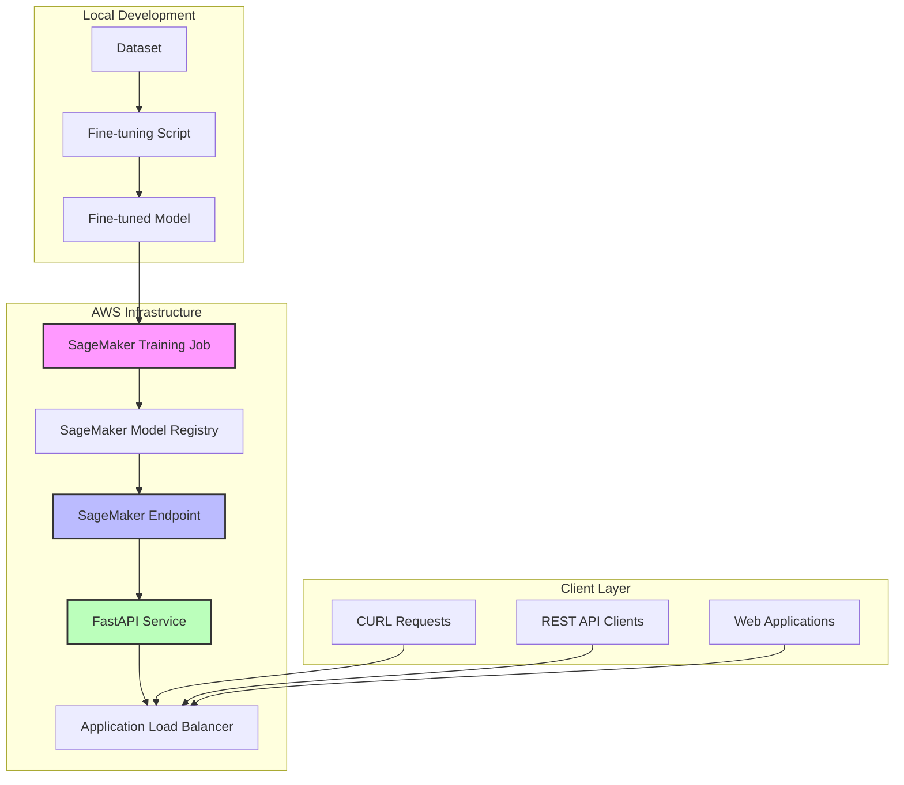

# Amazon SageMaker deployment for Arcee Agent

This document covers deploying the Arcee Agent function calling system to Amazon AWS using SageMaker for fine-tuning and deployment.

## Overview

The deployment process involves:
1. **Local development**: Fine-tune Arcee Agent on local dataset
2. **Containerization**: Create Docker images for deployment
3. **Amazon AWS setup**: Configure IAM roles and SageMaker environment
4. **Model Deployment**: Deploy fine-tuned model to SageMaker endpoints
5. **API service**: FastAPI service for client requests
6. **Cost management**: Resource allocation and monitoring

## Architecture



## Prerequisites

### Local environment setup

1. **Install AWS CLI and SDK**:
```bash
# Install AWS CLI
curl "https://awscli.amazonaws.com/awscli-exe-linux-x86_64.zip" -o "awscliv2.zip"
unzip awscliv2.zip
sudo ./aws/install

# Install boto3 and sagemaker SDK
pip install boto3 sagemaker awscli
```

2. **Install Docker**:
```bash
# Ubuntu/Debian
sudo apt-get update
sudo apt-get install docker.io docker-compose
sudo usermod -aG docker $USER
# Log out and back in for group changes
```

3. **Install additional dependencies**:
```bash
# Add to requirements.txt
echo "fastapi[all]" >> requirements.txt
echo "uvicorn[standard]" >> requirements.txt
echo "boto3" >> requirements.txt
echo "sagemaker" >> requirements.txt
echo "docker" >> requirements.txt
```

### Amazon AWS configuration

1. **Configure AWS credentials**:
```bash
aws configure
# Enter your AWS Access Key ID, Secret Access Key, region, and output format
```

2. **Create IAM roles** (see IAM setup section below)

## Step 1: Local fine-tuning with quantized model

### Modified fine-tuning for Amazon AWS deployment

Update `fine_tune_arcee.py` to support quantized models and AWS integration:

```python
# Additional imports for AWS
import boto3
from sagemaker.huggingface import HuggingFace
from sagemaker import get_execution_role

# Add quantization support
def load_quantized_model(model_name):
    """Load quantized model for local fine-tuning."""
    from transformers import BitsAndBytesConfig
    
    quantization_config = BitsAndBytesConfig(
        load_in_4bit=True,
        bnb_4bit_quant_type="nf4",
        bnb_4bit_compute_dtype=torch.float16,
        bnb_4bit_use_double_quant=True,
    )
    
    model = AutoModelForCausalLM.from_pretrained(
        model_name,
        quantization_config=quantization_config,
        device_map="auto",
        trust_remote_code=True
    )
    
    return model

# Add Amazon AWS model upload function
def upload_model_to_s3(model_path, s3_bucket, s3_key):
    """Upload fine-tuned model to S3."""
    s3_client = boto3.client('s3')
    
    # Compress model directory
    import tarfile
    tar_path = f"{model_path}.tar.gz"
    
    with tarfile.open(tar_path, "w:gz") as tar:
        tar.add(model_path, arcname=os.path.basename(model_path))
    
    # Upload to S3
    s3_client.upload_file(tar_path, s3_bucket, s3_key)
    print(f"Model uploaded to s3://{s3_bucket}/{s3_key}")
    
    return f"s3://{s3_bucket}/{s3_key}"
```

### Run local fine-tuning

```bash
# Install quantization dependencies
pip install bitsandbytes accelerate

# Run fine-tuning with quantized model
python fine_tune_arcee.py \
    --dataset_path ./dataset \
    --output_dir ./fine_tuned_arcee_agent \
    --num_epochs 3 \
    --batch_size 1 \
    --gradient_accumulation_steps 8 \
    --use_quantization
```

## Step 2: Containerization

### Dockerfile for main application

```dockerfile
FROM python:3.11-slim

WORKDIR /app

# Install system dependencies
RUN apt-get update && apt-get install -y \
    gcc \
    g++ \
    && rm -rf /var/lib/apt/lists/*

# Copy requirements and install Python dependencies
COPY requirements.txt .
RUN pip install --no-cache-dir -r requirements.txt

# Copy application code
COPY main.py .
COPY model_manager.py .
COPY sagemaker_inference.py .
COPY api_server.py .

# Create directories
RUN mkdir -p /app/models /app/logs

# Expose port for FastAPI
EXPOSE 8080

# Command to run the application
CMD ["uvicorn", "api_server:app", "--host", "0.0.0.0", "--port", "8080"]
```

### Docker Compose for local testing

```yaml
version: '3.8'

services:
  arcee-agent-api:
    build: .
    ports:
      - "8080:8080"
    environment:
      - AWS_DEFAULT_REGION=us-east-1
      - SAGEMAKER_ENDPOINT_NAME=arcee-agent-endpoint
    volumes:
      - ./models:/app/models
      - ./logs:/app/logs
      - ~/.aws:/root/.aws:ro
    networks:
      - arcee-network

  nginx:
    image: nginx:alpine
    ports:
      - "80:80"
    volumes:
      - ./nginx.conf:/etc/nginx/nginx.conf
    depends_on:
      - arcee-agent-api
    networks:
      - arcee-network

networks:
  arcee-network:
    driver: bridge
```

## Step 3: FastAPI service

Create `api_server.py`:

```python
#!/usr/bin/env python3
"""
FastAPI service for Arcee Agent function calling

Provides RESTful API endpoints for client requests.
"""

from fastapi import FastAPI, HTTPException, BackgroundTasks
from pydantic import BaseModel
from typing import List, Dict, Any, Optional
import json
import logging
import os
from datetime import datetime

# Import our modules
from main import process_single_query, create_function_calling_prompt, parse_tool_calls
from sagemaker_inference import SageMakerInference

# Configure logging
logging.basicConfig(level=logging.INFO)
logger = logging.getLogger(__name__)

app = FastAPI(
    title="Arcee Agent Function Calling API",
    description="API for function calling with Arcee Agent model",
    version="1.0.0"
)

# Initialize SageMaker inference
sagemaker_inference = SageMakerInference()

class ToolDefinition(BaseModel):
    name: str
    description: str
    parameters: Dict[str, Any]

class FunctionCallRequest(BaseModel):
    query: str
    tools: List[ToolDefinition]
    temperature: Optional[float] = 0.1
    max_tokens: Optional[int] = 512

class FunctionCallResponse(BaseModel):
    query: str
    tool_calls: List[Dict[str, Any]]
    processing_time: float
    model_response: str
    timestamp: str

@app.get("/")
async def root():
    """Health check endpoint."""
    return {
        "service": "Arcee Agent Function Calling API",
        "status": "healthy",
        "timestamp": datetime.utcnow().isoformat()
    }

@app.get("/health")
async def health_check():
    """Detailed health check."""
    try:
        # Check SageMaker endpoint
        endpoint_status = sagemaker_inference.check_endpoint_status()
        
        return {
            "status": "healthy",
            "sagemaker_endpoint": endpoint_status,
            "timestamp": datetime.utcnow().isoformat()
        }
    except Exception as e:
        raise HTTPException(status_code=503, detail=f"Service unhealthy: {str(e)}")

@app.post("/function-call", response_model=FunctionCallResponse)
async def function_call(request: FunctionCallRequest):
    """
    Process a function calling request.
    
    Args:
        request: Function call request with query and tools
        
    Returns:
        Function call response with extracted tool calls
    """
    start_time = datetime.utcnow()
    
    try:
        # Convert tools to the expected format
        tools_list = [tool.dict() for tool in request.tools]
        
        # Create prompt
        prompt = create_function_calling_prompt(request.query, tools_list)
        
        # Call SageMaker endpoint
        model_response = await sagemaker_inference.predict(
            prompt=prompt,
            temperature=request.temperature,
            max_tokens=request.max_tokens
        )
        
        # Parse tool calls
        tool_calls = parse_tool_calls(model_response)
        
        # Calculate processing time
        end_time = datetime.utcnow()
        processing_time = (end_time - start_time).total_seconds()
        
        return FunctionCallResponse(
            query=request.query,
            tool_calls=tool_calls,
            processing_time=processing_time,
            model_response=model_response,
            timestamp=end_time.isoformat()
        )
        
    except Exception as e:
        logger.error(f"Error processing function call: {e}")
        raise HTTPException(status_code=500, detail=f"Processing error: {str(e)}")

@app.post("/batch-function-call")
async def batch_function_call(
    requests: List[FunctionCallRequest],
    background_tasks: BackgroundTasks
):
    """
    Process multiple function calling requests in batch.
    """
    if len(requests) > 10:  # Limit batch size
        raise HTTPException(status_code=400, detail="Batch size limited to 10 requests")
    
    try:
        results = []
        for req in requests:
            result = await function_call(req)
            results.append(result)
        
        return {
            "batch_size": len(requests),
            "results": results,
            "timestamp": datetime.utcnow().isoformat()
        }
        
    except Exception as e:
        raise HTTPException(status_code=500, detail=f"Batch processing error: {str(e)}")

@app.get("/models")
async def list_models():
    """List available models."""
    return {
        "models": [
            {
                "id": "arcee-agent-fine-tuned",
                "name": "Fine-tuned Arcee Agent",
                "endpoint": os.getenv("SAGEMAKER_ENDPOINT_NAME"),
                "status": "active"
            }
        ]
    }

if __name__ == "__main__":
    import uvicorn
    uvicorn.run(app, host="0.0.0.0", port=8080)
```

## Step 4: SageMaker integration

Create `sagemaker_inference.py`:

```python
#!/usr/bin/env python3
"""
SageMaker inference integration for Arcee Agent
"""

import boto3
import json
import asyncio
import logging
from typing import Dict, Any, Optional
import os

logger = logging.getLogger(__name__)

class SageMakerInference:
    """SageMaker inference client for Arcee Agent."""
    
    def __init__(self):
        self.sagemaker_runtime = boto3.client('sagemaker-runtime')
        self.endpoint_name = os.getenv('SAGEMAKER_ENDPOINT_NAME')
        
        if not self.endpoint_name:
            raise ValueError("SAGEMAKER_ENDPOINT_NAME environment variable not set")
    
    async def predict(self, prompt: str, temperature: float = 0.1, max_tokens: int = 512) -> str:
        """
        Make prediction using SageMaker endpoint.
        
        Args:
            prompt: Input prompt for the model
            temperature: Sampling temperature
            max_tokens: Maximum tokens to generate
            
        Returns:
            Model response string
        """
        try:
            # Prepare payload
            payload = {
                "inputs": prompt,
                "parameters": {
                    "temperature": temperature,
                    "max_new_tokens": max_tokens,
                    "do_sample": True,
                    "return_full_text": False
                }
            }
            
            # Make async request
            loop = asyncio.get_event_loop()
            response = await loop.run_in_executor(
                None,
                self._invoke_endpoint,
                json.dumps(payload)
            )
            
            # Parse response
            result = json.loads(response['Body'].read().decode())
            
            if isinstance(result, list) and len(result) > 0:
                return result[0].get('generated_text', '')
            else:
                return result.get('generated_text', '')
                
        except Exception as e:
            logger.error(f"SageMaker prediction error: {e}")
            raise
    
    def _invoke_endpoint(self, payload: str):
        """Synchronous endpoint invocation."""
        return self.sagemaker_runtime.invoke_endpoint(
            EndpointName=self.endpoint_name,
            ContentType='application/json',
            Body=payload
        )
    
    def check_endpoint_status(self) -> str:
        """Check SageMaker endpoint status."""
        try:
            sagemaker_client = boto3.client('sagemaker')
            response = sagemaker_client.describe_endpoint(
                EndpointName=self.endpoint_name
            )
            return response['EndpointStatus']
        except Exception as e:
            logger.error(f"Error checking endpoint status: {e}")
            return "Unknown"
```

## Step 5: Amazon AWS deployment scripts

### IAM roles setup

Create `setup_iam_roles.py`:

```python
#!/usr/bin/env python3
"""
Setup IAM roles for SageMaker deployment
"""

import boto3
import json

def create_sagemaker_execution_role():
    """Create SageMaker execution role."""
    iam = boto3.client('iam')
    
    # Trust policy for SageMaker
    trust_policy = {
        "Version": "2012-10-17",
        "Statement": [
            {
                "Effect": "Allow",
                "Principal": {
                    "Service": "sagemaker.amazonaws.com"
                },
                "Action": "sts:AssumeRole"
            }
        ]
    }
    
    # Create role
    try:
        response = iam.create_role(
            RoleName='ArceeAgentSageMakerRole',
            AssumeRolePolicyDocument=json.dumps(trust_policy),
            Description='SageMaker execution role for Arcee Agent'
        )
        
        role_arn = response['Role']['Arn']
        print(f"Created role: {role_arn}")
        
        # Attach policies
        policies = [
            'arn:aws:iam::aws:policy/AmazonSageMakerFullAccess',
            'arn:aws:iam::aws:policy/AmazonS3FullAccess',
            'arn:aws:iam::aws:policy/CloudWatchLogsFullAccess'
        ]
        
        for policy in policies:
            iam.attach_role_policy(
                RoleName='ArceeAgentSageMakerRole',
                PolicyArn=policy
            )
            print(f"Attached policy: {policy}")
        
        return role_arn
        
    except iam.exceptions.EntityAlreadyExistsException:
        print("Role already exists")
        return iam.get_role(RoleName='ArceeAgentSageMakerRole')['Role']['Arn']

if __name__ == "__main__":
    role_arn = create_sagemaker_execution_role()
    print(f"SageMaker Role ARN: {role_arn}")
```

### SageMaker training job

Create `sagemaker_training.py`:

```python
#!/usr/bin/env python3
"""
SageMaker training job for fine-tuning Arcee Agent
"""

import boto3
import sagemaker
from sagemaker.huggingface import HuggingFace
import os

def create_training_job():
    """Create SageMaker training job for Arcee Agent fine-tuning."""
    
    # SageMaker session
    sess = sagemaker.Session()
    role = os.getenv('SAGEMAKER_ROLE_ARN', 'arn:aws:iam::YOUR_ACCOUNT:role/ArceeAgentSageMakerRole')
    
    # Training script and requirements
    huggingface_estimator = HuggingFace(
        entry_point='fine_tune_sagemaker.py',
        source_dir='.',
        instance_type='ml.g4dn.xlarge',  # GPU instance
        instance_count=1,
        role=role,
        transformers_version='4.26',
        pytorch_version='1.13',
        py_version='py39',
        hyperparameters={
            'epochs': 3,
            'per_device_train_batch_size': 1,
            'per_device_eval_batch_size': 1,
            'warmup_steps': 100,
            'learning_rate': 5e-5,
            'fp16': True,
            'logging_steps': 10,
            'evaluation_strategy': 'steps',
            'eval_steps': 50,
            'save_steps': 100,
            'output_dir': '/opt/ml/model'
        },
        max_run=86400,  # 24 hours
        use_spot_instances=True,  # Cost optimization
        max_wait=90000
    )
    
    # Upload dataset to S3
    dataset_s3_path = sess.upload_data(
        path='./dataset',
        bucket=sess.default_bucket(),
        key_prefix='arcee-agent/dataset'
    )
    
    print(f"Dataset uploaded to: {dataset_s3_path}")
    
    # Start training
    huggingface_estimator.fit({
        'train': dataset_s3_path
    })
    
    return huggingface_estimator

if __name__ == "__main__":
    estimator = create_training_job()
    print(f"Training job started: {estimator.latest_training_job.name}")
```

### Model deployment script

Create `deploy_model.py`:

```python
#!/usr/bin/env python3
"""
Deploy fine-tuned Arcee Agent model to SageMaker endpoint
"""

import boto3
import sagemaker
from sagemaker.huggingface import HuggingFaceModel
import os

def deploy_model(model_data_s3_path: str):
    """Deploy model to SageMaker endpoint."""
    
    sess = sagemaker.Session()
    role = os.getenv('SAGEMAKER_ROLE_ARN')
    
    # Create HuggingFace model
    huggingface_model = HuggingFaceModel(
        model_data=model_data_s3_path,
        role=role,
        transformers_version="4.26",
        pytorch_version="1.13",
        py_version="py39",
        entry_point="inference.py",
        source_dir="."
    )
    
    # Deploy to endpoint
    predictor = huggingface_model.deploy(
        initial_instance_count=1,
        instance_type="ml.g4dn.xlarge",
        endpoint_name="arcee-agent-endpoint"
    )
    
    print(f"Model deployed to endpoint: {predictor.endpoint_name}")
    return predictor

def create_auto_scaling_policy(endpoint_name: str):
    """Create auto-scaling policy for cost optimization."""
    
    autoscaling = boto3.client('application-autoscaling')
    
    # Register scalable target
    autoscaling.register_scalable_target(
        ServiceNamespace='sagemaker',
        ResourceId=f'endpoint/{endpoint_name}/variant/AllTraffic',
        ScalableDimension='sagemaker:variant:DesiredInstanceCount',
        MinCapacity=0,  # Scale to zero when not in use
        MaxCapacity=3   # Maximum instances
    )
    
    # Create scaling policy
    autoscaling.put_scaling_policy(
        PolicyName=f'{endpoint_name}-scaling-policy',
        ServiceNamespace='sagemaker',
        ResourceId=f'endpoint/{endpoint_name}/variant/AllTraffic',
        ScalableDimension='sagemaker:variant:DesiredInstanceCount',
        PolicyType='TargetTrackingScaling',
        TargetTrackingScalingPolicyConfiguration={
            'TargetValue': 70.0,
            'PredefinedMetricSpecification': {
                'PredefinedMetricType': 'SageMakerVariantInvocationsPerInstance'
            },
            'ScaleOutCooldown': 300,
            'ScaleInCooldown': 300
        }
    )
    
    print(f"Auto-scaling policy created for {endpoint_name}")

if __name__ == "__main__":
    # Replace with your model S3 path
    model_s3_path = "s3://your-bucket/arcee-agent/model/model.tar.gz"
    predictor = deploy_model(model_s3_path)
    create_auto_scaling_policy(predictor.endpoint_name)
```

## Step 6: Cost management

### CloudWatch monitoring

Create `setup_monitoring.py`:

```python
#!/usr/bin/env python3
"""
Setup CloudWatch monitoring and cost alerts
"""

import boto3

def create_cost_alert():
    """Create CloudWatch alarm for cost monitoring."""
    
    cloudwatch = boto3.client('cloudwatch')
    
    # Create alarm for SageMaker costs
    cloudwatch.put_metric_alarm(
        AlarmName='ArceeAgent-SageMaker-CostAlert',
        ComparisonOperator='GreaterThanThreshold',
        EvaluationPeriods=1,
        MetricName='EstimatedCharges',
        Namespace='AWS/Billing',
        Period=86400,  # Daily
        Statistic='Maximum',
        Threshold=100.0,  # $100 threshold
        ActionsEnabled=True,
        AlarmActions=[
            'arn:aws:sns:us-east-1:YOUR_ACCOUNT:cost-alerts'
        ],
        AlarmDescription='Alert when SageMaker costs exceed $100',
        Dimensions=[
            {
                'Name': 'Currency',
                'Value': 'USD'
            },
            {
                'Name': 'ServiceName',
                'Value': 'AmazonSageMaker'
            }
        ]
    )
    
    print("Cost alert created")

def setup_endpoint_monitoring(endpoint_name: str):
    """Setup monitoring for SageMaker endpoint."""
    
    cloudwatch = boto3.client('cloudwatch')
    
    # Invocation rate alarm
    cloudwatch.put_metric_alarm(
        AlarmName=f'{endpoint_name}-HighInvocationRate',
        ComparisonOperator='GreaterThanThreshold',
        EvaluationPeriods=2,
        MetricName='Invocations',
        Namespace='AWS/SageMaker',
        Period=300,
        Statistic='Sum',
        Threshold=1000.0,
        ActionsEnabled=True,
        AlarmDescription='High invocation rate detected',
        Dimensions=[
            {
                'Name': 'EndpointName',
                'Value': endpoint_name
            }
        ]
    )
    
    print(f"Monitoring setup for {endpoint_name}")

if __name__ == "__main__":
    create_cost_alert()
    setup_endpoint_monitoring("arcee-agent-endpoint")
```

## Step 7: Deployment commands

### Build and deploy script

Create `deploy.sh`:

```bash
#!/bin/bash

set -e

echo "🚀 Deploying Arcee Agent to AWS SageMaker"

# Configuration
AWS_REGION=${AWS_REGION:-us-east-1}
ECR_REPOSITORY=${ECR_REPOSITORY:-arcee-agent}
S3_BUCKET=${S3_BUCKET:-arcee-agent-models}

# Step 1: Setup IAM roles
echo "📋 Setting up IAM roles..."
python setup_iam_roles.py

# Step 2: Create S3 bucket for models
echo "📦 Creating S3 bucket..."
aws s3 mb s3://$S3_BUCKET --region $AWS_REGION || echo "Bucket already exists"

# Step 3: Build and push Docker image
echo "🐳 Building Docker image..."
docker build -t $ECR_REPOSITORY .

# Create ECR repository
aws ecr create-repository --repository-name $ECR_REPOSITORY --region $AWS_REGION || echo "Repository exists"

# Get login token
aws ecr get-login-password --region $AWS_REGION | docker login --username AWS --password-stdin $(aws sts get-caller-identity --query Account --output text).dkr.ecr.$AWS_REGION.amazonaws.com

# Tag and push image
ECR_URI=$(aws sts get-caller-identity --query Account --output text).dkr.ecr.$AWS_REGION.amazonaws.com/$ECR_REPOSITORY:latest
docker tag $ECR_REPOSITORY:latest $ECR_URI
docker push $ECR_URI

echo "📤 Docker image pushed to: $ECR_URI"

# Step 4: Upload fine-tuned model (if exists)
if [ -d "./fine_tuned_arcee_agent" ]; then
    echo "📤 Uploading fine-tuned model..."
    tar -czf fine_tuned_model.tar.gz -C fine_tuned_arcee_agent .
    aws s3 cp fine_tuned_model.tar.gz s3://$S3_BUCKET/models/fine_tuned_model.tar.gz
    rm fine_tuned_model.tar.gz
fi

# Step 5: Deploy model to SageMaker
echo "🤖 Deploying model to SageMaker..."
export SAGEMAKER_ROLE_ARN=$(aws iam get-role --role-name ArceeAgentSageMakerRole --query 'Role.Arn' --output text)
python deploy_model.py

# Step 6: Setup monitoring
echo "📊 Setting up monitoring..."
python setup_monitoring.py

echo "✅ Deployment completed!"
echo "🔗 API will be available at: http://your-load-balancer-url"
echo "💰 Monitor costs at: https://console.aws.amazon.com/billing/"
```

Make it executable:
```bash
chmod +x deploy.sh
```

## Usage

### Test the deployed API:

```bash
# Health check
curl http://your-api-endpoint/health

# Function calling request
curl -X POST http://your-api-endpoint/function-call \
  -H "Content-Type: application/json" \
  -d '{
    "query": "Where can I find live giveaways for beta access and games?",
    "tools": [
      {
        "name": "live_giveaways_by_type",
        "description": "Retrieve live giveaways from the GamerPower API",
        "parameters": {
          "type": {
            "type": "string",
            "description": "Type of giveaways (game, loot, beta)"
          }
        }
      }
    ],
    "temperature": 0.1,
    "max_tokens": 512
  }'
```

## Cost optimization

1. **Use Spot Instances**: For training jobs
2. **Auto-scaling**: Scale endpoints to zero when not in use
3. **Reserved Instances**: For predictable workloads
4. **Monitor Usage**: Set up CloudWatch alarms
5. **Batch Processing**: Group requests to reduce cold starts

This setup provides a production-ready deployment of your Arcee Agent system on AWS SageMaker with proper cost controls and monitoring.
