# Arcee Agent

Arcee Agent is a 7B parameter language model designed for function calling and tool use.

This project demonstrates how to use the Arcee Agent model to process datasets containing queries, tools, and expected answers for function calling tasks.

## Features

- **Function calls**: Implements function calling with the Arcee Agent model
- **Tool processing**: Parses and processes tool definitions from datasets
- **Dataset handling**: Loads and processes function calling datasets
- **Evaluation**: Evaluates model predictions against ground truth
- **Local & API support**: Works with both local quantized models and API endpoints
- **vLLM integration**: Compatible with vLLM OpenAI compatible servers

## Project

```

ARCEE_AGENT/
├── main.py                    # Main function calling implementation
├── test_arcee_agent.py       # Test suite
├── dataset_example.ipynb     # Jupyter notebook example
├── setup.sh                  # Environment setup script
├── requirements.txt          # Python dependencies
├── .gitignore               # Git ignore file
├── dataset/                 # Dataset directory
│   ├── data-00000-of-00001.arrow
│   ├── dataset_dict.json
│   ├── dataset_info.json
│   └── ...
└── models/ # Local models directory (created by setup)

```

## Steps

### 1. Environment

```bash
# Make setup script executable and run it
chmod +x setup.sh
./setup.sh
```
The setup script will:
- Install required dependencies using Poetry
- Create necessary directories
- Optionally download the quantized Arcee Agent model (~4.3GB)

### 2. Using Ollama (Option)

```bash
# Install and run with Ollama
ollama run arcee-ai/arcee-agent

# Use with our script (in another terminal)
poetry run python main.py \
    --model arcee-agent \
    --base_url http://127.0.0.1:11434/v1 \
    --max_samples 5
```

### 3. Using vLLM server (Production)

Start a vLLM server with the Arcee Agent model.

```bash
# Install vLLM (if not already installed)
poetry add vllm

# Start vLLM server
poetry run vllm serve arcee-ai/Arcee-Agent --port 8000
```

In another terminal, run the function calling script.

```bash
# Process a few samples for testing
poetry run python main.py \
    --model arcee-ai/Arcee-Agent \
    --base_url http://127.0.0.1:8000/v1 \
    --max_samples 5 \
    --evaluate

# Process full dataset
poetry run python main.py \
    --model arcee-ai/Arcee-Agent \
    --base_url http://127.0.0.1:8000/v1 \
    --evaluate
```

### 4. Using local quantized models

If you downloaded the quantized model during setup.

```bash
poetry run python main.py \
    --model arcee-agent-local \
    --use_local_model \
    --max_samples 5
```

### 5. Run tests

```bash
poetry run python test_arcee_agent.py
```

## Dataset format

The dataset should contain the following columns:

- **query**: User query/question (string)
- **tools**: Available tools in JSON format (string)
- **answers**: Expected tool calls in JSON format (string, optional for evaluation)

Example:
```json
{
  "query": "Where can I find live giveaways for beta access and games?",
  "tools": "[{\"name\": \"live_giveaways_by_type\", \"description\": \"Retrieve live giveaways from the GamerPower API based on the specified type.\", \"parameters\": {\"type\": {\"description\": \"The type of giveaways to retrieve (e.g., game, loot, beta).\", \"type\": \"str\", \"default\": \"game\"}}}]",
  "answers": "[{\"name\": \"live_giveaways_by_type\", \"arguments\": {\"type\": \"beta\"}}, {\"name\": \"live_giveaways_by_type\", \"arguments\": {\"type\": \"game\"}}]"
}
```

## Command line

```bash
python main.py [OPTIONS]

Options:
  --model TEXT              Name of the model to use [required]
  --base_url TEXT          Base URL of the inference server [default: http://127.0.0.1:8000/v1]
  --api_key TEXT           API key for the inference server [default: dummy]
  --use_local_model        Use local quantized model instead of API
  --model_path TEXT        Path to local model file [default: ./models/arcee-agent-q4_k_m.gguf]
  --max_samples INTEGER    Maximum number of samples to process (for testing)
  --download_model         Download the quantized model before processing
  --dataset_path TEXT      Path to the dataset directory [default: ./dataset/]
  --output_path TEXT       Path to save the processed dataset [default: ./my_dataset]
  --evaluate              Evaluate predictions against ground truth
  --help                  Show this message and exit
```

## Usage

### Run the Arcee Agent model with Ollama (Local)

```bash
# Start Ollama (in one terminal)
ollama serve

# In another terminal
ollama run arcee-ai/arcee-agent

# Process 5 samples with evaluation (in third terminal)
poetry run python main.py \
    --model arcee-agent \
    --base_url http://127.0.0.1:11434/v1 \
    --max_samples 5 \
    --evaluate
```

### vLLM server (Production)

```bash
# Process 5 samples with evaluation
poetry run python main.py \
    --model arcee-ai/Arcee-Agent \
    --base_url http://127.0.0.1:8000/v1 \
    --max_samples 5 \
    --evaluate
```

### Download and use local model

```bash
# Download quantized model
poetry run python main.py \
    --download_model \
    --model arcee-agent-local

# Use local model
poetry run python main.py \
    --model arcee-agent-local \
    --use_local_model \
    --max_samples 5
```

## Function calling process

1. **Load dataset**: Load the function calling dataset from disk
2. **Validate rows**: Check each row has required fields (query, tools)
3. **Create prompts**: Generate function calling prompts with query and tool definitions
4. **Model inference**: Call Arcee Agent model to generate tool calls
5. **Parse responses**: Extract tool calls from model responses
6. **Evaluation**: Compare predictions with ground truth (if available)
7. **Save results**: Save processed dataset with generated tool calls

## Model output format

The model generates tool calls in JSON format:

```json
[
  {
    "name": "tool_name",
    "arguments": {
      "param1": "value1",
      "param2": "value2"
    }
  }
]
```
## Evaluation

### Metrics

- **Tool accuracy**: Percentage of correct tool names
- **Exact match**: Percentage of exact matches (tool names + arguments)
- **Total samples**: Number of evaluated samples

## Troubleshooting

### Issues

1. **Model not found**: Ensure VLLM server/Ollama is running or local model is downloaded
2. **Memory issues**: Use `--max_samples` to limit processing for testing
3. **Import errors**: Run the setup script to install dependencies

### Performance

- Use Ollama for simple local inference
- Use quantized models for faster inference and lower memory usage
- Limit samples with `--max_samples` for testing
- Use VLLM server for better performance with multiple requests

## Amazon AWS resource allocation and fine-tuning on Amazon SageMaker

### Computing resources allocation

#### SageMaker instance types for Arcee Agent

**For Inference (Real-time Endpoints):**

| Instance Type | vCPUs | RAM | GPU | Use Case | Cost/Hour (USD) |
|---------------|-------|-----|-----|----------|-----------------|
| `ml.t3.medium` | 2 | 4GB | None | Light testing, CPU-only | ~$0.05 |
| `ml.m5.large` | 2 | 8GB | None | Production CPU inference | ~$0.115 |
| `ml.m5.xlarge` | 4 | 16GB | None | High-volume CPU inference | ~$0.23 |
| `ml.g4dn.xlarge` | 4 | 16GB | 1x T4 (16GB) | GPU inference, small batches | ~$0.53 |
| `ml.g4dn.2xlarge` | 8 | 32GB | 1x T4 (16GB) | GPU inference, medium batches | ~$0.94 |
| `ml.p3.2xlarge` | 8 | 61GB | 1x V100 (16GB) | High-performance GPU inference | ~$3.83 |

**Training or fine-tuning:**

| Instance Type | vCPUs | RAM | GPU | VRAM | Use Case | Cost/Hour (USD) |
|---------------|-------|-----|-----|------|----------|-----------------|
| `ml.g4dn.xlarge` | 4 | 16GB | 1x T4 | 16GB | Basic fine-tuning with LoRA | ~$0.53 |
| `ml.g4dn.2xlarge` | 8 | 32GB | 1x T4 | 16GB | Standard fine-tuning | ~$0.94 |
| `ml.p3.2xlarge` | 8 | 61GB | 1x V100 | 16GB | Fast fine-tuning | ~$3.83 |
| `ml.p3.8xlarge` | 32 | 244GB | 4x V100 | 64GB | Multi-GPU fine-tuning | ~$15.32 |
| `ml.p4d.24xlarge` | 96 | 1152GB | 8x A100 | 320GB | Large-scale training | ~$37.69 |

#### Resource allocation strategy

**Memory Requirements:**
- **Model Loading**: ~14GB for full Arcee-Agent (7B parameters in FP16)
- **Fine-tuning with LoRA**: ~16-20GB GPU memory
- **Full fine-tuning**: ~28-32GB GPU memory
- **Quantized inference**: ~4-8GB GPU memory

**Configurations:**

1. **Development or testing**: `ml.g4dn.xlarge` (16GB GPU, sufficient for LoRA fine-tuning)
2. **Production inference**: `ml.m5.large` or `ml.g4dn.xlarge` (depending on latency needs)
3. **Fine-tuning**: `ml.g4dn.2xlarge` or `ml.p3.2xlarge` (faster training)

### Fine-tuning Arcee Agent with local dataset

#### Prerequisites for fine-tuning

**Hardware Requirements:**
- **Minimum**: NVIDIA GPU with 16GB VRAM
- **Recommended**: NVIDIA GPU with 24GB+ VRAM
- **System RAM**: 32GB+ recommended
- **Storage**: 100GB+ free space for models, datasets, and checkpoints

**Requirements:**
```bash
# Install fine-tuning dependencies
pip install torch torchvision torchaudio --index-url https://download.pytorch.org/whl/cu118
pip install transformers accelerate peft bitsandbytes
pip install datasets wandb tensorboard
pip install deepspeed  # For advanced optimization
```

#### Step 1: Prepare the local dataset

Your dataset should be in the format already present in the `dataset/` folder:

```bash
# Verify dataset structure
ls -la dataset/
# Should contain: data-00000-of-00001.arrow, dataset_dict.json, etc.

# Check dataset content
python -c "
from datasets import load_from_disk
dataset = load_from_disk('./dataset')
print(f'Dataset size: {len(dataset)}')
print(f'Sample: {dataset[0]}')
"
```

#### Step 2: Create fine-tuning script

Create an `fine_tune_arcee.py` script:

```python
#!/usr/bin/env python3
"""
Enhanced Fine-tune Arcee Agent model on function calling dataset
Supports both local training and SageMaker training with resource optimization
"""

import os
import json
import argparse
import logging
from datetime import datetime
from pathlib import Path

import torch
from transformers import (
    AutoTokenizer, AutoModelForCausalLM, 
    TrainingArguments, Trainer, DataCollatorForLanguageModeling,
    BitsAndBytesConfig
)
from datasets import load_from_disk, Dataset
from peft import LoraConfig, get_peft_model, TaskType, prepare_model_for_kbit_training
import wandb

# Configure logging
logging.basicConfig(level=logging.INFO)
logger = logging.getLogger(__name__)

class ArceeAgentFineTuner:
    def __init__(self, config):
        self.config = config
        self.model = None
        self.tokenizer = None
        self.dataset = None
        
    def setup_quantization_config(self):
        """Configure quantization for memory efficiency"""
        if self.config.use_quantization:
            return BitsAndBytesConfig(
                load_in_4bit=True,
                bnb_4bit_quant_type="nf4",
                bnb_4bit_compute_dtype=torch.float16,
                bnb_4bit_use_double_quant=True,
            )
        return None
    
    def load_model_and_tokenizer(self):
        """Load model and tokenizer with memory optimization"""
        logger.info(f"Loading model: {self.config.model_name}")
        
        # Load tokenizer
        self.tokenizer = AutoTokenizer.from_pretrained(self.config.model_name)
        if self.tokenizer.pad_token is None:
            self.tokenizer.pad_token = self.tokenizer.eos_token
        
        # Setup quantization if enabled
        quantization_config = self.setup_quantization_config()
        
        # Load model with appropriate configuration
        model_kwargs = {
            "torch_dtype": torch.float16,
            "device_map": "auto",
            "trust_remote_code": True,
        }
        
        if quantization_config:
            model_kwargs["quantization_config"] = quantization_config
        
        self.model = AutoModelForCausalLM.from_pretrained(
            self.config.model_name, **model_kwargs
        )
        
        # Prepare model for k-bit training if using quantization
        if quantization_config:
            self.model = prepare_model_for_kbit_training(self.model)
        
        logger.info(f"Model loaded. GPU memory: {torch.cuda.memory_allocated() / 1e9:.2f}GB")
    
    def setup_lora_config(self):
        """Configure LoRA for efficient fine-tuning"""
        return LoraConfig(
            task_type=TaskType.CAUSAL_LM,
            inference_mode=False,
            r=self.config.lora_r,
            lora_alpha=self.config.lora_alpha,
            lora_dropout=self.config.lora_dropout,
            target_modules=["q_proj", "v_proj", "k_proj", "o_proj", "gate_proj", "up_proj", "down_proj"],
            bias="none",
        )
    
    def prepare_training_data(self):
        """Prepare dataset for fine-tuning"""
        logger.info(f"Loading dataset from: {self.config.dataset_path}")
        
        # Load dataset
        if os.path.isfile(self.config.dataset_path):
            # Single file dataset
            with open(self.config.dataset_path, 'r') as f:
                data = json.load(f)
            self.dataset = Dataset.from_list(data)
        else:
            # Arrow format dataset
            self.dataset = load_from_disk(self.config.dataset_path)
        
        logger.info(f"Dataset loaded. Size: {len(self.dataset)}")
        
        def format_training_example(example):
            """Format each example for training"""
            query = example['query']
            tools = json.loads(example['tools']) if isinstance(example['tools'], str) else example['tools']
            answers = json.loads(example['answers']) if isinstance(example['answers'], str) else example['answers']
            
            # Create the training prompt
            tools_str = json.dumps(tools, indent=2)
            prompt = f"""You are an AI assistant with access to the following tools:

{tools_str}

Based on the user's query, determine which tool(s) to call and with what arguments.
Your response should be a JSON array of tool calls in the format:
[{{"name": "tool_name", "arguments": {{"param": "value"}}}}]

User Query: {query}

Tool Calls: {json.dumps(answers)}<|endoftext|>"""
            
            return {"text": prompt}
        
        # Format the dataset
        formatted_dataset = self.dataset.map(format_training_example)
        
        # Tokenize
        def tokenize_function(examples):
            return self.tokenizer(
                examples["text"],
                truncation=True,
                padding=False,  # Dynamic padding is more efficient
                max_length=self.config.max_length,
                return_tensors=None
            )
        
        tokenized_dataset = formatted_dataset.map(
            tokenize_function, 
            batched=True, 
            remove_columns=formatted_dataset.column_names,
            num_proc=4  # Parallel processing
        )
        
        return tokenized_dataset
    
    def setup_training_arguments(self, output_dir):
        """Setup training arguments optimized for different resource levels"""
        
        # Determine optimal batch size based on GPU memory
        gpu_memory_gb = torch.cuda.get_device_properties(0).total_memory / 1e9
        
        if gpu_memory_gb >= 40:  # A100, V100
            per_device_batch_size = 4
            gradient_accumulation_steps = 4
        elif gpu_memory_gb >= 24:  # RTX 4090, RTX 6000
            per_device_batch_size = 2
            gradient_accumulation_steps = 8
        elif gpu_memory_gb >= 16:  # T4, RTX 4080
            per_device_batch_size = 1
            gradient_accumulation_steps = 16
        else:  # Smaller GPUs
            per_device_batch_size = 1
            gradient_accumulation_steps = 32
        
        effective_batch_size = per_device_batch_size * gradient_accumulation_steps
        logger.info(f"GPU Memory: {gpu_memory_gb:.1f}GB, Batch size: {per_device_batch_size}, "
                   f"Gradient accumulation: {gradient_accumulation_steps}, "
                   f"Effective batch size: {effective_batch_size}")
        
        return TrainingArguments(
            output_dir=output_dir,
            num_train_epochs=self.config.num_epochs,
            per_device_train_batch_size=per_device_batch_size,
            per_device_eval_batch_size=per_device_batch_size,
            gradient_accumulation_steps=gradient_accumulation_steps,
            warmup_steps=100,
            learning_rate=self.config.learning_rate,
            fp16=True,
            logging_steps=10,
            evaluation_strategy="steps" if self.config.eval_steps > 0 else "no",
            eval_steps=self.config.eval_steps if self.config.eval_steps > 0 else None,
            save_steps=100,
            save_total_limit=3,
            remove_unused_columns=False,
            dataloader_pin_memory=False,
            group_by_length=True,  # More efficient training
            ddp_find_unused_parameters=False,
            report_to="wandb" if self.config.use_wandb else None,
            run_name=f"arcee-agent-finetune-{datetime.now().strftime('%Y%m%d-%H%M%S')}",
        )
    
    def train(self):
        """Main training loop"""
        logger.info("Starting Arcee Agent fine-tuning...")
        
        # Setup wandb if enabled
        if self.config.use_wandb:
            wandb.init(
                project="arcee-agent-finetuning",
                name=f"finetune-{datetime.now().strftime('%Y%m%d-%H%M%S')}",
                config=vars(self.config)
            )
        
        # Load model and tokenizer
        self.load_model_and_tokenizer()
        
        # Apply LoRA
        if self.config.use_lora:
            lora_config = self.setup_lora_config()
            self.model = get_peft_model(self.model, lora_config)
            self.model.print_trainable_parameters()
        
        # Prepare dataset
        tokenized_dataset = self.prepare_training_data()
        
        # Split dataset
        if self.config.validation_split > 0:
            train_size = int((1 - self.config.validation_split) * len(tokenized_dataset))
            train_dataset = tokenized_dataset.select(range(train_size))
            eval_dataset = tokenized_dataset.select(range(train_size, len(tokenized_dataset)))
        else:
            train_dataset = tokenized_dataset
            eval_dataset = None
        
        # Setup training arguments
        output_dir = Path(self.config.output_dir) / f"arcee-agent-{datetime.now().strftime('%Y%m%d-%H%M%S')}"
        training_args = self.setup_training_arguments(output_dir)
        
        # Data collator
        data_collator = DataCollatorForLanguageModeling(
            tokenizer=self.tokenizer,
            mlm=False,
        )
        
        # Create trainer
        trainer = Trainer(
            model=self.model,
            args=training_args,
            train_dataset=train_dataset,
            eval_dataset=eval_dataset,
            data_collator=data_collator,
            tokenizer=self.tokenizer,
        )
        
        # Start training
        logger.info("Starting training...")
        trainer.train()
        
        # Save the final model
        final_output_dir = output_dir / "final"
        trainer.save_model(final_output_dir)
        self.tokenizer.save_pretrained(final_output_dir)
        
        logger.info(f"Training completed! Model saved to: {final_output_dir}")
        
        # Save training metrics
        if trainer.state.log_history:
            with open(output_dir / "training_metrics.json", "w") as f:
                json.dump(trainer.state.log_history, f, indent=2)
        
        if self.config.use_wandb:
            wandb.finish()
        
        return final_output_dir

class Config:
    def __init__(self):
        # Model and dataset configuration
        self.model_name = "arcee-ai/Arcee-Agent"
        self.dataset_path = "./dataset"
        self.output_dir = "./fine_tuned_models"
        
        # Training configuration
        self.num_epochs = 3
        self.learning_rate = 2e-4
        self.max_length = 2048
        self.validation_split = 0.1
        self.eval_steps = 50
        
        # LoRA configuration
        self.use_lora = True
        self.lora_r = 16
        self.lora_alpha = 32
        self.lora_dropout = 0.1
        
        # Memory optimization
        self.use_quantization = True  # Use 4-bit quantization
        
        # Monitoring
        self.use_wandb = False  # Set to True if you have wandb configured

def main():
    """Main function with argument parsing"""
    parser = argparse.ArgumentParser(description="Fine-tune Arcee Agent model")
    parser.add_argument("--model-name", default="arcee-ai/Arcee-Agent", help="Model name or path")
    parser.add_argument("--dataset-path", default="./dataset", help="Path to dataset")
    parser.add_argument("--output-dir", default="./fine_tuned_models", help="Output directory")
    parser.add_argument("--num-epochs", type=int, default=3, help="Number of training epochs")
    parser.add_argument("--learning-rate", type=float, default=2e-4, help="Learning rate")
    parser.add_argument("--max-length", type=int, default=2048, help="Maximum sequence length")
    parser.add_argument("--lora-r", type=int, default=16, help="LoRA rank")
    parser.add_argument("--lora-alpha", type=int, default=32, help="LoRA alpha")
    parser.add_argument("--no-quantization", action="store_true", help="Disable quantization")
    parser.add_argument("--use-wandb", action="store_true", help="Enable wandb logging")
    
    args = parser.parse_args()
    
    # Create configuration
    config = Config()
    config.model_name = args.model_name
    config.dataset_path = args.dataset_path
    config.output_dir = args.output_dir
    config.num_epochs = args.num_epochs
    config.learning_rate = args.learning_rate
    config.max_length = args.max_length
    config.lora_r = args.lora_r
    config.lora_alpha = args.lora_alpha
    config.use_quantization = not args.no_quantization
    config.use_wandb = args.use_wandb
    
    # Check GPU availability
    if not torch.cuda.is_available():
        logger.error("CUDA not available. Fine-tuning requires a GPU.")
        return
    
    logger.info(f"Using GPU: {torch.cuda.get_device_name()}")
    logger.info(f"GPU Memory: {torch.cuda.get_device_properties(0).total_memory / 1e9:.1f}GB")
    
    # Create fine-tuner and start training
    fine_tuner = ArceeAgentFineTuner(config)
    model_path = fine_tuner.train()
    
    logger.info(f"Fine-tuning completed successfully! Model saved to: {model_path}")

if __name__ == "__main__":
    main()
```

#### Step 3: Optimized training

**Local training (Development):**
```bash
# Basic fine-tuning with quantization (16GB GPU)
python fine_tune_arcee.py \
    --dataset-path ./dataset \
    --num-epochs 3 \
    --learning-rate 2e-4 \
    --max-length 2048

# High-memory GPU training (24GB+)
python fine_tune_arcee.py \
    --dataset-path ./dataset \
    --num-epochs 5 \
    --learning-rate 1e-4 \
    --max-length 4096 \
    --no-quantization \
    --lora-r 32

# Monitor with wandb
python fine_tune_arcee.py \
    --dataset-path ./dataset \
    --use-wandb \
    --num-epochs 3
```

**Memory-constrained training (8-12GB GPU):**
```bash
# Ultra-lightweight training
python fine_tune_arcee.py \
    --dataset-path ./dataset \
    --num-epochs 2 \
    --max-length 1024 \
    --lora-r 8 \
    --lora-alpha 16
```

#### Step 4: SageMaker training with automated resource allocation

Create a SageMaker training script `scripts/sagemaker_training.py`:
        model=model,
        args=training_args,
        train_dataset=train_ds,
        eval_dataset=eval_ds,
        data_collator=data_collator,
    )
    
    # Start training
    print("Starting fine-tuning...")
    trainer.train()
    
    # Save the fine-tuned model
    trainer.save_model("./fine_tuned_arcee_agent")
    tokenizer.save_pretrained("./fine_tuned_arcee_agent")
    
    print("Fine-tuning completed!")

if __name__ == "__main__":
    main()
```

### Running fine-tuning

```bash
# Install dependencies
pip install torch transformers accelerate peft bitsandbytes

# Run fine-tuning (requires GPU)
python fine_tune_arcee.py

# Monitor training with tensorboard
tensorboard --logdir ./fine_tuned_arcee_agent/logs
```

## Downloading quantized Arcee Agent model

### Automatic download with the script

```bash
# Download the quantized model automatically
python main.py --download_model

# Check downloaded model
ls -la ./models/
# Should show: arcee-agent-q4_k_m.gguf (~4.3GB)
```

### Manual download from Hugging Face

```bash
# Using huggingface_hub
pip install huggingface_hub

python -c "
from huggingface_hub import hf_hub_download
import os

os.makedirs('./models', exist_ok=True)
hf_hub_download(
    repo_id='crusoeai/Arcee-Agent-GGUF',
    filename='arcee-agent-q4_k_m.gguf',
    local_dir='./models',
    local_dir_use_symlinks=False
)
print('Model downloaded successfully!')
"
```

### Using Git LFS

```bash
# Clone the quantized model repository
git lfs install
git clone https://huggingface.co/crusoeai/Arcee-Agent-GGUF ./models/arcee-agent-gguf

# Copy the model file
cp ./models/arcee-agent-gguf/arcee-agent-q4_k_m.gguf ./models/
```

### Installation

For detailed system setup including Docker, AWS CLI, and AWS configuration, see:
- **[INSTALLATION_GUIDE.md](INSTALLATION_GUIDE.md)** - Complete step-by-step installation
- **[TESTING_STATUS_REPORT.md](TESTING_STATUS_REPORT.md)** - Current project status

## Setup

```bash
# 1. Install system dependencies
sudo apt update && sudo apt install -y docker.io
curl "https://awscli.amazonaws.com/awscliv2.zip" -o "awscliv2.zip"
unzip awscliv2.zip && sudo ./aws/install

# 2. Configure AWS
aws configure

# 3. Test project
python test_arcee_agent.py

# 4. Build and deploy
docker build -t arcee-agent-api .
python scripts/sagemaker_deployment.py
```

## Data flow

```mermaid
graph TD
    A[Dataset] --> B[🔍 Data Validation]
    B --> C[✅ Valid Rows]
    B --> D[❌ Invalid Rows - Skipped]
    
    C --> E[Prompt Creation]
    E --> F[Function Calling Prompt]
    
    F --> G{Arcee Agent Model}
    
    G --> H[Ollama Server]
    G --> I[⚡ VLLM Server]
    G --> J[Local GGUF Model]
    
    H --> K[Model Response]
    I --> K
    J --> K
    
    K --> L[Response Parsing]
    L --> M[Tool Calls Extracted]
    L --> N[Parse Errors]
    
    M --> O[Evaluation]
    O --> P[Tool Accuracy]
    O --> Q[Exact Match Score]
    
    M --> R[Save Results]
    R --> S[Output Dataset]
    
    style A fill:#e1f5fe
    style G fill:#f3e5f5
    style K fill:#e8f5e8
    style S fill:#fff3e0
```



### Data processing flow

1. **Data loading** (`load_from_disk`)
   - Loads dataset with queries, tools, answers
   - Validates JSON format for tools and answers

2. **Row validation** (`validate_dataset_row`)
   - Checks required fields: query, tools
   - Validates JSON format in tools field
   - Skips invalid rows for training

3. **Prompt engineering** (`create_function_calling_prompt`)
   - Formats tools as JSON specification
   - Creates structured prompt for function calling
   - Includes examples and format instructions

4. **Model inference** (Multiple options)
   - **Ollama**: Local server with simple setup
   - **VLLM**: High-performance OpenAI-compatible API
   - **Local GGUF**: Direct quantized model inference

5. **Response processing** (`parse_tool_calls`)
   - Extracts JSON from model response
   - Validates tool call format
   - Handles various response formats

6. **Evaluation** (`evaluate_predictions`)
   - Compares with ground truth answers
   - Calculates tool name accuracy
   - Measures exact match scores

## Running Ollama server for Arcee Agent

### Installing Ollama

```bash
# Linux/macOS
curl -fsSL https://ollama.ai/install.sh | sh

# Or download from https://ollama.ai/
```

### Setting up Arcee Agent with Ollama

```bash
# Pull the Arcee Agent model
ollama pull arcee-ai/arcee-agent

# Start Ollama server (runs on port 11434 by default)
ollama serve

# Test the model directly
ollama run arcee-ai/arcee-agent
```

### Using Ollama with the script

```bash
# Option 1: Use our demo script
python demo_ollama.py

# Option 2: Use main script with Ollama
python main.py \
    --model arcee-ai/arcee-agent \
    --base_url http://127.0.0.1:11434/v1 \
    --max_samples 5 \
    --evaluate
```

### Ollama configuration

Create `~/.ollama/config.json` for custom settings:

```json
{
  "origins": ["*"],
  "host": "0.0.0.0:11434",
  "keep_alive": "5m",
  "max_loaded_models": 1
}
```

## OpenAI API integration & CURL testing

### API Endpoints available

When running with Ollama or VLLM, you get OpenAI-compatible endpoints:

- **Chat Completions**: `POST /v1/chat/completions`
- **Models**: `GET /v1/models`
- **Health**: `GET /health`

### CURL tests

#### Test model availability

```bash
# Check available models
curl -X GET "http://127.0.0.1:11434/v1/models" \
  -H "Content-Type: application/json"
```

#### Test function calling

```bash
# Create a function calling request
curl -X POST "http://127.0.0.1:11434/v1/chat/completions" \
  -H "Content-Type: application/json" \
  -d '{
    "model": "arcee-ai/arcee-agent",
    "messages": [
      {
        "role": "system",
        "content": "You are a helpful AI assistant that excels at function calling. Always respond with valid JSON."
      },
      {
        "role": "user",
        "content": "You have access to this tool: [{\"name\": \"get_weather\", \"description\": \"Get weather for a location\", \"parameters\": {\"location\": {\"type\": \"string\", \"description\": \"Location name\"}}}]. For the query \"What is the weather in Paris?\", what tool should I call?"
      }
    ],
    "temperature": 0.1,
    "max_tokens": 512
  }'
```

#### Test with the dataset format

```bash
# Test with actual dataset format
curl -X POST "http://127.0.0.1:11434/v1/chat/completions" \
  -H "Content-Type: application/json" \
  -d '{
    "model": "arcee-ai/arcee-agent",
    "messages": [
      {
        "role": "user",
        "content": "You are an AI assistant with access to the following tools:\n\n[{\"name\": \"live_giveaways_by_type\", \"description\": \"Retrieve live giveaways from the GamerPower API based on the specified type.\", \"parameters\": {\"type\": {\"description\": \"The type of giveaways to retrieve (e.g., game, loot, beta).\", \"type\": \"str\", \"default\": \"game\"}}}]\n\nBased on the user query, determine which tool(s) to call and with what arguments.\nYour response should be a JSON array of tool calls in the format:\n[{\"name\": \"tool_name\", \"arguments\": {\"param\": \"value\"}}]\n\nUser Query: Where can I find live giveaways for beta access and games?\n\nTool Calls:"
      }
    ],
    "temperature": 0.1,
    "max_tokens": 512
  }'
```

### Python script API integration

Our main script integrates with these APIs using the OpenAI client:

```python
from openai import OpenAI

# For Ollama
client = OpenAI(
    base_url="http://127.0.0.1:11434/v1", 
    api_key="dummy"  # Ollama doesn't require real API key
)

# For VLLM
client = OpenAI(
    base_url="http://127.0.0.1:8000/v1",
    api_key="dummy"  # VLLM also accepts dummy key
)

# Make request
response = client.chat.completions.create(
    model="arcee-ai/arcee-agent",
    messages=[{"role": "user", "content": "Your prompt here"}],
    temperature=0.1,
    max_tokens=512
)
```

### Testing script integration

Create a simple test script `test_api.py`:

```python
#!/usr/bin/env python3
import requests
import json

def test_ollama_api():
    """Test Ollama API directly"""
    url = "http://127.0.0.1:11434/v1/chat/completions"
    
    payload = {
        "model": "arcee-ai/arcee-agent",
        "messages": [
            {
                "role": "user",
                "content": "What tools would you call for: 'Get weather in Paris'?"
            }
        ],
        "temperature": 0.1,
        "max_tokens": 256
    }
    
    try:
        response = requests.post(url, json=payload, timeout=30)
        response.raise_for_status()
        result = response.json()
        print("✅ API Response:")
        print(json.dumps(result, indent=2))
        return True
    except Exception as e:
        print(f"❌ API Error: {e}")
        return False

if __name__ == "__main__":
    test_ollama_api()
```

Run the test:

```bash
python test_api.py
```

## AWS SageMaker deployment

### Production deployment pipeline

This section covers deploying the Arcee Agent to AWS SageMaker for production use, including fine-tuning, containerization, and cost management.

#### Prerequisites

**Local environment:**
- Linux/macOS with Docker installed
- Python 3.8+ with pip/poetry
- AWS CLI configured with appropriate permissions
- At least 8GB RAM for local fine-tuning (quantized model)

**AWS requirements:**
- AWS account with SageMaker access
- IAM permissions for SageMaker, S3, ECR, CloudWatch
- S3 bucket for model artifacts and datasets
- ECR repositories for Docker images

#### Deployment

```bash
# 1. Set environment variables
export S3_BUCKET="your-arcee-agent-bucket"
export AWS_REGION="us-east-1"

# 2. Run complete deployment pipeline
./deploy_to_sagemaker.sh --all

# 3. Start API service (after deployment completes)
./deploy_to_sagemaker.sh --start-api
```

#### Step-by-step deployment

##### 1. Environment setup

```bash
# Install AWS CLI
curl "https://awscli.amazonaws.com/awscliv2.zip" -o "awscliv2.zip"
unzip awscliv2.zip
sudo ./aws/install

# Configure AWS credentials
aws configure

# Set environment variables
export S3_BUCKET="your-arcee-agent-bucket"
export AWS_REGION="us-east-1"
export PROJECT_NAME="arcee-agent"

# Install additional dependencies
pip install boto3 awscli docker
```

##### 2. IAM role setup

```bash
# Create necessary IAM roles and policies
./deploy_to_sagemaker.sh --setup-iam

# This creates:
# - ArceeAgentSageMakerRole (execution role)
# - Policies for S3, ECR, SageMaker access
# - CloudWatch logging permissions
```

##### 3. Dataset preparation and upload

```bash
# Ensure dataset is available locally
ls -la dataset/

# Upload dataset to S3
./deploy_to_sagemaker.sh --upload-data

# Verify upload
aws s3 ls s3://$S3_BUCKET/arcee-agent/datasets/ --recursive
```

##### 4. Docker image creation

```bash
# Build and push all Docker images
./deploy_to_sagemaker.sh --build-images

# This creates:
# - Training image: arcee-agent-training:latest
# - Inference image: arcee-agent-inference:latest  
# - API image: arcee-agent-api:latest
```

##### 5. Model fine-tuning

```bash
# Start SageMaker training job
./deploy_to_sagemaker.sh --train-model

# Monitor training progress
aws sagemaker describe-training-job --training-job-name arcee-agent-training-$(date +%Y%m%d-%H%M%S)

# Training parameters (configurable):
# - Instance type: ml.g4dn.xlarge (GPU)
# - LoRA fine-tuning with quantization
# - 3 epochs, learning rate 2e-4
# - Batch size 1, gradient accumulation 4
```

##### 6. Model deployment

```bash
# Deploy fine-tuned model to SageMaker endpoint
./deploy_to_sagemaker.sh --deploy-endpoint

# Check endpoint status
aws sagemaker describe-endpoint --endpoint-name arcee-agent-endpoint
```

##### 7. API service

```bash
# Start FastAPI service locally (connects to SageMaker endpoint)
./deploy_to_sagemaker.sh --start-api

# Or run with Docker
docker-compose up arcee-api

# API available at: http://localhost:8000
# Documentation: http://localhost:8000/docs
```

#### Testing the deployment

##### Health check

```bash
# Check API health
curl http://localhost:8000/health

# Check SageMaker endpoint directly
python sagemaker_inference.py \
    --endpoint-name arcee-agent-endpoint \
    --test-query "What is the weather like in Paris?"
```

##### Function calling test

```bash
# Test via CURL
curl -X POST "http://localhost:8000/function-call" \
  -H "Content-Type: application/json" \
  -d '{
    "query": "What is the weather like in New York?",
    "tools": [
      {
        "name": "get_weather",
        "description": "Get weather information for a location",
        "parameters": {
          "type": "object",
          "properties": {
            "location": {"type": "string", "description": "Location name"}
          },
          "required": ["location"]
        }
      }
    ],
    "temperature": 0.1,
    "max_tokens": 256
  }'
```

##### Python client test

```python
import requests

# Test the API
response = requests.post("http://localhost:8000/function-call", json={
    "query": "Find restaurants near the Eiffel Tower",
    "tools": [
        {
            "name": "find_restaurants",
            "description": "Find restaurants near a landmark",
            "parameters": {
                "type": "object",
                "properties": {
                    "landmark": {"type": "string"},
                    "radius": {"type": "number", "default": 1000}
                },
                "required": ["landmark"]
            }
        }
    ]
})

print(response.json())
```

#### Cost management and monitoring

##### Cost monitoring

```bash
# Generate daily cost report
python scripts/monitor_deployment.py --daily-report --endpoint-name arcee-agent-endpoint

# Get detailed cost analysis
python scripts/monitor_deployment.py --cost-analysis --endpoint-name arcee-agent-endpoint

# Set up cost alerts (replace with your email)
python scripts/monitor_deployment.py --create-alert --budget 100.0 --email your-email@example.com
```

##### Performance monitoring

```bash
# Get endpoint metrics (last 24 hours)
python scripts/monitor_deployment.py --endpoint-metrics --endpoint-name arcee-agent-endpoint

# Get training job metrics
python scripts/monitor_deployment.py --training-metrics --training-job-name your-training-job-name
```

##### Resource cleanup

```bash
# Preview cleanup (dry run)
python scripts/monitor_deployment.py --cleanup --dry-run

# Perform cleanup of old resources
python scripts/monitor_deployment.py --cleanup

# Complete cleanup (removes endpoint, models, configs)
./deploy_to_sagemaker.sh --cleanup
```

#### Cost optimization

```bash
# Modify instance types and counts in deployment scripts
# Use ml.m5.large for cost-effective inference
# Use ml.g4dn.xlarge for GPU training (spot instances for savings)

# Configure auto-scaling for endpoints
aws application-autoscaling register-scalable-target \
    --service-namespace sagemaker \
    --scalable-dimension sagemaker:variant:DesiredInstanceCount \
    --resource-id endpoint/arcee-agent-endpoint/variant/AllTraffic \
    --min-capacity 1 \
    --max-capacity 3
```

#### Security

```bash
# Principle of least privilege
# Only grant necessary permissions in IAM policies

# Secure credential storage
aws ssm put-parameter \
    --name "/arcee-agent/api-key" \
    --value "your-secret-api-key" \
    --type "SecureString"

# Retrieve in code:
# aws ssm get-parameter --name "/arcee-agent/api-key" --with-decryption
```

---

## 🔑 AWS credentials and IAM roles configuration

### Step-by-step guide to configure AWS for SageMaker deployment

This section provides detailed instructions for configuring AWS credentials and creating the necessary IAM roles for Amazon SageMaker deployment.

#### Prerequisites

1. **AWS Account**: You need an active AWS account
2. **AWS CLI**: Must be installed (already done ✅)
3. **Administrative Access**: Permissions to create IAM roles and policies

---

### Part 1: AWS credentials configuration

#### Step 1.1: Obtain AWS access keys

1. **Login to AWS Console**:
   - Go to [https://aws.amazon.com/console/](https://aws.amazon.com/console/)
   - Sign in with your AWS account credentials

2. **Navigate to IAM**:
   - In the AWS Console, search for "IAM" and click on it
   - Go to "Users" in the left sidebar

3. **Create or select user**:
   - If you don't have a programmatic user, click "Create User"
   - Choose "Programmatic access" for access type
   - If you have an existing user, select it

4. **Create access keys**:
   - Click on your username
   - Go to "Security credentials" tab
   - Click "Create access key"
   - Choose "Command Line Interface (CLI)"
   - Download or copy the Access Key ID and Secret Access Key
   - **⚠️ IMPORTANT**: Save these credentials securely - you won't see the secret key again.

#### Step 1.2: Configure AWS CLI

```bash
# Method 1: Interactive configuration (Recommended)
aws configure

# You'll be prompted for:
# AWS Access Key ID [None]: AKIA... (paste your access key)
# AWS Secret Access Key [None]: xxxx... (paste your secret key)
# Default region name [None]: us-east-1 (recommended for SageMaker)
# Default output format [None]: json
```

```bash
# Method 2: Set environment variables (Temporary)
export AWS_ACCESS_KEY_ID="your-access-key-id"
export AWS_SECRET_ACCESS_KEY="your-secret-access-key"
export AWS_DEFAULT_REGION="us-east-1"
```

```bash
# Method 3: Manual configuration files
mkdir -p ~/.aws

# Create credentials file
cat << EOF > ~/.aws/credentials
[default]
aws_access_key_id = YOUR_ACCESS_KEY_ID
aws_secret_access_key = YOUR_SECRET_ACCESS_KEY
EOF

# Create config file
cat << EOF > ~/.aws/config
[default]
region = us-east-1
output = json
EOF

# Set secure permissions
chmod 600 ~/.aws/credentials ~/.aws/config
```

#### Step 1.3: Verify AWS Configuration

```bash
# Test AWS credentials
aws sts get-caller-identity

# Expected output:
# {
#     "UserId": "AIDACKCEVSQ6C2EXAMPLE",
#     "Account": "123456789012",
#     "Arn": "arn:aws:iam::123456789012:user/your-username"
# }

# Test basic AWS services access
aws s3 ls
aws sagemaker list-endpoints
```

---

### Part 2: IAM roles for Amazon SageMaker

#### Step 2.1: Required IAM roles

Amazon SageMaker requires specific IAM roles with the following permissions:

1. **SageMaker Execution Role**: Allows SageMaker to access AWS resources
2. **S3 Access**: For storing model artifacts and datasets
3. **ECR Access**: For Docker container images
4. **CloudWatch Logs**: For monitoring and logging

#### Step 2.2: Create SageMaker execution role (Manual)

```bash
# Create trust policy document
cat << EOF > sagemaker-trust-policy.json
{
    "Version": "2012-10-17",
    "Statement": [
        {
            "Effect": "Allow",
            "Principal": {
                "Service": "sagemaker.amazonaws.com"
            },
            "Action": "sts:AssumeRole"
        }
    ]
}
EOF

# Create the execution role
aws iam create-role \
    --role-name ArceeAgentSageMakerExecutionRole \
    --assume-role-policy-document file://sagemaker-trust-policy.json \
    --description "Execution role for Arcee Agent SageMaker deployment"

# Attach AWS managed policies
aws iam attach-role-policy \
    --role-name ArceeAgentSageMakerExecutionRole \
    --policy-arn arn:aws:iam::aws:policy/AmazonSageMakerFullAccess

aws iam attach-role-policy \
    --role-name ArceeAgentSageMakerExecutionRole \
    --policy-arn arn:aws:iam::aws:policy/AmazonS3FullAccess

aws iam attach-role-policy \
    --role-name ArceeAgentSageMakerExecutionRole \
    --policy-arn arn:aws:iam::aws:policy/AmazonEC2ContainerRegistryFullAccess

aws iam attach-role-policy \
    --role-name ArceeAgentSageMakerExecutionRole \
    --policy-arn arn:aws:iam::aws:policy/CloudWatchLogsFullAccess
```

#### Step 2.3: Create custom policy

```bash
# Create enhanced policy for comprehensive SageMaker operations
cat << EOF > sagemaker-enhanced-policy.json
{
    "Version": "2012-10-17",
    "Statement": [
        {
            "Effect": "Allow",
            "Action": [
                "sagemaker:CreateTrainingJob",
                "sagemaker:CreateModel",
                "sagemaker:CreateEndpointConfig",
                "sagemaker:CreateEndpoint",
                "sagemaker:DescribeTrainingJob",
                "sagemaker:DescribeModel",
                "sagemaker:DescribeEndpointConfig",
                "sagemaker:DescribeEndpoint",
                "sagemaker:UpdateEndpoint",
                "sagemaker:DeleteEndpoint",
                "sagemaker:DeleteEndpointConfig",
                "sagemaker:DeleteModel",
                "sagemaker:ListTrainingJobs",
                "sagemaker:ListModels",
                "sagemaker:ListEndpoints",
                "sagemaker:InvokeEndpoint",
                "sagemaker:StopTrainingJob",
                "iam:PassRole",
                "iam:GetRole",
                "ecr:GetAuthorizationToken",
                "ecr:BatchCheckLayerAvailability",
                "ecr:GetDownloadUrlForLayer",
                "ecr:BatchGetImage",
                "ecr:CreateRepository",
                "ecr:DescribeRepositories",
                "ecr:InitiateLayerUpload",
                "ecr:UploadLayerPart",
                "ecr:CompleteLayerUpload",
                "ecr:PutImage",
                "logs:CreateLogGroup",
                "logs:CreateLogStream",
                "logs:DescribeLogGroups",
                "logs:DescribeLogStreams",
                "logs:PutLogEvents",
                "logs:GetLogEvents",
                "s3:GetObject",
                "s3:PutObject",
                "s3:DeleteObject",
                "s3:ListBucket",
                "s3:CreateBucket",
                "s3:GetBucketLocation",
                "s3:ListAllMyBuckets",
                "application-autoscaling:RegisterScalableTarget",
                "application-autoscaling:DescribeScalableTargets",
                "application-autoscaling:PutScalingPolicy",
                "application-autoscaling:DescribeScalingPolicies",
                "cloudwatch:PutMetricData",
                "cloudwatch:GetMetricData",
                "cloudwatch:GetMetricStatistics",
                "cloudwatch:ListMetrics"
            ],
            "Resource": "*"
        }
    ]
}
EOF

# Create the custom policy
aws iam create-policy \
    --policy-name ArceeAgentSageMakerEnhancedPolicy \
    --policy-document file://sagemaker-enhanced-policy.json \
    --description "Enhanced policy for Arcee Agent SageMaker operations"

# Get your AWS account ID
ACCOUNT_ID=$(aws sts get-caller-identity --query Account --output text)

# Attach the custom policy to the role
aws iam attach-role-policy \
    --role-name ArceeAgentSageMakerExecutionRole \
    --policy-arn arn:aws:iam::${ACCOUNT_ID}:policy/ArceeAgentSageMakerEnhancedPolicy
```

#### Step 2.4: Grant user permissions

```bash
# Get your current AWS username
AWS_USERNAME=$(aws sts get-caller-identity --query Arn --output text | cut -d'/' -f2)

echo "Configuring permissions for user: $AWS_USERNAME"

# Attach necessary policies to your user account
aws iam attach-user-policy \
    --user-name $AWS_USERNAME \
    --policy-arn arn:aws:iam::aws:policy/AmazonSageMakerFullAccess

aws iam attach-user-policy \
    --user-name $AWS_USERNAME \
    --policy-arn arn:aws:iam::aws:policy/AmazonS3FullAccess

aws iam attach-user-policy \
    --user-name $AWS_USERNAME \
    --policy-arn arn:aws:iam::aws:policy/AmazonEC2ContainerRegistryFullAccess

aws iam attach-user-policy \
    --user-name $AWS_USERNAME \
    --policy-arn arn:aws:iam::aws:policy/IAMFullAccess

aws iam attach-user-policy \
    --user-name $AWS_USERNAME \
    --policy-arn arn:aws:iam::aws:policy/CloudWatchFullAccess
```

---

### Part 3: Automated setup (Recommended)

#### Step 3.1: Use the automated setup Script

```bash
# Make the setup script executable
chmod +x scripts/setup_aws.sh

# Run the automated setup (after configuring AWS credentials)
./scripts/setup_aws.sh
```

#### Step 3.2: What the automated script does?

The automated setup script performs the following:

1. **Validates AWS credentials** and connectivity
2. **Creates SageMaker execution role** with proper trust policies
3. **Attaches all necessary AWS managed policies**:
   - AmazonSageMakerFullAccess
   - AmazonS3FullAccess
   - AmazonEC2ContainerRegistryFullAccess
   - CloudWatchLogsFullAccess
4. **Creates custom enhanced policy** for advanced operations
5. **Creates S3 bucket** for model artifacts with encryption
6. **Creates ECR repository** for Docker images
7. **Sets up environment variables** in ~/.bashrc
8. **Verifies all permissions** and access

---

### Part 4: Verification and testing

#### Step 4.1: Verify IAM role creation

```bash
# Check if the role exists
aws iam get-role --role-name ArceeAgentSageMakerExecutionRole

# Get the role ARN (save this for deployment)
SAGEMAKER_ROLE_ARN=$(aws iam get-role --role-name ArceeAgentSageMakerExecutionRole --query 'Role.Arn' --output text)
echo "SageMaker Role ARN: $SAGEMAKER_ROLE_ARN"

# List attached policies
aws iam list-attached-role-policies --role-name ArceeAgentSageMakerExecutionRole
```

#### Step 4.2: Test SageMaker access

```bash
# Test SageMaker service access
aws sagemaker list-endpoints

# Test S3 access
aws s3 ls

# Test ECR access
aws ecr describe-repositories

# Test CloudWatch logs access
aws logs describe-log-groups
```

#### Step 4.3: Environment variables

```bash
# Add environment variables to your shell profile
cat << EOF >> ~/.bashrc

# AWS Configuration for Arcee Agent SageMaker
export AWS_DEFAULT_REGION=us-east-1
export SAGEMAKER_ROLE_ARN=\$(aws iam get-role --role-name ArceeAgentSageMakerExecutionRole --query 'Role.Arn' --output text 2>/dev/null)
export S3_BUCKET_NAME="arcee-agent-\$(aws sts get-caller-identity --query Account --output text 2>/dev/null)"
export ECR_REPOSITORY_URI="\$(aws sts get-caller-identity --query Account --output text 2>/dev/null).dkr.ecr.us-east-1.amazonaws.com/arcee-agent"
EOF

# Apply changes
source ~/.bashrc

# Verify environment variables
echo "Environment variables:"
echo "AWS_DEFAULT_REGION: $AWS_DEFAULT_REGION"
echo "SAGEMAKER_ROLE_ARN: $SAGEMAKER_ROLE_ARN"
echo "S3_BUCKET_NAME: $S3_BUCKET_NAME"
echo "ECR_REPOSITORY_URI: $ECR_REPOSITORY_URI"
```

---

### Part 5: Required IAM roles

#### 5.1: Core IAM role

**Role Name**: `ArceeAgentSageMakerExecutionRole`

**Purpose**: Primary execution role for all SageMaker operations

**Trust Policy**: Allows `sagemaker.amazonaws.com` to assume this role

#### 5.2: Attached AWS managed policies

| Policy Name | Purpose |
|-------------|---------|
| `AmazonSageMakerFullAccess` | Complete SageMaker service access |
| `AmazonS3FullAccess` | S3 bucket access for model artifacts |
| `AmazonEC2ContainerRegistryFullAccess` | ECR access for Docker images |
| `CloudWatchLogsFullAccess` | Logging and monitoring |

#### 5.3: Custom policy

**Policy name**: `ArceeAgentSageMakerEnhancedPolicy`

**Additional permissions**:
- Fine-grained SageMaker operations
- Auto-scaling capabilities
- Advanced CloudWatch metrics
- IAM pass role permissions

---

### Part 6: Troubleshooting issues

#### 6.1: Permission denied errors

```bash
# Check your user permissions
aws iam list-attached-user-policies --user-name $(aws sts get-caller-identity --query Arn --output text | cut -d'/' -f2)

# If missing permissions, run:
aws iam attach-user-policy --user-name YOUR_USERNAME --policy-arn arn:aws:iam::aws:policy/AmazonSageMakerFullAccess
```

#### 6.2: Role already exists

```bash
# Check existing role details
aws iam get-role --role-name ArceeAgentSageMakerExecutionRole

# Delete if needed (be careful!)
aws iam detach-role-policy --role-name ArceeAgentSageMakerExecutionRole --policy-arn arn:aws:iam::aws:policy/AmazonSageMakerFullAccess
aws iam delete-role --role-name ArceeAgentSageMakerExecutionRole
```

#### 6.3: Region configuration issues

```bash
# Check current region
aws configure get region

# Set correct region
aws configure set region us-east-1

# Or use environment variable
export AWS_DEFAULT_REGION=us-east-1
```

#### 6.4: S3 Bucket naming conflicts

```bash
# S3 bucket names must be globally unique
# Use your account ID and timestamp:
export S3_BUCKET_NAME="arcee-agent-$(aws sts get-caller-identity --query Account --output text)-$(date +%Y%m%d)"
aws s3 mb s3://$S3_BUCKET_NAME
```

---

### Part 7: Security

#### 7.1: Principle of least privilege

- Only grant necessary permissions
- Regularly review and rotate credentials
- Use IAM policies to restrict access by IP or time

#### 7.2: Secure credential management

```bash
# Use AWS SSM Parameter Store for sensitive data
aws ssm put-parameter \
    --name "/arcee-agent/api-key" \
    --value "your-secret-api-key" \
    --type "SecureString"

# Retrieve in code:
# aws ssm get-parameter --name "/arcee-agent/api-key" --with-decryption
```

#### 7.3: Monitoring and auditing

```bash
# Enable CloudTrail for API logging
aws cloudtrail create-trail \
    --name arcee-agent-trail \
    --s3-bucket-name your-cloudtrail-bucket

# Set up cost alerts
aws budgets create-budget \
    --account-id $(aws sts get-caller-identity --query Account --output text) \
    --budget '{
        "BudgetName": "ArceeAgentBudget",
        "BudgetLimit": {
            "Amount": "100.0",
            "Unit": "USD"
        },
        "TimeUnit": "MONTHLY",
        "BudgetType": "COST"
    }'
```

---

### Part 8: Validation script

Create and run this validation script to ensure everything is configured correctly:

```bash
#!/bin/bash
# validate_aws_setup.sh

echo "🔍 Validating AWS Setup for Arcee Agent..."

# Test 1: AWS credentials
echo "1. Testing AWS credentials..."
if aws sts get-caller-identity >/dev/null 2>&1; then
    echo "✅ AWS credentials valid"
    ACCOUNT_ID=$(aws sts get-caller-identity --query Account --output text)
    echo "   Account ID: $ACCOUNT_ID"
else
    echo "❌ AWS credentials invalid - run 'aws configure'"
    exit 1
fi

# Test 2: SageMaker access
echo "2. Testing SageMaker access..."
if aws sagemaker list-endpoints >/dev/null 2>&1; then
    echo "✅ SageMaker access working"
else
    echo "❌ SageMaker access failed - check IAM permissions"
fi

# Test 3: IAM role
echo "3. Testing SageMaker execution role..."
if aws iam get-role --role-name ArceeAgentSageMakerExecutionRole >/dev/null 2>&1; then
    echo "✅ SageMaker execution role exists"
    ROLE_ARN=$(aws iam get-role --role-name ArceeAgentSageMakerExecutionRole --query 'Role.Arn' --output text)
    echo "   Role ARN: $ROLE_ARN"
else
    echo "❌ SageMaker execution role missing - run './scripts/setup_aws.sh'"
fi

# Test 4: S3 access
echo "4. Testing S3 access..."
if aws s3 ls >/dev/null 2>&1; then
    echo "✅ S3 access working"
else
    echo "❌ S3 access failed"
fi

# Test 5: ECR access
echo "5. Testing ECR access..."
if aws ecr describe-repositories >/dev/null 2>&1; then
    echo "✅ ECR access working"
else
    echo "❌ ECR access failed"
fi

```

```bash
# Make it executable and run
chmod +x validate_aws_setup.sh
./validate_aws_setup.sh
```

---

**Amazon AWS environment is ready for SageMaker deployment.**

**Next command**: `python scripts/sagemaker_deployment.py`

## References

- **Introducing Arcee Agent**: https://www.arcee.ai/blog/introducing-arcee-agent-a-specialized-7b-language-model-for-function-calling-and-tool-use-2
- **Arcee Agent model (HuggingFace)**: https://huggingface.co/arcee-ai/Arcee-Agent
- **Quantized models (GGUF)**: https://huggingface.co/crusoeai/Arcee-Agent-GGUF
- **Ollama model**: https://ollama.com/arcee-ai/arcee-agent
- **AWS SageMaker example**: https://github.com/arcee-ai/aws-samples/blob/main/model_notebooks/sample-notebook-arcee-agent-on-sagemaker.ipynb


