# Python virtual environment: Local vs AWS EMR

## **Question?**

**"Is there Python virtual environment on Amazon AWS or how the Jupyter Notebook is run if the local Jupyter Notebook is deployed to EMR on Amazon AWS?"**

## **Answer**

**NO Amazon EMR does NOT use your local virtual environment** (`jupyter/` folder). Instead, EMR provides a **pre-configured cluster environment** with system-wide Python and all necessary libraries.

## **Comparison**

### **Local environment (Computer)**
```bash
📁 Project/
├── jupyter/                    # ← Virtual environment folder
│   ├── bin/python             # Local Python interpreter
│   ├── lib/python3.12/        # Local packages
│   └── pyvenv.cfg             # Virtual env configuration
├── AirTrafficProcessor.ipynb   # Your notebook
└── 2008.csv                   # Local data files
```

**How it works locally?**
1. Activate virtual environment: `source jupyter/bin/activate`
2. Start Jupyter: `jupyter lab`
3. Notebook runs with local Python + local data

### **AWS EMR environment (Cloud Cluster)**
```bash
🌐 EMR Cluster/
├── Master Node (m5.xlarge)
│   ├── /usr/bin/python3.8+    # ← System Python (pre-installed)
│   ├── JupyterHub Server      # Multi-user notebook server
│   ├── Spark Driver          # Manages distributed computing
│   └── Your uploaded notebook
├── Worker Nodes (2x m5.large)
│   ├── Spark Executors       # Process data in parallel
│   └── Same Python environment
└── S3 Bucket
    └── Data files (CSV, etc.)  # Cloud storage
```

**How it works on EMR?**
1. EMR creates cluster with pre-installed Python + PySpark
2. JupyterHub serves notebooks via HTTPS
3. Your notebook runs on system Python across distributed cluster
4. Data loaded from S3, not local files

## **Environment transition process**

### **What Happens during deployment?**

```mermaid
sequenceDiagram
    participant L as Local Machine
    participant S as S3 Bucket
    participant E as EMR Cluster
    
    L->>S: 1. Upload data files (2008.csv → S3)
    L->>S: 2. Upload notebook (.ipynb → S3)
    L->>E: 3. Create EMR cluster via Terraform
    E->>E: 4. Install Python 3.8+ + PySpark + MLlib
    E->>E: 5. Start JupyterHub server
    E->>S: 6. Download notebook from S3
    E->>S: 7. Configure S3 data access
    Note over E: Ready for distributed processing!
```



### **Code adaptation:**

Your notebook **automatically detects** the environment:

```python
# This code runs in both environments
import os

def detect_environment():
    if os.path.exists('/mnt/var/lib/info/'):
        return 'emr'        # ← Amazon EMR detected
    else:
        return 'local'      # ← Local environment

ENV = detect_environment()

# Environment-specific SparkSession
if ENV == 'emr':
    # Use EMR's distributed Spark cluster
    spark = SparkSession.builder.appName("AirTraffic").getOrCreate()
else:
    # Use local Spark with your virtual environment
    spark = SparkSession.builder.master("local[*]").getOrCreate()
```

## **Environment comparison table**

| Aspect | Local Environment | AWS EMR Environment |
|--------|------------------|-------------------|
| **Python Setup** | Virtual environment (`jupyter/`) | System Python 3.8+ |
| **Package Management** | `pip install` in venv | Pre-installed packages |
| **Jupyter Server** | Local Jupyter Lab | JupyterHub (multi-user) |
| **Spark Execution** | Single machine | Distributed cluster |
| **Data Storage** | Local files (CSV) | S3 buckets |
| **Resource Limits** | Your laptop RAM/CPU | Scalable EC2 instances |
| **Access Method** | `http://localhost:8888` | `https://emr-dns:9443` |
| **Collaboration** | Single user | Multi-user teams |
| **Cost** | Free (your hardware) | Pay-per-use AWS resources |

## 🛠️ **Pre-installed libraries on EMR**

EMR comes with these libraries **already installed**:

### **Data stack:**
- **Python 3.8+** (system-wide)
- **PySpark 3.4+** with MLlib
- **Pandas** for data manipulation
- **NumPy** for numerical computing
- **Matplotlib** for visualization
- **SciPy** for scientific computing

### **AWS integration:**
- **Boto3** for AWS services
- **S3FS** for S3 file system access
- **PyArrow** for columnar data processing

### **Machine learning:**
- **Scikit-learn** for traditional ML
- **TensorFlow** (optional)
- **PyTorch** (optional)

## 🔐 **Security**

### **Local environment security:**
- Virtual environment isolation
- Local network only
- No cloud credentials needed

### **EMR environment security:**
- **IAM roles** for AWS access
- **VPC isolation** from internet
- **Security groups** for network control
- **Encryption** for data at rest and in transit

## **Cost**

### **Local development (Free):**
- Uses your laptop/desktop resources
- No cloud costs
- Limited by your hardware

### **EMR production ($$$):**
- **Master node**: ~$0.27/hour (m5.xlarge)
- **Worker nodes**: ~$0.096/hour each (m5.large)
- **S3 storage**: ~$0.023/GB/month
- **Auto-termination**: Saves costs when idle


### **Development workflow:**
1. **Local development**: Use virtual environment for rapid prototyping
2. **Data testing**: Test with sample data locally
3. **EMR deployment**: Deploy to EMR for large-scale processing
4. **Production**: Use EMR for team collaboration and big data

### **When to use local environment or  EMR environment?**

**Use local environment when:**
- Developing and testing code
- Working with small datasets (<1GB)
- Learning PySpark concepts
- Working offline

**Use EMR environment when:**
- Processing large datasets (>10GB)
- Need distributed computing power
- Collaborating with teams
- Production data pipelines
- Cost-effective scaling needed

## **Summary**

1. **No virtual environment migration**: Your `jupyter/` folder stays local
2. **System wide Python**: EMR uses pre-configured system Python
3. **Automatic detection**: Notebook adapts to environment automatically
4. **S3 integration**: Data comes from cloud storage, not local files
5. **Distributed processing**: EMR runs Spark across multiple machines
6. **JupyterHub access**: Browser-based access via HTTPS
7. **Cost**: Auto-termination prevents unnecessary charges

Your local virtual environment is for **development environment**, while EMR provides a **production ready cluster environment** with enterprise features and scalability.
