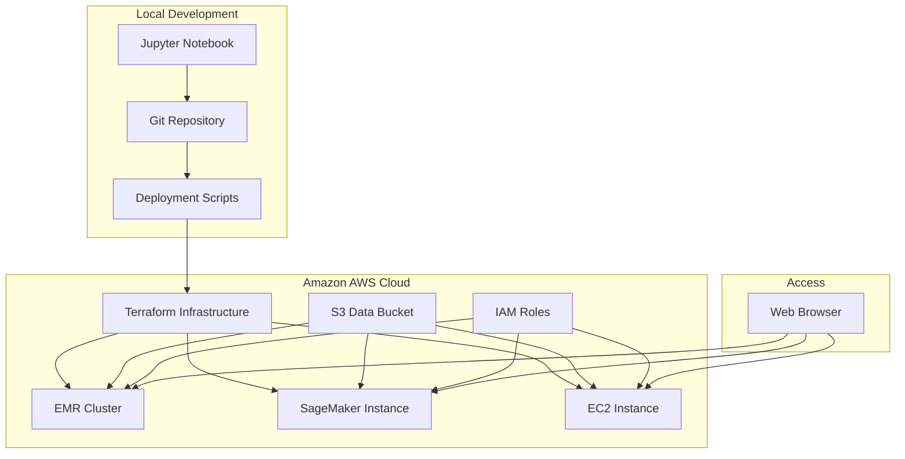
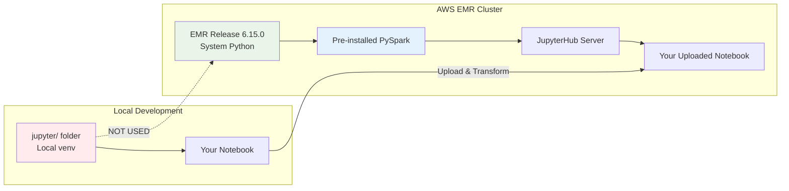
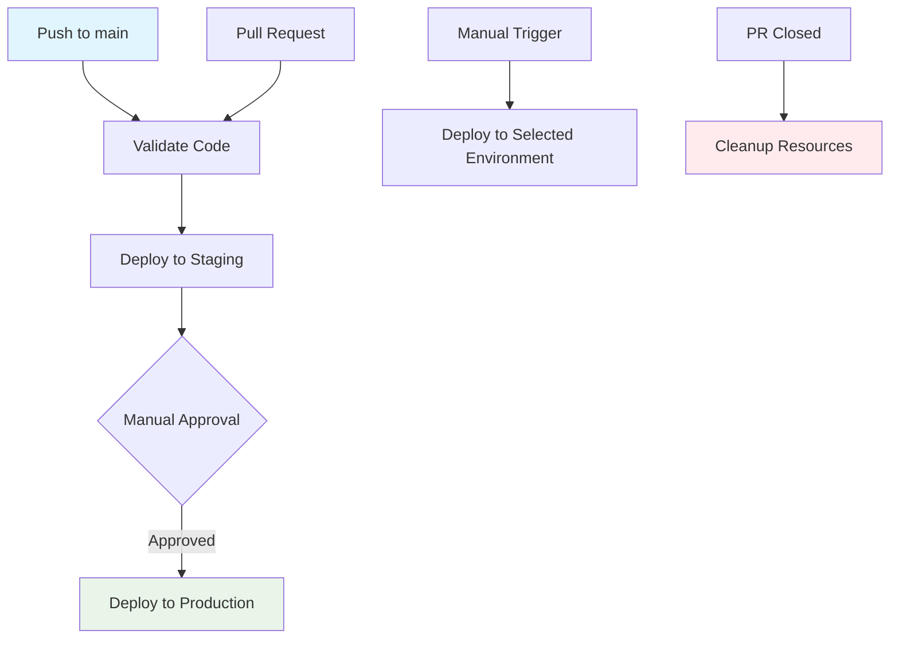
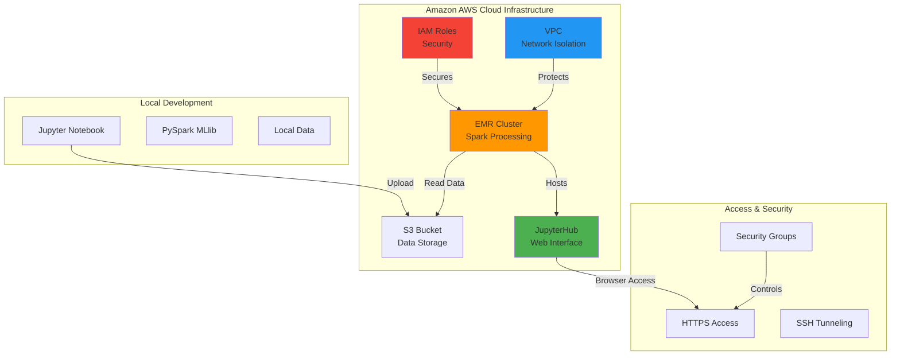

# Apache Spark

##  Amazon AWS cloud deployment

### Deploy PySpark/MLlib Jupyter Notebook to Amazon AWS

For production workloads, large-scale data processing, and collaborative development, deploy your PySpark/MLlib Jupyter Notebook to Amazon AWS using multiple deployment options:

#### Deployment

```bash
# 1. Install AWS deployment tools
./aws-deployment/install-aws-tools.sh

# 2. Configure AWS credentials
aws configure

# 3. Choose deployment option:

# Option A: Amazon EMR (Recommended for Production)
./aws-deployment/deploy-to-aws.sh emr us-east-1

# Option B: Amazon SageMaker (Recommended for ML Development)
./aws-deployment/deploy-to-aws.sh sagemaker us-east-1

# Option C: Self-managed EC2 (Custom Configuration)
./aws-deployment/deploy-to-aws.sh ec2 us-east-1
```

#### 📋 Deployment options comparison

| Option | Best For | Pros | Cons |
|--------|----------|------|------|
| **Amazon EMR** | Production, Large datasets | Auto-scaling, Managed Spark, Cost-effective | Complex setup |
| **Amazon SageMaker** | ML Development, Collaboration | Pre-configured, Easy sharing, Jupyter built-in | Higher cost |
| **Self-managed EC2** | Custom needs, Learning | Full control, Lowest cost | Manual management |

#### Infrastructure as Code (IaC)

The deployment uses Terraform for infrastructure management:

```bash
# Deploy infrastructure
cd aws-deployment/terraform
terraform init
terraform plan
terraform apply

# Get deployment outputs
terraform output
```

#### 🔐 Security

- **IAM Roles**: Least privilege access principles
- **VPC Isolation**: Private network deployment
- **Encryption**: S3 and EBS encryption enabled
- **Security Groups**: Minimal required port access
- **HTTPS**: Secure notebook access

#### Cost

- **Auto-termination**: Clusters shut down when idle
- **Spot instances**: Reduce costs up to 90%
- **Right sizing**: Appropriate instance types
- **Monitoring**: CloudWatch cost alerts

#### Deployment architecture



#### Tools

```bash
# Monitor EMR cluster
./aws-deployment/manage-cluster.sh j-XXXXXXXXX status

# View logs
./aws-deployment/manage-cluster.sh j-XXXXXXXXX logs

# SSH access
./aws-deployment/manage-cluster.sh j-XXXXXXXXX ssh

# Upload additional data
./aws-deployment/upload-data.sh your-bucket-name
```

**See: `aws-deployment/AMAZON-AWS-DEPLOYMENT.md`**

#### Amazon AWS URLs

After deployment, access your notebook at:
- **EMR**: `https://your-emr-dns:9443` (JupyterHub)
- **SageMaker**: AWS Console → SageMaker → Notebook Instances
- **EC2**: `http://your-ec2-ip:8888/?token=your-token`

#### Python virtual environment

**Question: Does EMR use my local virtual environment?**

**Answer: NO**

Here's how it works:



**EMR environment:**
- **No virtual environment**: EMR provides system-wide Python 3.8+
- **Pre-installed libraries**: PySpark, MLlib, pandas, numpy, matplotlib
- **JupyterHub**: Multi-user notebook server (not local Jupyter)
- **Distributed computing**: Spark runs across multiple EC2 instances
- **S3 integration**: Data loaded from S3 buckets, not local files

**Jupyter Notebook automatically detects the environment and configures accordingly:**

| Environment | Python Setup | Spark Master | Data Source |
|-------------|--------------|--------------|-------------|
| **Local** | `jupyter/` venv | `local[*]` | Local CSV files |
| **EMR** | System Python | Cluster managed | S3 buckets |
| **SageMaker** | Conda environment | `local[*]` | S3 buckets |

#### Use Cases for Amazon AWS deployment

1. **Production analytics**: Process large airline datasets (>100GB)
2. **Team collaboration**: Share notebooks across data science teams
3. **Scalable ML**: Train models on distributed Spark clusters
4. **Cost efficiency**: Auto-scale resources based on demand
5. **Security**: Enterprise security controls

## Amazon AWS deployment

### Continuous integration/continuous deployment (CI/CD)

A complete CI/CD pipeline is provided in `aws-deployment/.github-workflows-deploy.yml` for GitHub Actions:



**Pipeline:**
- **Automated testing**: Validates notebook and scripts on every push
- **Multi-environment**: Staging → Production deployment flow
- **Manual deployment**: Support for EMR, SageMaker, and EC2 options
- **Resource cleanup**: Automatic cleanup of PR environments
- **Security**: Uses AWS IAM roles and GitHub secrets

**GitHub secrets required:**
```bash
AWS_ACCESS_KEY_ID=your_access_key
AWS_SECRET_ACCESS_KEY=your_secret_key
```

**To use the CI/CD pipeline:**
1. Copy `.github-workflows-deploy.yml` to `.github/workflows/`
2. Configure GitHub secrets in repository settings
3. Push to main branch to trigger deployment

### Manual deployment options

For detailed AWS deployment instructions, see: [`aws-deployment/AMAZON-AWS-DEPLOYMENT.md`](aws-deployment/AMAZON-AWS-DEPLOYMENT.md)

**Quick Start:**
```bash
# Install AWS tools
./aws-deployment/install-aws-tools.sh

# Deploy to EMR (recommended for production)
./aws-deployment/deploy-to-aws.sh emr us-east-1

# Alternative: Deploy to SageMaker (for ML development)
./aws-deployment/deploy-to-aws.sh sagemaker us-east-1
```

### Amazon AWS architecture



### Cost

The deployment includes automatic cost optimization:
- **Auto-termination**: Clusters shut down after 2 hours of inactivity
- **Spot instances**: Optional use of EC2 spot instances for cost savings
- **S3 lifecycle**: Intelligent tiering for data storage
- **Monitoring**: CloudWatch alerts for cost thresholds

### Security

- **VPC isolation**: Private subnets for EMR clusters
- **IAM roles**: Least privilege access principles
- **Security groups**: Restrictive firewall rules
- **Encryption**: S3 and EBS encryption enabled
- **Access control**: HTTPS-only access to JupyterHub

---
