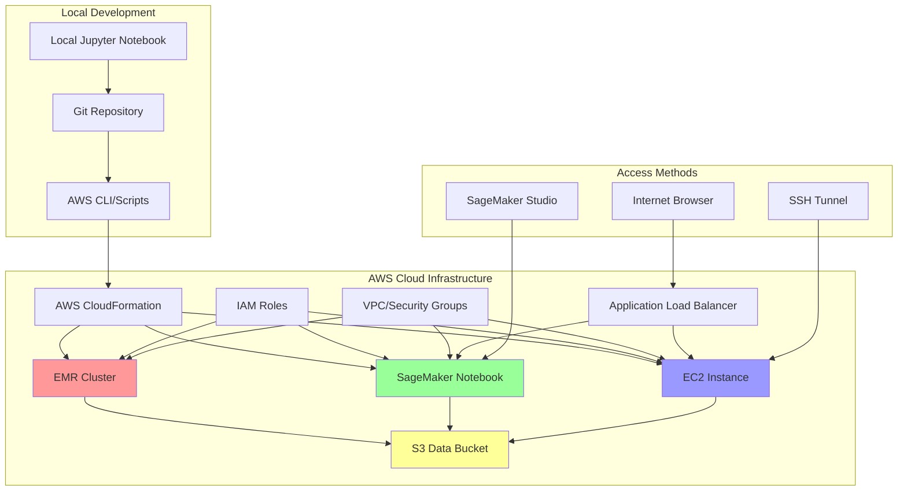

# AWS deployment for PySpark MLlib Jupyter Notebook

This guide provides comprehensive instructions for deploying the `AirTrafficProcessor.ipynb` notebook to Amazon AWS using multiple deployment strategies.

## Architecture



## Deployment options

### Option 1: Amazon EMR (Recommended for production)
- **Best for**: Large-scale data processing, production workloads
- **Features**: Auto-scaling, managed Spark cluster, cost-effective
- **Security**: VPC isolated, IAM integrated

### Option 2: Amazon SageMaker
- **Best for**: ML development, collaboration, managed notebooks
- **Features**: Pre-configured ML environment, easy sharing
- **Security**: Built-in authentication, encryption

### Option 3: Self-managed EC2
- **Best for**: Custom configurations, cost control
- **Features**: Full control, custom software stack
- **Security**: Manual security configuration required

## Prerequisites

### Local tools installation

```bash
# 1. Install AWS CLI v2
curl "https://awscli.amazonaws.com/awscli-exe-linux-x86_64.zip" -o "awscliv2.zip"
unzip awscliv2.zip
sudo ./aws/install

# 2. Install Terraform (Infrastructure as Code)
wget -O- https://apt.releases.hashicorp.com/gpg | sudo gpg --dearmor -o /usr/share/keyrings/hashicorp-archive-keyring.gpg
echo "deb [signed-by=/usr/share/keyrings/hashicorp-archive-keyring.gpg] https://apt.releases.hashicorp.com $(lsb_release -cs) main" | sudo tee /etc/apt/sources.list.d/hashicorp.list
sudo apt update && sudo apt install terraform

# 3. Install AWS CDK (Alternative to Terraform)
npm install -g aws-cdk

# 4. Install additional tools
pip install boto3 awscli-plugin-endpoint
```

### AWS account setup

1. **Create Amazon AWS account**: If you don't have one already
2. **Create IAM user**: For programmatic access
3. **Generate access keys**: For AWS CLI authentication
4. **Configure AWS CLI**:
```bash
aws configure
# Enter: Access Key ID, Secret Access Key, Region (e.g., us-east-1), Output format (json)
```

## 🔐 Security

### IAM roles and policies

The deployment requires several IAM roles with specific permissions:

#### EMR service role
```json
{
    "Version": "2012-10-17",
    "Statement": [
        {
            "Effect": "Allow",
            "Action": [
                "s3:GetObject",
                "s3:PutObject",
                "s3:DeleteObject",
                "s3:ListBucket"
            ],
            "Resource": [
                "arn:aws:s3:::your-airtraffic-bucket/*",
                "arn:aws:s3:::your-airtraffic-bucket"
            ]
        },
        {
            "Effect": "Allow",
            "Action": [
                "logs:CreateLogGroup",
                "logs:CreateLogStream",
                "logs:PutLogEvents"
            ],
            "Resource": "*"
        }
    ]
}
```

#### SageMaker execution role
```json
{
    "Version": "2012-10-17",
    "Statement": [
        {
            "Effect": "Allow",
            "Action": [
                "sagemaker:*",
                "s3:GetObject",
                "s3:PutObject",
                "s3:ListBucket"
            ],
            "Resource": "*"
        }
    ]
}
```

## Option 1: Amazon EMR deployment

### Step 1: Create Infrastructure as Code with Terraform

Create `terraform/main.tf`:

```hcl
# Provider configuration
terraform {
  required_providers {
    aws = {
      source  = "hashicorp/aws"
      version = "~> 5.0"
    }
  }
}

provider "aws" {
  region = var.aws_region
}

# Variables
variable "aws_region" {
  description = "AWS region"
  type        = string
  default     = "us-east-1"
}

variable "project_name" {
  description = "Project name for resource naming"
  type        = string
  default     = "airtraffic-analysis"
}

# S3 Bucket for data and notebooks
resource "aws_s3_bucket" "airtraffic_data" {
  bucket = "${var.project_name}-data-${random_string.suffix.result}"
}

resource "aws_s3_bucket_public_access_block" "airtraffic_data" {
  bucket = aws_s3_bucket.airtraffic_data.id

  block_public_acls       = true
  block_public_policy     = true
  ignore_public_acls      = true
  restrict_public_buckets = true
}

resource "random_string" "suffix" {
  length  = 8
  special = false
  upper   = false
}

# VPC for EMR cluster
resource "aws_vpc" "emr_vpc" {
  cidr_block           = "10.0.0.0/16"
  enable_dns_hostnames = true
  enable_dns_support   = true

  tags = {
    Name = "${var.project_name}-vpc"
  }
}

resource "aws_internet_gateway" "emr_igw" {
  vpc_id = aws_vpc.emr_vpc.id

  tags = {
    Name = "${var.project_name}-igw"
  }
}

resource "aws_subnet" "emr_subnet" {
  vpc_id                  = aws_vpc.emr_vpc.id
  cidr_block              = "10.0.1.0/24"
  availability_zone       = data.aws_availability_zones.available.names[0]
  map_public_ip_on_launch = true

  tags = {
    Name = "${var.project_name}-subnet"
  }
}

resource "aws_route_table" "emr_route_table" {
  vpc_id = aws_vpc.emr_vpc.id

  route {
    cidr_block = "0.0.0.0/0"
    gateway_id = aws_internet_gateway.emr_igw.id
  }

  tags = {
    Name = "${var.project_name}-route-table"
  }
}

resource "aws_route_table_association" "emr_route_table_association" {
  subnet_id      = aws_subnet.emr_subnet.id
  route_table_id = aws_route_table.emr_route_table.id
}

data "aws_availability_zones" "available" {
  state = "available"
}

# Security Groups
resource "aws_security_group" "emr_master" {
  name_prefix = "${var.project_name}-emr-master"
  vpc_id      = aws_vpc.emr_vpc.id

  ingress {
    from_port   = 22
    to_port     = 22
    protocol    = "tcp"
    cidr_blocks = ["0.0.0.0/0"]
  }

  ingress {
    from_port   = 8888
    to_port     = 8888
    protocol    = "tcp"
    cidr_blocks = ["0.0.0.0/0"]
  }

  ingress {
    from_port   = 8080
    to_port     = 8080
    protocol    = "tcp"
    cidr_blocks = ["0.0.0.0/0"]
  }

  egress {
    from_port   = 0
    to_port     = 0
    protocol    = "-1"
    cidr_blocks = ["0.0.0.0/0"]
  }

  tags = {
    Name = "${var.project_name}-emr-master-sg"
  }
}

resource "aws_security_group" "emr_slave" {
  name_prefix = "${var.project_name}-emr-slave"
  vpc_id      = aws_vpc.emr_vpc.id

  ingress {
    from_port       = 0
    to_port         = 65535
    protocol        = "tcp"
    security_groups = [aws_security_group.emr_master.id]
  }

  egress {
    from_port   = 0
    to_port     = 0
    protocol    = "-1"
    cidr_blocks = ["0.0.0.0/0"]
  }

  tags = {
    Name = "${var.project_name}-emr-slave-sg"
  }
}

# IAM Role for EMR
resource "aws_iam_role" "emr_service_role" {
  name = "${var.project_name}-emr-service-role"

  assume_role_policy = jsonencode({
    Version = "2012-10-17"
    Statement = [
      {
        Action = "sts:AssumeRole"
        Effect = "Allow"
        Principal = {
          Service = "elasticmapreduce.amazonaws.com"
        }
      }
    ]
  })
}

resource "aws_iam_role_policy_attachment" "emr_service_role_policy" {
  role       = aws_iam_role.emr_service_role.name
  policy_arn = "arn:aws:iam::aws:policy/service-role/AmazonElasticMapReduceRole"
}

resource "aws_iam_role" "emr_instance_profile_role" {
  name = "${var.project_name}-emr-instance-profile-role"

  assume_role_policy = jsonencode({
    Version = "2012-10-17"
    Statement = [
      {
        Action = "sts:AssumeRole"
        Effect = "Allow"
        Principal = {
          Service = "ec2.amazonaws.com"
        }
      }
    ]
  })
}

resource "aws_iam_role_policy_attachment" "emr_instance_profile_policy" {
  role       = aws_iam_role.emr_instance_profile_role.name
  policy_arn = "arn:aws:iam::aws:policy/service-role/AmazonElasticMapReduceforEC2Role"
}

resource "aws_iam_instance_profile" "emr_instance_profile" {
  name = "${var.project_name}-emr-instance-profile"
  role = aws_iam_role.emr_instance_profile_role.name
}

# EMR Cluster
resource "aws_emr_cluster" "airtraffic_cluster" {
  name          = "${var.project_name}-emr-cluster"
  release_label = "emr-6.15.0"
  applications  = ["Spark", "Hadoop", "JupyterHub"]

  ec2_attributes {
    subnet_id                         = aws_subnet.emr_subnet.id
    emr_managed_master_security_group = aws_security_group.emr_master.id
    emr_managed_slave_security_group  = aws_security_group.emr_slave.id
    instance_profile                  = aws_iam_instance_profile.emr_instance_profile.arn
    key_name                         = aws_key_pair.emr_key_pair.key_name
  }

  master_instance_group {
    instance_type = "m5.xlarge"
  }

  core_instance_group {
    instance_type  = "m5.large"
    instance_count = 2

    ebs_config {
      size                 = "40"
      type                 = "gp2"
      volumes_per_instance = 1
    }
  }

  service_role = aws_iam_role.emr_service_role.arn

  configurations_json = jsonencode([
    {
      Classification = "jupyter-s3-conf"
      Properties = {
        "s3.persistence.enabled" = "true"
        "s3.persistence.bucket"  = aws_s3_bucket.airtraffic_data.bucket
      }
    }
  ])

  tags = {
    Name        = "${var.project_name}-emr-cluster"
    Environment = "development"
  }
}

# Key Pair for SSH access
resource "aws_key_pair" "emr_key_pair" {
  key_name   = "${var.project_name}-key"
  public_key = file("~/.ssh/id_rsa.pub")
}

# Outputs
output "emr_master_public_dns" {
  description = "EMR Master public DNS"
  value       = aws_emr_cluster.airtraffic_cluster.master_public_dns
}

output "jupyter_url" {
  description = "JupyterHub URL"
  value       = "https://${aws_emr_cluster.airtraffic_cluster.master_public_dns}:9443"
}

output "s3_bucket_name" {
  description = "S3 bucket for data storage"
  value       = aws_s3_bucket.airtraffic_data.bucket
}
```

### Step 2: Deploy Infrastructure as Code

```bash
# Initialize Terraform
cd terraform
terraform init

# Plan deployment
terraform plan

# Apply infrastructure
terraform apply

# Note down the outputs: EMR cluster DNS, S3 bucket name, Jupyter URL
```

### Step 3: Upload data and Jupyter Notebooks

```bash
# Upload data files to S3
aws s3 cp 2008.csv s3://your-bucket-name/data/
aws s3 cp carriers.csv s3://your-bucket-name/data/
aws s3 cp airports.csv s3://your-bucket-name/data/

# Upload notebook
aws s3 cp AirTrafficProcessor.ipynb s3://your-bucket-name/notebooks/
```

## Option 2: Amazon SageMaker deployment

### Step 1: Create SageMaker Notebook instance

```bash
# Create SageMaker notebook instance using AWS CLI
aws sagemaker create-notebook-instance \
    --notebook-instance-name airtraffic-analysis \
    --instance-type ml.t3.medium \
    --role-arn arn:aws:iam::YOUR-ACCOUNT:role/SageMakerExecutionRole \
    --default-code-repository https://github.com/your-username/your-repo.git
```

### Step 2: Configure Notebook for PySpark

Create `sagemaker-setup.py`:

```python
import subprocess
import sys

def install_pyspark():
    """Install PySpark in SageMaker environment"""
    subprocess.check_call([
        sys.executable, "-m", "pip", "install", 
        "pyspark==3.5.0", "pandas", "numpy", "matplotlib"
    ])

def configure_spark():
    """Configure Spark for SageMaker"""
    spark_config = """
from pyspark.sql import SparkSession

spark = SparkSession.builder \\
    .master("local[*]") \\
    .appName("AirTrafficAnalysis-SageMaker") \\
    .config("spark.driver.memory", "4g") \\
    .config("spark.driver.maxResultSize", "2g") \\
    .config("spark.sql.adaptive.enabled", "true") \\
    .getOrCreate()
"""
    
    with open("spark_config.py", "w") as f:
        f.write(spark_config)

if __name__ == "__main__":
    install_pyspark()
    configure_spark()
    print("✅ SageMaker environment configured for PySpark!")
```

## Option 3: Self-managed EC2 deployment

### Step 1: Launch EC2 instance

Create `ec2-deployment/launch-instance.sh`:

```bash
#!/bin/bash

# Launch EC2 instance for Jupyter notebook
aws ec2 run-instances \
    --image-id ami-0c02fb55956c7d316 \
    --instance-type t3.large \
    --key-name your-key-pair \
    --security-group-ids sg-xxxxxxxxx \
    --subnet-id subnet-xxxxxxxxx \
    --user-data file://user-data.sh \
    --tag-specifications 'ResourceType=instance,Tags=[{Key=Name,Value=AirTraffic-Jupyter}]'
```

### Step 2: User data script

Create `ec2-deployment/user-data.sh`:

```bash
#!/bin/bash
yum update -y
yum install -y python3 python3-pip git

# Install Java
yum install -y java-11-amazon-corretto

# Create jupyter user
useradd -m jupyter
su - jupyter << 'EOF'

# Install Python packages
pip3 install --user jupyter jupyterlab pyspark pandas numpy matplotlib boto3

# Create Jupyter config
mkdir -p ~/.jupyter
cat > ~/.jupyter/jupyter_notebook_config.py << 'JUPYTER_CONFIG'
c.NotebookApp.ip = '0.0.0.0'
c.NotebookApp.port = 8888
c.NotebookApp.open_browser = False
c.NotebookApp.token = 'your-secure-token'
c.NotebookApp.allow_root = True
JUPYTER_CONFIG

# Clone repository
git clone https://github.com/your-username/your-repo.git
cd your-repo

# Start Jupyter
nohup jupyter lab > jupyter.log 2>&1 &

EOF
```

## Deployment scripts

### Deployment script

Create `deploy-to-aws.sh`:

```bash
#!/bin/bash

set -e

DEPLOYMENT_TYPE=${1:-"emr"}
AWS_REGION=${2:-"us-east-1"}
PROJECT_NAME="airtraffic-analysis"

echo "🚀 Deploying AirTraffic Analysis to AWS using $DEPLOYMENT_TYPE"

# Check prerequisites
check_prerequisites() {
    echo "🔍 Checking prerequisites..."
    
    # Check AWS CLI
    if ! command -v aws &> /dev/null; then
        echo "❌ AWS CLI not found. Please install it first."
        exit 1
    fi
    
    # Check AWS credentials
    if ! aws sts get-caller-identity &> /dev/null; then
        echo "❌ AWS credentials not configured. Run 'aws configure'"
        exit 1
    fi
    
    echo "✅ Prerequisites check passed"
}

# Deploy using EMR
deploy_emr() {
    echo "📦 Deploying to Amazon EMR..."
    
    cd terraform
    terraform init
    terraform plan -var="aws_region=$AWS_REGION" -var="project_name=$PROJECT_NAME"
    terraform apply -auto-approve -var="aws_region=$AWS_REGION" -var="project_name=$PROJECT_NAME"
    
    # Get outputs
    BUCKET_NAME=$(terraform output -raw s3_bucket_name)
    EMR_DNS=$(terraform output -raw emr_master_public_dns)
    
    echo "📤 Uploading data and notebooks..."
    aws s3 cp ../2008.csv s3://$BUCKET_NAME/data/ || echo "⚠️  2008.csv not found"
    aws s3 cp ../carriers.csv s3://$BUCKET_NAME/data/
    aws s3 cp ../airports.csv s3://$BUCKET_NAME/data/
    aws s3 cp ../AirTrafficProcessor.ipynb s3://$BUCKET_NAME/notebooks/
    
    echo "✅ EMR deployment complete!"
    echo "🌐 JupyterHub URL: https://$EMR_DNS:9443"
    echo "📊 S3 Bucket: $BUCKET_NAME"
}

# Deploy using SageMaker
deploy_sagemaker() {
    echo "📦 Deploying to Amazon SageMaker..."
    
    # Create SageMaker execution role if it doesn't exist
    aws iam create-role --role-name SageMakerExecutionRole-AirTraffic \
        --assume-role-policy-document file://sagemaker-trust-policy.json || true
    
    aws iam attach-role-policy --role-name SageMakerExecutionRole-AirTraffic \
        --policy-arn arn:aws:iam::aws:policy/AmazonSageMakerFullAccess || true
    
    # Create notebook instance
    aws sagemaker create-notebook-instance \
        --notebook-instance-name airtraffic-analysis \
        --instance-type ml.t3.medium \
        --role-arn "arn:aws:iam::$(aws sts get-caller-identity --query Account --output text):role/SageMakerExecutionRole-AirTraffic"
    
    echo "✅ SageMaker deployment initiated!"
    echo "🌐 Check AWS Console for notebook instance status"
}

# Deploy using EC2
deploy_ec2() {
    echo "📦 Deploying to Amazon EC2..."
    
    # Launch instance
    INSTANCE_ID=$(aws ec2 run-instances \
        --image-id ami-0c02fb55956c7d316 \
        --instance-type t3.large \
        --key-name $PROJECT_NAME-key \
        --user-data file://ec2-deployment/user-data.sh \
        --tag-specifications "ResourceType=instance,Tags=[{Key=Name,Value=AirTraffic-Jupyter}]" \
        --query 'Instances[0].InstanceId' \
        --output text)
    
    echo "✅ EC2 deployment complete!"
    echo "🖥️  Instance ID: $INSTANCE_ID"
    echo "⏳ Wait 5-10 minutes for setup to complete"
}

# Main execution
main() {
    check_prerequisites
    
    case $DEPLOYMENT_TYPE in
        "emr")
            deploy_emr
            ;;
        "sagemaker")
            deploy_sagemaker
            ;;
        "ec2")
            deploy_ec2
            ;;
        *)
            echo "❌ Unknown deployment type: $DEPLOYMENT_TYPE"
            echo "Usage: $0 [emr|sagemaker|ec2] [aws-region]"
            exit 1
            ;;
    esac
}

main "$@"
```

### Data upload script

Create `upload-data.sh`:

```bash
#!/bin/bash

BUCKET_NAME=${1:-"your-bucket-name"}
echo "📤 Uploading data to S3 bucket: $BUCKET_NAME"

# Create bucket if it doesn't exist
aws s3 mb s3://$BUCKET_NAME --region us-east-1 || true

# Upload data files
echo "📊 Uploading CSV data files..."
aws s3 cp 2008.csv s3://$BUCKET_NAME/data/2008.csv || echo "⚠️  2008.csv not found"
aws s3 cp 2008_sample.csv s3://$BUCKET_NAME/data/2008_sample.csv || echo "⚠️  Sample file not found"
aws s3 cp carriers.csv s3://$BUCKET_NAME/data/carriers.csv
aws s3 cp airports.csv s3://$BUCKET_NAME/data/airports.csv

# Upload notebooks
echo "📓 Uploading Jupyter notebooks..."
aws s3 cp AirTrafficProcessor.ipynb s3://$BUCKET_NAME/notebooks/AirTrafficProcessor.ipynb

# Upload scripts
echo "🔧 Uploading utility scripts..."
aws s3 cp verify_pyspark_mllib.py s3://$BUCKET_NAME/scripts/verify_pyspark_mllib.py
aws s3 cp quick_verify.py s3://$BUCKET_NAME/scripts/quick_verify.py

echo "✅ Data upload complete!"
echo "🌐 S3 Browser URL: https://s3.console.aws.amazon.com/s3/buckets/$BUCKET_NAME"
```

## 🔒 Security

### 1. IAM security
- Use least privilege principle
- Create separate roles for different services
- Enable MFA for AWS console access
- Rotate access keys regularly

### 2. Network security
- Deploy in private subnets when possible
- Use VPC endpoints for S3 access
- Implement security groups with minimal required access
- Enable VPC Flow Logs for monitoring

### 3. Data security
- Enable S3 bucket encryption
- Use SSL/TLS for all communications
- Implement bucket policies to restrict access
- Enable CloudTrail for audit logging

### 4. Notebook security
- Use strong authentication tokens
- Implement HTTPS only access
- Regular security updates
- Monitor notebook access logs

## Cost

### EMR cost
```bash
# Use Spot instances for core nodes
aws emr create-cluster \
    --name "AirTraffic-Spot" \
    --instance-groups \
    InstanceGroupType=MASTER,InstanceType=m5.xlarge,InstanceCount=1 \
    InstanceGroupType=CORE,InstanceType=m5.large,InstanceCount=2,BidPrice=0.05

# Auto-terminate cluster when idle
aws emr put-auto-termination-policy \
    --cluster-id j-xxxxxxxxx \
    --auto-termination-policy IdleTimeout=3600
```

### SageMaker cost
- Use ml.t3 instances for development
- Stop instances when not in use
- Use lifecycle configurations for auto-shutdown

### General cost
- Set up billing alerts
- Use AWS Cost Explorer
- Tag all resources for cost tracking
- Regular cleanup of unused resources

## Tutorials

### Start

1. **Setup local environment**:
```bash
# Install tools
./install-aws-tools.sh

# Configure AWS
aws configure
```

2. **Deploy to EMR**:
```bash
# Deploy infrastructure
./deploy-to-aws.sh emr us-east-1

# Upload data
./upload-data.sh your-bucket-name
```

3. **Access Jupyter**:
- Open the provided JupyterHub URL
- Login with jovyan/jupyter
- Navigate to notebooks folder
- Open AirTrafficProcessor.ipynb

### Configuration

For production deployments, consider:
- Multi-AZ deployment
- Auto-scaling groups
- Load balancers
- Monitoring with CloudWatch
- Backup strategies

## Monitoring and troubleshooting

### EMR monitoring
```bash
# Check cluster status
aws emr describe-cluster --cluster-id j-xxxxxxxxx

# View application logs
aws logs describe-log-streams --log-group-name /aws/emr/airtraffic-cluster

# Monitor costs
aws ce get-cost-and-usage --time-period Start=2024-01-01,End=2024-01-31
```

### Issues

1. **Permission denied**: Check IAM roles and policies
2. **Network timeout**: Verify security groups and VPC configuration
3. **Memory issues**: Increase instance sizes or optimize Spark configuration
4. **Cost alerts**: Review instance types and auto-termination settings

## CI/CD pipeline integration

For automated deployments, integrate with:
- **GitHub Actions**: For continuous deployment
- **AWS CodePipeline**: For AWS-native CI/CD
- **Jenkins**: For on-premises CI/CD integration

Example GitHub actions workflow:
```yaml
name: Deploy to AWS
on: [push]
jobs:
  deploy:
    runs-on: ubuntu-latest
    steps:
    - uses: actions/checkout@v2
    - name: Deploy to EMR
      run: ./deploy-to-aws.sh emr
      env:
        AWS_ACCESS_KEY_ID: ${{ secrets.AWS_ACCESS_KEY_ID }}
        AWS_SECRET_ACCESS_KEY: ${{ secrets.AWS_SECRET_ACCESS_KEY }}
```

This document provides multiple deployment options with security, cost optimization, and monitoring considerations for your PySpark MLlib notebook on AWS.
