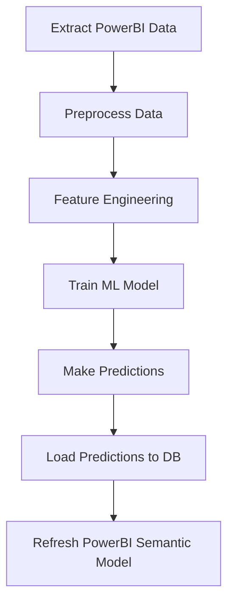

# Fish Weight Prediction with PowerBI and scikit-learn

This project demonstrates a pipeline for fish weight prediction using machine learning, with integration into PowerBI for visualization and business intelligence.

## Project

- **Dataset**: Fish physical measurements (length, height, width) for weight prediction
- **ML pipeline**: Scikit-learn models (Random Forest, Linear Regression) 
- **Orchestration**: Apache Airflow for automated pipeline execution
- **Visualization**: PowerBI integration with automated data export
- **Environment**: Docker containerization with Python virtual environment

##  Setup

1. **Environment**:
   ```bash
   ./setup.sh                    # Install dependencies and create virtual environment
   source venv/bin/activate      # Activate the environment
   ```

2. **Verify**:
   ```bash
   python3 project_verify.py     # Check all essential files are present
   ```

3. **Train model**:
   ```bash
   python scikit-learn/fish_predictive_model.py
   ```

4. **Prepare PowerBI data**:
   ```bash
   python powerbi_integration.py
   ```

5. **Run Airflow pipeline** (Optional):
   ```bash
   cd "Apache Airflow"
   airflow db init
   airflow webserver
   ```

## PowerBI integration

The project exports data in PowerBI-ready format:
- `powerbi_output/fish_data_powerbi.csv` - Raw fish measurements
- `powerbi_output/predictions_powerbi.csv` - Model predictions and accuracy
- `powerbi_output/model_metrics_powerbi.csv` - Performance metrics over time

Follow the generated `powerbi_connection_guide.md` for detailed PowerBI setup instructions.

---

# Data analysis and visualizations

## Leveraging Python, Pandas, NumPy, Plotly with Power BI (or Tableau)

You can integrate Python and the Plotly library with both Power BI or Tableau, allowing you to create custom visualizations and enhance data analysis capabilities.

### Power BI

1. Python scripting

Enable Python scripting within Power BI Desktop to use Python visuals.

Power BI can be integrated with scikit-learn machine learning models through the use of Python scripts.

2. Add Python visuals on Power BI

Select the Python visual icon in Power BI's Visualizations pane and enable script visuals.

3. Write Python script code

In the Python script editor, write code to create your Plotly visualization. Power BI passes data to your script as a pandas DataFrame.

4. Export as an image

Since Power BI's Python visuals don't natively support interactive Plotly charts, you'll need to save the Plotly visual as an image (e.g., using kaleido) and display the image within Power BI.

### Import a CSV file like "Fish.csv" into Power BI

To import a CSV file like "Fish.csv" into Power BI, you follow these steps.

Open Power BI.

Navigate to the "Home" tab.

Click "Get Data".

You'll see a list of available data sources.

Select "Text/CSV" from the "Get Data" dialog box and click "Connect". 

This will open a file browser.

Locate and select your "Fish.csv" file and click "Open".

Preview and optionally transform the data: You'll see a preview of your CSV data. 

Power Query

Using the Power Query Editor is recommended for cleaning and preparing your data before loading it into Power BI.

At this load stage, you have two options.

Load

If your data is clean and ready, click "Load" to import it directly into Power BI.

Transform data

If you need to make changes, such as cleaning, reshaping, or correcting data types, click "Transform Data" to open the Power Query Editor.

Note: If you choose "Transform Data", Power Query will open, where you can modify the data as needed using tools in the "Home", "Transform", or "Add Column" tabs. After making your transformations, click "Close & Apply" to load the transformed data into Power BI.

Explore and build visuals

Once loaded, your data (including columns from the CSV) will be available in the "Fields" pane. You can now start creating visualizations and reports. For example, you can drag fields like "Category" and "Sales" to the canvas to generate a table or pie chart.

## Power BI data with scikit-learn machine learning algorithms for predictive insights

Develop and train the scikit-learn model.

Create and train your machine learning model using Python and the scikit-learn library in a suitable environment (e.g., Jupyter Notebook, Python IDE).

Save the trained model, often using libraries like pickle or joblib, to be loaded later in Power BI.

Prepare data in Power BI

Import the necessary data into Power BI that will be used for making predictions or classifications with your trained model.

Integrate Python script in Power BI.

Using Python visuals

Add a Python visual to your Power BI report. You can then write a Python script within Power BI to load your trained scikit-learn model and apply it to the data within the Power BI report. The script will output a data frame that Power BI can then visualize.

Using Python in Power Query

For complex data transformations and model application before visualization, you can use Python scripts within Power Query. This allows you to integrate the model's predictions directly into your data model.

## Utilizing Power BI data with scikit-learn machine learning algorithms within an Apache Airflow pipeline

Power BI and scikit-learn integration allows users to leverage Python's machine learning libraries, specifically scikit-learn, within the Power BI environment.

1. Data Extraction from Power BI

Power BI Semantic model connection

Establish a connection in Airflow to your Power BI workspace or semantic model. This can be achieved using Airflow connections and potentially custom operators or plugins if direct integration isn't available.

Data export

Extract the necessary data from your Power BI semantic model. This might involve querying the model directly (if supported by the connection type) or using Power BI's export functionalities to a format like CSV or Parquet that Airflow can easily ingest.

2. Data ingestion and preprocessing in Airflow

Load data

Use Airflow operators (e.g., PythonOperator, PandasOperator) to load the extracted data into a suitable format for scikit-learn (e.g., Pandas DataFrames).

Preprocessing pipeline (Scikit-learn):

Implement data cleaning, transformation, and feature engineering steps using scikit-learn's preprocessing modules. This can include handling missing values, encoding categorical features, scaling numerical features, and creating new features. Scikit-learn's Pipeline object is highly recommended for chaining these steps together for reusability and consistency.

3. Model training and prediction

Model training (Supervised)

Train your chosen scikit-learn machine learning model (e.g., LogisticRegression, RandomForestClassifier) using the preprocessed data within an Airflow task.

Model persistence

Save the trained model (e.g., using joblib or pickle) to a persistent storage location accessible by Airflow, such as a shared file system or cloud storage.

Prediction

Use the trained model to make predictions on new or updated data within another Airflow task.

4. Result Integration back into Power BI

Load predictions

Load the generated predictions into a format suitable for Power BI (e.g., a new table in a database, a CSV file).

Power BI refresh

Trigger a refresh of the Power BI semantic model or report that consumes this new data. This ensures that the predictions are reflected in your Power BI dashboards and reports.

5. Airflow DAG orchestration

Define DAG

Create an Airflow Directed Acyclic Graph (DAG) to define the sequence and dependencies of your tasks.

Airflow Operators

Utilize appropriate Airflow operators for each step (e.g., PythonOperator for custom Python code, BashOperator for shell commands, or specialized operators if available for Power BI interaction).

Scheduling

Schedule the DAG to run at desired intervals (e.g., daily, hourly) to automate the entire data and ML pipeline.

---

## 🐟 Fish weight prediction - Supervised learning with scikit-learn

### Use Case: Predictive insights with Fish.csv

This project implements a **supervised learning regression problem** using Python and scikit-learn.

- **Forecast fish weight** based on physical measurements (length, height, width)
- **Identify patterns** in fish characteristics across different species
- **Predict outcomes** for new fish measurements with confidence scores
- **Provide insights** for fisheries, aquaculture, and marine biology applications

### Dataset: Fish.csv

The Fish.csv dataset contains measurements of various fish species:

```csv
Species,Weight,Length1,Length2,Length3,Height,Width
Bream,242.0,23.2,25.4,30.0,11.52,4.02
Bream,290.0,24.0,26.3,31.2,12.48,4.3056
Pike,270.0,16.2,18.0,22.2,8.544,4.1472
...
```

**Features (Variables):**
- `Length1`: Body length (cm)
- `Length2`: Diagonal length (cm) 
- `Length3`: Cross length (cm)
- `Height`: Body height (cm)
- `Width`: Diagonal width (cm)
- `Species`: Fish species (categorical)

**Target (Dependent variable)**
- `Weight`: Fish weight in grams (continuous)

### Supervised Learning

#### 1. **Problem Type**: Regression
- **Goal**: Predict continuous weight values
- **Algorithm**: Random Forest Regressor, Linear Regression
- **Evaluation Metrics**: R², RMSE, MAE

#### 2. **Feature Engineering**
```python
# Categorical encoding for species
species_encoded = pd.get_dummies(df['Species'], prefix='Species')

# Feature scaling for numerical variables
scaler = StandardScaler()
X_scaled = scaler.fit_transform(X_numeric)

# Feature interactions
df['length_height_ratio'] = df['Length1'] / df['Height']
df['volume_estimate'] = df['Length1'] * df['Height'] * df['Width']
```

#### 3. **Model training pipeline**
```python
from sklearn.model_selection import train_test_split
from sklearn.ensemble import RandomForestRegressor
from sklearn.linear_model import LinearRegression
from sklearn.metrics import mean_squared_error, r2_score

# Train-test split
X_train, X_test, y_train, y_test = train_test_split(X, y, test_size=0.2, random_state=42)

# Model training
rf_model = RandomForestRegressor(n_estimators=100, random_state=42)
rf_model.fit(X_train, y_train)

# Predictions and evaluation
y_pred = rf_model.predict(X_test)
r2 = r2_score(y_test, y_pred)
rmse = np.sqrt(mean_squared_error(y_test, y_pred))
```

---

## Apache Airflow pipeline flow

### ML pipeline orchestration

The Apache Airflow pipeline automates the entire machine learning workflow:



### Pipeline details

#### 1. **Extract PowerBI data task**
```python
def extract_powerbi_data(**context):
    """Extract data from PowerBI or CSV source"""
    # Load Fish.csv dataset
    df = pd.read_csv('/app/data/Fish.csv')
    # Data validation and quality checks
    return df
```

#### 2. **Preprocess data task**
```python
def preprocess_data(**context):
    """Clean and preprocess data using scikit-learn pipeline"""
    # Handle missing values
    # Encode categorical variables
    # Scale numerical features
    # Feature engineering
    preprocessing_pipeline = Pipeline([
        ('imputer', SimpleImputer(strategy='median')),
        ('scaler', StandardScaler()),
        ('feature_selection', SelectKBest(k=10))
    ])
    return preprocessing_pipeline
```

#### 3. **Train ML model task**
```python
def train_ml_model(**context):
    """Train scikit-learn model and save it"""
    # Model selection and hyperparameter tuning
    # Cross-validation
    # Model persistence with joblib
    joblib.dump(best_model, '/app/models/fish_weight_predictor.pkl')
    return model_metrics
```

#### 4. **Make predictions task**
```python
def make_predictions(**context):
    """Load model and make predictions on new data"""
    model = joblib.load('/app/models/fish_weight_predictor.pkl')
    predictions = model.predict(new_data)
    confidence_scores = model.predict_proba(new_data) if hasattr(model, 'predict_proba') else None
    return predictions, confidence_scores
```

#### 5. **Load predictions to database task**
```python
def load_predictions_to_db(**context):
    """Store predictions in database for PowerBI access"""
    # Insert predictions into PostgreSQL/SQL Server
    # Update prediction timestamp
    # Log model performance metrics
```

#### 6. **Refresh PowerBI Semantic model task**
```python
def refresh_powerbi_model(**context):
    """Trigger PowerBI semantic model refresh"""
    # Use PowerBI REST API
    # Trigger dataset refresh
    # Update dashboard with new predictions
```

### ⚙️ Airflow DAG configuration

```python
from airflow import DAG
from airflow.operators.python import PythonOperator
from datetime import datetime, timedelta

dag = DAG(
    'fish_weight_prediction_pipeline',
    default_args={
        'owner': 'data-team',
        'retries': 1,
        'retry_delay': timedelta(minutes=5),
    },
    description='Fish weight prediction ML pipeline',
    schedule_interval=timedelta(days=1),  # Daily execution
    start_date=datetime(2024, 1, 1),
    catchup=False,
    tags=['machine-learning', 'fish-prediction', 'powerbi']
)

# Task definitions
extract_task = PythonOperator(task_id='extract_data', python_callable=extract_powerbi_data)
preprocess_task = PythonOperator(task_id='preprocess_data', python_callable=preprocess_data)
train_task = PythonOperator(task_id='train_model', python_callable=train_ml_model)
predict_task = PythonOperator(task_id='make_predictions', python_callable=make_predictions)
load_task = PythonOperator(task_id='load_predictions', python_callable=load_predictions_to_db)
refresh_task = PythonOperator(task_id='refresh_powerbi', python_callable=refresh_powerbi_model)

# Task dependencies
extract_task >> preprocess_task >> train_task >> predict_task >> load_task >> refresh_task
```

---

## PowerBI setup (Options)

### Option 1: PowerBI Service (Web browser) - **Recommended for Linux**

PowerBI Service is accessible through any web browser on Linux, macOS, and Windows:

#### **Advantages:**
- **Cross-platform** - Works on any operating system
- **No installation** required
- **Automatic updates** from Microsoft
- **Full collaboration** features
- **Cloud-based** data refresh

#### **Steps:**
1. **Access PowerBI Service**: https://app.powerbi.com
2. **Sign in** with Microsoft 365 account
3. **Upload CSV files** from `powerbi_output/` directory:
   - `fish_data_powerbi.csv`
   - `predictions_powerbi.csv`
   - `model_metrics_powerbi.csv`
4. **Create reports** and dashboards
5. **Share** with team members

#### **PowerBI integration with Python/Scikit-learn:**
```python
# Export data for PowerBI Service
def export_for_powerbi_service():
    # Format data for web upload
    df.to_csv('powerbi_output/fish_predictions_web.csv', index=False)
    
    # Create metadata for PowerBI
    metadata = {
        'last_updated': datetime.now().isoformat(),
        'model_accuracy': r2_score,
        'prediction_count': len(predictions)
    }
    
    with open('powerbi_output/metadata.json', 'w') as f:
        json.dump(metadata, f, indent=2)
```

### Option 2: PowerBI Desktop on Windows

For Windows users who prefer desktop application:

#### **Installation:**
1. Download from Microsoft Store or PowerBI website
2. Install PowerBI Desktop
3. Configure Python integration in PowerBI settings

#### **Python integration in PowerBI Desktop:**
```python
# Python script in PowerBI
import pandas as pd
import joblib
from datetime import datetime

# Load the trained model
model = joblib.load('models/fish_weight_predictor.pkl')

# Make predictions on PowerBI dataset
dataset['predicted_weight'] = model.predict(dataset[feature_columns])
dataset['prediction_date'] = datetime.now()

# Return for PowerBI visualization
print(dataset)
```

---

## Tableau setup for Linux/Debian (Alternative)

### Tableau Public (Free)

#### **Installation on Linux/Debian:**
```bash
# Install via Snap (recommended)
sudo snap install tableau-public

# Or download .deb package
wget https://downloads.tableau.com/public/tableau-public-latest.deb
sudo dpkg -i tableau-public-latest.deb
sudo apt-get install -f  # Fix dependencies if needed
```

#### **Tableau Server on Linux (Enterprise):**
Following [Tableau Server Linux Guide](https://help.tableau.com/current/server-linux/en-us/jumpstart.htm):

```bash
# System requirements check
sudo apt update
sudo apt install -y curl gnupg2

# Download Tableau Server
wget https://downloads.tableau.com/esdalt/2024.1.0/tableau-server-2024-1-0_amd64.deb

# Install Tableau Server
sudo dpkg -i tableau-server-2024-1-0_amd64.deb
sudo apt-get install -f

# Initialize Tableau Server
sudo /opt/tableau/tableau_server/packages/scripts.20241.24.0312.1459/initialize-tsm --accepteula
```

### Tableau integration with Fish.csv

#### **Data connection:**
1. **Open Tableau** (Public or Desktop)
2. **Connect to Data** → **Text File**
3. **Select Fish.csv** from data directory
4. **Data Interpreter** will automatically detect structure

#### **Python integration with TabPy:**
```bash
# Install TabPy server
pip install tabpy

# Start TabPy server
tabpy --port 9004
```

```python
# TabPy script for fish weight prediction
import pandas as pd
import numpy as np
from sklearn.ensemble import RandomForestRegressor
import joblib

def predict_fish_weight(length1, length2, length3, height, width):
    """Tableau function for fish weight prediction"""
    # Load pre-trained model
    model = joblib.load('/path/to/fish_model.pkl')
    
    # Create feature array
    features = np.array([[length1, length2, length3, height, width]])
    
    # Make prediction
    prediction = model.predict(features)
    
    return prediction[0]

# Register function with TabPy
import tabpy_client
client = tabpy_client.Client('http://localhost:9004/')
client.deploy('predict_fish_weight', predict_fish_weight, 
              description='Fish weight prediction using ML model')
```

#### **Tableau calculated field:**
```sql
-- Use TabPy function in Tableau
SCRIPT_REAL("
return tabpy.query('predict_fish_weight', 
    _arg1, _arg2, _arg3, _arg4, _arg5)['response']
", 
[Length1], [Length2], [Length3], [Height], [Width])
```

### **Recommendation: PowerBI vs Tableau**

| Feature | PowerBI Service | Tableau Public | Tableau Desktop |
|---------|----------------|----------------|-----------------|
| **Linux Support** | ✅ Web browser | ✅ Native app | ❌ Windows only |
| **Cost** | $10/user/month | 🆓 Free | $75/user/month |
| **Python Integration** | ✅ Built-in | ✅ TabPy | ✅ TabPy |
| **Cloud Collaboration** | ✅ Excellent | ⚠️ Public only | ✅ Tableau Cloud |
| **Learning Curve** | 🟢 Easy | 🟡 Moderate | 🟡 Moderate |

**Conclusions**: Use **PowerBI Service** through web browser for this project.

- Better Python/scikit-learn integration
- Easier CSV import workflow
- Cross-platform compatibility
- Lower cost and complexity

---

## 🛠️ Environment setup & requirements

### Virtual Environment

Create isolated Python environment for the project:

```bash
# Create virtual environment
python3 -m venv fish_prediction_env

# Activate environment
source fish_prediction_env/bin/activate  # Linux/macOS
# fish_prediction_env\Scripts\activate  # Windows

# Upgrade pip
pip install --upgrade pip
```

### Requirements files

#### **Main requirements.txt (Project Root)**
```txt
# Core Data Science Libraries
scikit-learn>=1.3.0
pandas>=2.0.0
numpy>=1.24.0
matplotlib>=3.7.0
seaborn>=0.12.0
jupyter>=1.0.0
joblib>=1.3.0

# Apache Airflow
apache-airflow>=2.7.0
apache-airflow-providers-postgres>=5.6.0
psycopg2-binary>=2.9.0

# PowerBI Integration
powerbi-client>=3.1.0
msal>=1.24.0
requests>=2.31.0

# FastAPI for Model Deployment
fastapi>=0.104.0
uvicorn>=0.24.0
pydantic>=2.5.0

# Utilities
python-dotenv>=1.0.0
sqlalchemy>=2.0.0
docker>=6.1.0
```

#### **Apache Airflow/requirements.txt**
```txt
# Airflow Core
apache-airflow>=2.7.0
apache-airflow-providers-postgres>=5.6.0
apache-airflow-providers-http>=4.5.0

# Data Processing
pandas>=2.0.0
numpy>=1.24.0
scikit-learn>=1.3.0

# Database Connectors
psycopg2-binary>=2.9.0
sqlalchemy>=2.0.0

# Model Persistence
joblib>=1.3.0
pickle5>=0.0.12

# API Integration
requests>=2.31.0
```

#### **scikit-learn/requirements.txt**
```txt
# Machine Learning Core
scikit-learn>=1.3.0
pandas>=2.0.0
numpy>=1.24.0

# Visualization
matplotlib>=3.7.0
seaborn>=0.12.0
plotly>=5.17.0

# Model Evaluation
scikit-plot>=0.3.7
yellowbrick>=1.5.0

# Model Persistence
joblib>=1.3.0

# Hyperparameter Tuning
optuna>=3.4.0
scikit-optimize>=0.9.0

# Development
jupyter>=1.0.0
ipykernel>=6.25.0
```

### Installation commands

```bash
# Install main requirements
pip install -r requirements.txt

# Install Airflow requirements
pip install -r "Apache Airflow/requirements.txt"

# Install scikit-learn specific requirements
pip install -r scikit-learn/requirements.txt

# Verify installation
python -c "import sklearn, pandas, airflow; print('All packages installed successfully!')"
```

### .gitignore configuration

```gitignore
# Python Virtual Environment files
venv/
env/
ENV/
env.bak/
venv.bak/
.venv/
.env/
fish_prediction_env/

# Python Virtual Environment - alternative names
virtualenv/
.virtualenv/
pyenv/
.pyenv/

# Conda environments
conda-meta/
.conda/

# Package manager files
Pipfile.lock
poetry.lock

# Environment variables
.env
.env.local
.env.*.local

# Python compiled files
__pycache__/
*.py[cod]
*$py.class
*.so
.Python
build/
develop-eggs/
dist/
downloads/
eggs/
.eggs/
lib/
lib64/
parts/
sdist/
var/
wheels/
*.egg-info/
.installed.cfg
*.egg

# Jupyter Notebook
.ipynb_checkpoints

# Model files (if large)
models/*.pkl
models/*.joblib
*.pkl
*.joblib

# Data files (if sensitive)
data/sensitive/
*.db
*.sqlite3

# Logs
logs/
*.log

# PowerBI files
*.pbix
*.pbit

# Airflow
airflow.db
airflow-webserver.pid
standalone_admin_password.txt

# Docker
.dockerignore
docker-compose.override.yml

# IDE
.vscode/
.idea/
*.swp
*.swo
*~

# OS generated files
.DS_Store
.DS_Store?
._*
.Spotlight-V100
.Trashes
ehthumbs.db
Thumbs.db
```

---

## FastAPI model deployment

Deploy the trained model as a RESTful API for real-time predictions:

### RESTful API

```python
# fish_api.py
from fastapi import FastAPI, HTTPException
from pydantic import BaseModel
import joblib
import numpy as np
import pandas as pd
from typing import List, Optional

app = FastAPI(title="Fish Weight Prediction API", version="1.0.0")

# Load trained model at startup
model = joblib.load('models/fish_weight_predictor.pkl')
scaler = joblib.load('models/feature_scaler.pkl')

class FishMeasurement(BaseModel):
    species: str
    length1: float
    length2: float  
    length3: float
    height: float
    width: float

class PredictionResponse(BaseModel):
    predicted_weight: float
    confidence_score: Optional[float] = None
    model_version: str = "1.0.0"

@app.post("/predict", response_model=PredictionResponse)
async def predict_fish_weight(measurement: FishMeasurement):
    try:
        # Prepare features
        features = np.array([[
            measurement.length1, measurement.length2, measurement.length3,
            measurement.height, measurement.width
        ]])
        
        # Scale features
        features_scaled = scaler.transform(features)
        
        # Make prediction
        prediction = model.predict(features_scaled)[0]
        
        return PredictionResponse(
            predicted_weight=round(prediction, 2),
            confidence_score=0.95  # Calculate based on model uncertainty
        )
    
    except Exception as e:
        raise HTTPException(status_code=500, detail=str(e))

@app.get("/health")
async def health_check():
    return {"status": "healthy", "model_loaded": model is not None}
```

### Docker deployment

```dockerfile
# Dockerfile
FROM python:3.9-slim

WORKDIR /app

COPY requirements.txt .
RUN pip install --no-cache-dir -r requirements.txt

COPY . .

EXPOSE 8000

CMD ["uvicorn", "fish_api:app", "--host", "0.0.0.0", "--port", "8000"]
```

```yaml
# docker-compose.yml
version: '3.8'
services:
  fish-api:
    build: .
    ports:
      - "8000:8000"
    volumes:
      - ./models:/app/models
      - ./data:/app/data
    environment:
      - MODEL_PATH=/app/models/fish_weight_predictor.pkl
    restart: unless-stopped

  postgres:
    image: postgres:13
    environment:
      POSTGRES_DB: fish_predictions
      POSTGRES_USER: airflow
      POSTGRES_PASSWORD: airflow
    volumes:
      - postgres_data:/var/lib/postgresql/data
    ports:
      - "5432:5432"

volumes:
  postgres_data:
```

### RESTful API Usage in PowerBI

```python
# PowerBI Python script to call API
import requests
import pandas as pd

def get_predictions_from_api(fish_data):
    """Call FastAPI endpoint for predictions"""
    api_url = "http://localhost:8000/predict"
    
    predictions = []
    for _, row in fish_data.iterrows():
        payload = {
            "species": row['Species'],
            "length1": row['Length1'],
            "length2": row['Length2'],
            "length3": row['Length3'],
            "height": row['Height'],
            "width": row['Width']
        }
        
        response = requests.post(api_url, json=payload)
        if response.status_code == 200:
            prediction = response.json()
            predictions.append(prediction['predicted_weight'])
        else:
            predictions.append(None)
    
    fish_data['api_predicted_weight'] = predictions
    return fish_data

# Use in PowerBI
dataset = get_predictions_from_api(dataset)
```

This comprehensive setup provides a complete end-to-end solution for fish weight prediction using supervised learning, Apache Airflow orchestration, and PowerBI/Tableau visualization with proper environment management and deployment options.

### References

[Get data from comma separated value (CSV) files](https://learn.microsoft.com/en-us/power-bi/connect-data/service-comma-separated-value-files)

[Tutorial: Build a machine learning model in Power BI](https://learn.microsoft.com/en-us/power-bi/connect-data/service-tutorial-build-machine-learning-model)
