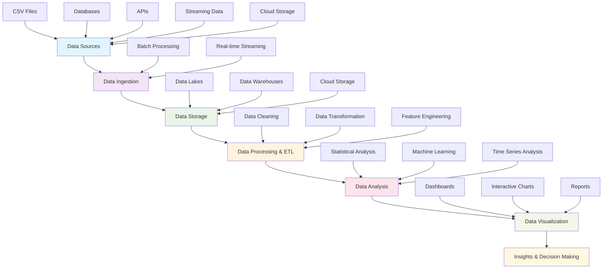

# Data Analysis and Visualizations

Data analysis is the process of gathering, cleaning, and modeling data to reveal insights.

## Data Analysis Pipeline



## Folders & Files

This repository contains examples and implementations for various data analysis and visualization technologies. Each folder represents a different technology or platform with practical examples and documentation.

```mermaid
graph TD
    Root[Data-Analysis-and-Visualizations] --> AWS[AWS Services]
    Root --> Apache[Apache Technologies]
    Root --> Cloud[Cloud Platforms]
    Root --> BI[Business Intelligence]
    Root --> ETL[ETL & Processing]
    
    AWS --> Bedrock[Amazon Bedrock<br/>AI/ML Foundation Models]
    AWS --> Firehose[Amazon Data Firehose<br/>Data Streaming & Delivery]
    AWS --> Kinesis[Amazon Kinesis<br/>Real-time Data Streaming]
    AWS --> Redshift[Amazon Redshift<br/>Data Warehousing]
    AWS --> SageMaker[Amazon SageMaker<br/>ML Platform]
    AWS --> Glue[AWS Glue<br/>ETL Service]
    AWS --> LakeFormation[AWS Lake Formation<br/>Data Lake Management]
    
    Apache --> Airflow[Apache Airflow<br/>Workflow Orchestration]
    Apache --> Beam[Apache Beam<br/>Batch & Stream Processing]
    Apache --> Flink[Apache Flink<br/>Stream Processing]
    Apache --> Iceberg[Apache Iceberg<br/>Table Format]
    Apache --> Kafka[Apache Kafka<br/>Event Streaming]
    Apache --> Spark[Apache Spark<br/>Big Data Processing]
    
    Cloud --> GBQ[Google BigQuery<br/>Data Warehouse]
    Cloud --> GDataflow[Google Cloud Dataflow<br/>Stream Processing]
    Cloud --> Databricks[Databricks<br/>Analytics Platform]
    
    BI --> PowerBI[Power BI<br/>Microsoft Analytics]
    BI --> Tableau[Tableau<br/>Data Visualization]
    BI --> Excel[Excel<br/>Spreadsheet Analysis]
    
    ETL --> ETLFolder[ETL<br/>Extract Transform Load]
    ETL --> PySpark[PySpark<br/>Python API for Spark]
    ETL --> Gradio[Gradio<br/>ML Interface Builder]
    
    style Root fill:#e3f2fd
    style AWS fill:#fff3e0
    style Apache fill:#e8f5e8
    style Cloud fill:#f3e5f5
    style BI fill:#fce4ec
    style ETL fill:#f1f8e9
```




| Category | Folder | Description |
|----------|--------|-------------|
| **AWS Services** | Amazon Bedrock | Managed service for foundation models and generative AI applications |
| | Amazon Data Firehose | Real-time data streaming and delivery service for analytics |
| | Amazon Kinesis | Real-time data streaming platform for processing data streams |
| | Amazon Redshift | Fully managed data warehouse for large-scale analytics |
| | Amazon SageMaker | Machine learning platform for building, training, and deploying ML models |
| | AWS Glue | Serverless data integration and ETL service |
| | AWS Lake Formation | Centralized data lake management and security |
| **Apache Technologies** | Apache Airflow | Workflow orchestration platform for data pipelines |
| | Apache Beam | Unified model for batch and stream data processing |
| | Apache Flink | Distributed stream processing engine |
| | Apache Iceberg | Open table format for large analytic datasets |
| | Apache Kafka | Distributed event streaming platform |
| | Apache Spark | Unified analytics engine for big data processing |
| **Cloud Platforms** | Google BigQuery | Serverless data warehouse for analytics at scale |
| | Google Cloud Dataflow | Fully managed stream and batch processing service |
| | Databricks | Unified analytics platform built on Apache Spark |
| **Business Intelligence** | Power BI | Microsoft's business analytics solution |
| | Tableau | Leading data visualization and business intelligence platform |
| | Excel | Microsoft Excel for data analysis and visualization |
| **ETL & Processing** | ETL | Extract, Transform, Load processes and examples |
| | PySpark | Python API for Apache Spark with practical examples |
| | Gradio | Python library for creating ML web interfaces |

Each folder contains:
- **README.md**: Detailed documentation and getting started guides
- **Code examples**: Practical implementations and sample projects
- **Configuration files**: Setup and deployment configurations
- **Documentation**: Architecture diagrams and technical specifications
- **Sample data**: Test datasets for hands-on learning

**AWS Glue**

AWS Glue is a serverless data integration service that makes it easy for analytics users to discover, prepare, move, and integrate data from multiple sources.

**AWS Lake Formation**

AWS Lake Formation permissions model enables fine-grained access to data stored in data lakes as well as external data sources.

**Amazon Bedrock**

Amazon Bedrock is a managed service that makes foundation models (FMs) from leading AI companies and Amazon available for your use through a unified API.

**Amazon Data Firehose**

Amazon Data Firehose provides way to acquire, transform, and deliver data streams to data lakes, data warehouses and analytics services.

**Amazon Kinesis**

You can use Amazon Kinesis to collect and process streams of data in real time.

**Amazon Redshift**

Amazon Redshift integrates with Amazon SageMaker, allowing you to leverage its SQL analytics capabilities.

**Amazon SageMaker**

Analyze, prepare, and integrate data for analytics and AI.

**Apache Airflow**

Apache Airflow is an open-source tool used to programmatically author, schedule, and monitor sequences of processes and tasks referred to as workflows.

**Apache Beam**

Apache Beam is an open source for defining both batch and streaming data-parallel processing pipelines.

You can use Apache Beam for Extract, Transform, and Load (ETL) tasks.

**Apache Flink**

Streaming Extract, Transform, and Load (ETL) with Apache Flink and Amazon Kinesis Data Analytics.

Apache Flink is a distributed processing engine for stateful computations over unbounded and bounded data streams.

**Apache Iceberg**

Apache Iceberg is an open-source table format that simplifies table management while improving performance. Amazon AWS analytics services such as Amazon EMR, AWS Glue, Amazon Athena, and Amazon Redshift include native support for Apache Iceberg

**Apache Kafka**

Apache Kafka is an open-source distributed event streaming platform. The event streaming is the practice of capturing data in real-time from event sources like databases, sensors or cloud services in the form of streams of events.

**Apache Spark**

Apache Spark is an open source distributed processing system used for big data workloads.

**Databricks**

Databricks is built on Apache Spark.

**Extract Transform and Load (ETL)**

Extract, Transform, and Load (ETL) is the process of combining data from multiple sources into a large repository called a data warehouse.

**Excel**

In data analytics with Excel, insights refer to the conclusions and patterns discovered after analyzing data.

**Google Cloud Dataflow**

Dataflow is a streaming platform provided by Google Cloud.

**Google BigQuery**

Google BigQuery provides a way to work with both structured and unstructured data and supports open table formats like Apache Iceberg and Delta.

**Power BI**

Power BI is Microsoft's analytics platform that helps you turn data into actionable insights.

**PySpark**

PySpark is the Python API for Apache Spark and tool for data analytics.

**Tableau**

Tableau is a data visualization tool used to analyze and present data in a visually and interactive way.


## Data sources

Data sources are the foundation of any data analysis project. Understanding and properly handling various data sources is crucial for successful data analysis. Here are the primary types of data sources and their characteristics:

### Structured Data Sources

**CSV files**

Comma-Separated Values (CSV) files are one of the most common data formats for tabular data. They are:
- Easy to read and process
- Compatible with most data analysis tools
- Lightweight and portable
- Ideal for small to medium-sized datasets
- Can be easily imported into databases or data frames

**Relational databases**

Traditional databases like PostgreSQL, MySQL, SQL Server provide:
- ACID compliance ensuring data integrity
- Complex queries using SQL
- Structured relationships between tables
- Scalable storage for large datasets
- Real-time data access and updates
- Support for concurrent users and transactions

**Excel files**

Microsoft Excel workbooks offer:
- Multiple sheets in a single file
- Built-in data validation and formatting
- Complex formulas and calculations
- Pivot tables for data summarization
- Wide business adoption and familiarity
- Mixed data types within sheets

### Semi-Structured Data Sources

**REST APIs**

Application Programming Interfaces provide:
- Real-time data access from web services
- JSON or XML formatted responses
- Authentication and rate limiting mechanisms
- Dynamic data that changes frequently
- Integration with third-party services
- Standardized HTTP methods for data retrieval

**JSON/XML files**

Document-based formats that offer:
- Hierarchical data structures
- Flexible schema definitions
- Nested objects and arrays
- Self-describing data formats
- Cross-platform compatibility

### Streaming Data Sources

**Real-time streams**

Continuous data flows from:
- IoT sensors and devices
- Social media platforms
- Financial market feeds
- Application logs and metrics
- User interaction events
- Network monitoring systems

### Cloud Data Sources

**Cloud Storage**

Modern cloud platforms provide:
- Amazon S3, Google Cloud Storage, Azure Blob Storage
- Scalable and cost-effective storage
- Data lakes for various file formats
- Integration with analytics services
- Automated backup and versioning
- Global accessibility and durability

### Data Source Considerations

**Data Quality Factors:**
- Completeness: Missing values and null entries
- Accuracy: Correctness of data values
- Consistency: Uniform data formats and standards
- Timeliness: Currency and freshness of data
- Validity: Data conforming to defined formats

**Access Methods:**
- Direct database connections
- File-based imports and exports
- API integrations and webhooks
- Streaming data pipelines
- Batch processing schedules


## Data analysis tasks

Data analysis involves a systematic approach to examining datasets to extract meaningful insights and support decision-making. The following tasks form the core components of a comprehensive data analysis workflow:

### Data Preparation and Cleaning

**Data cleaning**

The foundation of reliable analysis requires:
- **Missing value handling**: Imputation strategies (mean, median, mode) or removal of incomplete records
- **Duplicate removal**: Identifying and eliminating redundant entries to maintain data integrity
- **Data type conversions**: Ensuring proper formats (dates, numbers, categories) for analysis
- **Outlier detection**: Statistical methods to identify anomalous values that may skew results
- **Data validation**: Checking constraints, ranges, and business rules compliance

**Data transformation**

Converting raw data into analysis-ready formats:
- **Normalization and standardization**: Scaling numerical features for fair comparison
- **Encoding categorical variables**: Converting text categories to numerical representations
- **Feature engineering**: Creating new variables from existing data to enhance analysis
- **Data aggregation**: Summarizing detailed records into meaningful groups
- **Reshaping data**: Pivoting between wide and long formats as needed

### Statistical Analysis

**Descriptive statistics**

Understanding data characteristics through:
- **Central tendency measures**: Mean, median, mode to understand typical values
- **Variability measures**: Standard deviation, variance, range, interquartile range
- **Distribution analysis**: Skewness, kurtosis, and probability distributions
- **Correlation analysis**: Relationships between variables using Pearson, Spearman coefficients
- **Cross-tabulation**: Frequency analysis across categorical variables

**Inferential statistics**

Drawing conclusions about populations from samples:
- **Hypothesis testing**: t-tests, chi-square tests, ANOVA for significant differences
- **Confidence intervals**: Estimating population parameters with uncertainty bounds
- **Statistical significance**: p-values and effect sizes for decision making
- **Regression analysis**: Linear, multiple, logistic regression for predictive modeling
- **Sampling techniques**: Ensuring representative data collection methods

### Advanced Analytical Tasks

**Conditional analysis**

Examining data under specific conditions:
- **Filtering and segmentation**: Isolating subsets based on business rules
- **Cohort analysis**: Tracking groups over time periods
- **A/B testing**: Comparing treatment and control groups
- **Scenario analysis**: "What-if" modeling for different conditions
- **Threshold analysis**: Identifying critical values and breakpoints

**Time series analysis**

Analyzing temporal data patterns:
- **Trend analysis**: Long-term directional movements in data
- **Seasonality detection**: Recurring patterns at regular intervals
- **Forecasting models**: ARIMA, exponential smoothing, Prophet
- **Change point detection**: Identifying significant shifts in behavior
- **Moving averages**: Smoothing techniques to reduce noise

**Machine Learning Applications**

Leveraging algorithms for pattern recognition:
- **Supervised learning**: Classification and regression with labeled data
- **Unsupervised learning**: Clustering, dimensionality reduction, association rules
- **Feature selection**: Identifying most relevant variables for modeling
- **Model evaluation**: Cross-validation, performance metrics, bias-variance tradeoff
- **Ensemble methods**: Combining multiple models for improved accuracy

### Data Analysis Pipeline Architecture

**Batch Processing Pipeline**

Traditional approach for large-scale data analysis:
```
Data Sources → Data Ingestion → Data Storage → ETL Processing → Analysis → Reporting
```

**Real-time Processing Pipeline**

Stream processing for immediate insights:
```
Streaming Data → Event Processing → Real-time Analytics → Live Dashboards → Alerts
```

**Lambda Architecture**

Combining batch and real-time processing:
```
Data Sources → [Batch Layer + Speed Layer] → Serving Layer → Applications
```

**Modern Data Pipeline Components**

1. **Data Ingestion Layer**
   - Batch ingestion tools (Apache Sqoop, AWS Glue)
   - Streaming ingestion (Apache Kafka, Amazon Kinesis)
   - API connectors and webhooks

2. **Data Storage Layer**
   - Data lakes (Amazon S3, Azure Data Lake)
   - Data warehouses (Amazon Redshift, Google BigQuery)
   - NoSQL databases (MongoDB, Cassandra)

3. **Processing Layer**
   - ETL tools (Apache Airflow, Talend, Informatica)
   - Big data frameworks (Apache Spark, Hadoop)
   - Stream processing (Apache Flink, Storm)

4. **Analytics Layer**
   - Statistical computing (R, Python, SAS)
   - Machine learning platforms (TensorFlow, scikit-learn)
   - Business intelligence tools (Tableau, Power BI)

5. **Orchestration Layer**
   - Workflow management (Apache Airflow, Prefect)
   - Job scheduling and monitoring
   - Data quality checks and alerts

### Quality Assurance in Data Analysis

**Data validation processes**
- Schema validation and data profiling
- Business rule verification
- Data lineage tracking
- Automated testing of analysis scripts
- Peer review and documentation standards

**Reproducibility measures**
- Version control for analysis code
- Environment management (Docker, conda)
- Parameterized analysis workflows
- Automated report generation
- Results validation and cross-checking

## Leveraging Python, Pandas, NumPy, Dask, PySpark and Plotly with Tableau or Power BI for Data Visualization

Tableau or Power BI

You can integrate Python and the Plotly library with both Tableau and Power BI, allowing you to create custom visualizations and enhance data analysis capabilities.

Dash

As an alternative, consider using Plotly Dash, an open-source framework for building analytical web applications in Python.

Dash allows you to create interactive dashboards with advanced features, including data manipulation using Python libraries.

### Tableau

TabPy

Tableau allows integration with Python through TabPy (Tableau Python Server) or the Tableau Python Data Connector (TDC).

TabPy allows you to run Python scripts from calculated fields in Tableau workbooks.

You can embed Plotly visualizations in Tableau dashboards by the next steps:

1. Creating the visualization with Plotly.

2. Generating an embed URL using Plotly's share function.

3. Adding the URL to a data source (e.g., Google Sheets).

4. Connecting Tableau to the data source.

5. Building sheets around the Plotly visualization.

6. Adding the sheets to a dashboard and dragging a web page object to embed the URL.

```

# Custom functions for Tableau calculated fields
def detect_outliers(data):
    # Statistical outlier detection
    pass

def calculate_trend(values, dates):
    # Time series trend analysis
    pass

```


Tableau Data Connector (TDC)

Custom data source connections and data publishing

### Power BI

1. Python scripting

Enable Python scripting within Power BI Desktop to use Python visuals.

2. Add Python visuals on Power BI

Select the Python visual icon in Power BI's Visualizations pane and enable script visuals.

3. Write Python script code

In the Python script editor, write code to create your Plotly visualization. Power BI passes data to your script as a pandas DataFrame.

4. Export as an image

Since Power BI's Python visuals don't natively support interactive Plotly charts, you'll need to save the Plotly visual as an image (e.g., using kaleido) and display the image within Power BI.
